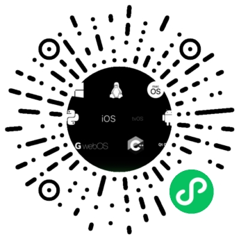

# QtDocumentCN
   [![mdBook](https://img.shields.io/badge/Powered%20by-mdBook-green?logo=data:image/svg+xml;base64,PHN2ZyB4bWxucz0iaHR0cDovL3d3dy53My5vcmcvMjAwMC9zdmciIHZpZXdCb3g9IjAgMCAxOTkuNyAxODQuMiI+DQogIDxzdHlsZT4NCiAgICBAbWVkaWEgKHByZWZlcnMtY29sb3Itc2NoZW1lOiBkYXJrKSB7DQogICAgICBzdmcgeyBmaWxsOiB3aGl0ZTsgfQ0KICAgIH0NCiAgPC9zdHlsZT4NCjxwYXRoIGQ9Ik0xODkuNSwzNi44YzAuMiwyLjgsMCw1LjEtMC42LDYuOEwxNTMsMTYyYy0wLjYsMi4xLTIsMy43LTQuMiw1Yy0yLjIsMS4yLTQuNCwxLjktNi43LDEuOUgzMS40Yy05LjYsMC0xNS4zLTIuOC0xNy4zLTguNA0KICBjLTAuOC0yLjItMC44LTMuOSwwLjEtNS4yYzAuOS0xLjIsMi40LTEuOCw0LjYtMS44SDEyM2M3LjQsMCwxMi42LTEuNCwxNS40LTQuMXM1LjctOC45LDguNi0xOC40bDMyLjktMTA4LjYNCiAgYzEuOC01LjksMS0xMS4xLTIuMi0xNS42UzE2OS45LDAsMTY0LDBINzIuN2MtMSwwLTMuMSwwLjQtNi4xLDEuMWwwLjEtMC40QzY0LjUsMC4yLDYyLjYsMCw2MSwwLjFzLTMsMC41LTQuMywxLjQNCiAgYy0xLjMsMC45LTIuNCwxLjgtMy4yLDIuOFM1Miw2LjUsNTEuMiw4LjFjLTAuOCwxLjYtMS40LDMtMS45LDQuM3MtMS4xLDIuNy0xLjgsNC4yYy0wLjcsMS41LTEuMywyLjctMiwzLjdjLTAuNSwwLjYtMS4yLDEuNS0yLDIuNQ0KICBzLTEuNiwyLTIuMiwyLjhzLTAuOSwxLjUtMS4xLDIuMmMtMC4yLDAuNy0wLjEsMS44LDAuMiwzLjJjMC4zLDEuNCwwLjQsMi40LDAuNCwzLjFjLTAuMywzLTEuNCw2LjktMy4zLDExLjYNCiAgYy0xLjksNC43LTMuNiw4LjEtNS4xLDEwLjFjLTAuMywwLjQtMS4yLDEuMy0yLjYsMi43Yy0xLjQsMS40LTIuMywyLjYtMi42LDMuN2MtMC4zLDAuNC0wLjMsMS41LTAuMSwzLjRjMC4zLDEuOCwwLjQsMy4xLDAuMywzLjgNCiAgYy0wLjMsMi43LTEuMyw2LjMtMywxMC44Yy0xLjcsNC41LTMuNCw4LjItNSwxMWMtMC4yLDAuNS0wLjksMS40LTIsMi44Yy0xLjEsMS40LTEuOCwyLjUtMiwzLjRjLTAuMiwwLjYtMC4xLDEuOCwwLjEsMy40DQogIGMwLjIsMS42LDAuMiwyLjgtMC4xLDMuNmMtMC42LDMtMS44LDYuNy0zLjYsMTFjLTEuOCw0LjMtMy42LDcuOS01LjQsMTFjLTAuNSwwLjgtMS4xLDEuNy0yLDIuOGMtMC44LDEuMS0xLjUsMi0yLDIuOA0KICBzLTAuOCwxLjYtMSwyLjVjLTAuMSwwLjUsMCwxLjMsMC40LDIuM2MwLjMsMS4xLDAuNCwxLjksMC40LDIuNmMtMC4xLDEuMS0wLjIsMi42LTAuNSw0LjRjLTAuMiwxLjgtMC40LDIuOS0wLjQsMy4yDQogIGMtMS44LDQuOC0xLjcsOS45LDAuMiwxNS4yYzIuMiw2LjIsNi4yLDExLjUsMTEuOSwxNS44YzUuNyw0LjMsMTEuNyw2LjQsMTcuOCw2LjRoMTEwLjdjNS4yLDAsMTAuMS0xLjcsMTQuNy01LjJzNy43LTcuOCw5LjItMTIuOQ0KICBsMzMtMTA4LjZjMS44LTUuOCwxLTEwLjktMi4yLTE1LjVDMTk0LjksMzkuNywxOTIuNiwzOCwxODkuNSwzNi44eiBNNTkuNiwxMjIuOEw3My44LDgwYzAsMCw3LDAsMTAuOCwwczI4LjgtMS43LDI1LjQsMTcuNQ0KICBjLTMuNCwxOS4yLTE4LjgsMjUuMi0zNi44LDI1LjRTNTkuNiwxMjIuOCw1OS42LDEyMi44eiBNNzguNiwxMTYuOGM0LjctMC4xLDE4LjktMi45LDIyLjEtMTcuMVM4OS4yLDg2LjMsODkuMiw4Ni4zbC04LjksMA0KICBsLTEwLjIsMzAuNUM3MC4yLDExNi45LDc0LDExNi45LDc4LjYsMTE2Ljh6IE03NS4zLDY4LjdMODksMjYuMmg5LjhsMC44LDM0bDIzLjYtMzRoOS45bC0xMy42LDQyLjVoLTcuMWwxMi41LTM1LjRsLTI0LjUsMzUuNGgtNi44DQogIGwtMC44LTM1TDgyLDY4LjdINzUuM3oiLz4NCjwvc3ZnPg==)](https://rust-lang.github.io/mdBook/)

   

本项目为翻译 Qt 官方文档，内容基于 Qt 最新发布版本 5.15，采用 [CC BY-NC-SA 4.0](https://creativecommons.org/licenses/by-nc-sa/4.0/deed.zh) 协议发布。

## 微信小程序

## 参与编写

关于本项目的目录结构、文件管理、格式规范等，详见[贡献指南](CONTRIBUTING.md)。

[完成度追踪表](completeness_tracking.md)，用于追踪待完成或有待进一步维护的文档状态。

辅助中文文档编写的脚本和工具，详见[辅助工具](https://github.com/QtDocumentCN/Tools)。

技术词汇的翻译可参考 [词汇对照表](Comparison_Table.md)。

关于如何将英文文档信达雅地翻译为中文技术文档，可参考 [语法小贴士](Grammar_Tips.md)。

## 关于社区

### 参与者公约
参与相关讨论时，请遵守[参与者公约](CODE_OF_CONDUCT.md)。

### 加入社区
可以通过[发起issue](https://github.com/QtDocumentCN/QtDocumentCN/issues/new)的方式建立讨论。

此外，我们组建了 `QtDocumentCN-社区组` 微信群，可以添加[@CryFeiFei](https://github.com/CryFeiFei) 的微信`Perfect_Cheung`，备注QtDoc，待邀请入群后在群里详细聊。

项目初期有可能有很多不完善的地方，希望各位开发提出不合理的地方。

## TODO

- [x] 使用 [mdbook](https://rust-lang.github.io/mdBook/) 生成 GitHub Pages，作为实际发布页面。
- [x] 国内gitee镜像 [gitee](https://gitee.com/cryfeifei/QtDocumentCN)。
- [x] 通过 Coding 等平台建立[国内镜像](https://www.qtdoc.cn)。
- [x] 使用 Coding 提供的服务来建立微信小程序
- [x] 通过[知乎专栏](https://zhuanlan.zhihu.com/c_1266078048082026496)等形式在社区进行发布。
- [x] 编写[辅助工具](https://github.com/QtDocumentCN/Tools)提高编辑效率。
- [ ] 提供离线发布版（如pdf、chm等）。
- [ ] 添加 `Q_D`/`D_Q` 私有指针、CorePrivate 模块等未在官方文档中正式发布，但已作为事实标准长期使用的特性介绍。

## 捐助列表

| 捐助人                                 | 捐助金额 |
| -------------------------------------- | -------- |
| [吴冬亮](https://github.com/abc881858) | 200￥    |
| 匿名Z | 100￥|
| 赵江涛| 50￥|
| [Rzself](https://github.com/Rzself) | 50￥ |

## Contributors

Made with [contributors-img](https://contributors-img.web.app).
