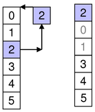

# QAbstractItemModel 类

QAbstractItemModel类为项模型类提供了抽象接口。[更多...]()

| 属性 | 方法 |
| ---- | ---- |
| 头文件 | `#include <QAbstractItemModel> ` |
| qmake | `QT += core` |
| 继承 | [QObject]() |
| 派生 | [QAbstractListModel]()、[QAbstractProxyModel]()、[QAbstractTableModel]()、[QConcatenateTablesProxyModel]()、[QDirModel]()、[QFileSystemModel]() 和 [QStandardItemModel]() |

## 公共成员类型

| 类型 | 类型名称 |
| ---- | ---- |
| enum class | [CheckIndexOption]() { NoOption, IndexIsValid, DoNotUseParent, ParentIsInvalid } |
| flags | [CheckIndexOptions]() |
| enum | [LayoutChangeHint]() { NoLayoutChangeHint, VerticalSortHint, HorizontalSortHint } |

## 公共成员函数

| 类型 | 函数名称 |
| ---- | ---- |
| | QAbstractItemModel(QObject *parent = nullptr) |
| virtual |	~QAbstractItemModel() |
| virtual QModelIndex |	buddy(const QModelIndex &index) const |
| virtual bool | canDropMimeData(const QMimeData *data, Qt::DropAction action, int row, int column, const QModelIndex &parent) const s|
| virtual bool | canFetchMore(const QModelIndex &parent) const |
| bool | checkIndex(const QModelIndex &index, QAbstractItemModel::CheckIndexOptions options = CheckIndexOption::NoOption) const |
| virtual int | columnCount(const QModelIndex &parent = QModelIndex()) const = 0 |
| virtual QVariant | data(const QModelIndex &index, int role = Qt::DisplayRole) const = 0 |
| virtual bool | dropMimeData(const QMimeData *data, Qt::DropAction action, int row, int column, const QModelIndex &parent) |
| virtual void | fetchMore(const QModelIndex &parent) |
| virtual Qt::ItemFlags | flags(const QModelIndex &index) const |
| virtual bool | hasChildren(const QModelIndex &parent = QModelIndex()) const |
| bool | hasIndex(int row, int column, const QModelIndex &parent = QModelIndex()) const |
| virtual QVariant | headerData(int section, Qt::Orientation orientation, int role = Qt::DisplayRole) const |
| virtual QModelIndex |	index(int row, int column, const QModelIndex &parent = QModelIndex()) const = 0 |
| bool | insertColumn(int column, const QModelIndex &parent = QModelIndex()) |
| virtual bool | insertColumns(int column, int count, const QModelIndex &parent = QModelIndex()) |
| bool | insertRow(int row, const QModelIndex &parent = QModelIndex()) |
| virtual bool | insertRows(int row, int count, const QModelIndex &parent = QModelIndex()) |
| virtual QMap<int, QVariant> |	itemData(const QModelIndex &index) const |
| virtual QModelIndexList | match(const QModelIndex &start, int role, const QVariant &value, int hits = 1, Qt::MatchFlags flags = Qt::MatchFlags (Qt::MatchStartsWith|Qt::MatchWrap)) const |
| virtual QMimeData * |	mimeData(const QModelIndexList &indexes) const |
| virtual QStringList |	mimeTypes() const |
| bool | moveColumn(const QModelIndex &sourceParent, int sourceColumn, const QModelIndex &destinationParent, int destinationChild) |
| virtual bool | moveColumns(const QModelIndex &sourceParent, int sourceColumn, int count, const QModelIndex &destinationParent, int destinationChild) |
| bool | moveRow(const QModelIndex &sourceParent, int sourceRow, const QModelIndex &destinationParent, int destinationChild) |
| virtual bool | moveRows(const QModelIndex &sourceParent, int sourceRow, int count, const QModelIndex &destinationParent, int destinationChild) |
| virtual QModelIndex |	parent(const QModelIndex &index) const = 0 |
| bool | removeColumn(int column, const QModelIndex &parent = QModelIndex()) |
| virtual bool | removeColumns(int column, int count, const QModelIndex &parent = QModelIndex()) |
| bool | removeRow(int row, const QModelIndex &parent = QModelIndex()) |
| virtual bool | removeRows(int row, int count, const QModelIndex &parent = QModelIndex()) |
| virtual QHash<int, QByteArray> | roleNames() const |
| virtual int | rowCount(const QModelIndex &parent = QModelIndex()) const = 0 |
| virtual bool | setData(const QModelIndex &index, const QVariant &value, int role = Qt::EditRole) |
| virtual bool | setHeaderData(int section, Qt::Orientation orientation, const QVariant &value, int role = Qt::EditRole) |
| virtual bool	| setItemData(const QModelIndex &index, const QMap<int, QVariant> &roles) |
| virtual QModelIndex |	sibling(int row, int column, const QModelIndex &index) const |
| virtual void | sort(int column, Qt::SortOrder order = Qt::AscendingOrder) |
| virtual QSize | span(const QModelIndex &index) const |
| virtual Qt::DropActions | supportedDragActions() const |
| virtual Qt::DropActions | supportedDropActions() const |

## 公共槽函数

| 类型　|　函数名称 |
| ---- | ---- |
| virtual void | revert() |
| virtual bool | submit() |

## 信号

| 类型　|　函数名称 |
| ---- | ---- |
| void | columnsAboutToBeInserted(const QModelIndex &parent, int first, int last) |
| void | columnsAboutToBeMoved(const QModelIndex &sourceParent, int sourceStart, int sourceEnd, const QModelIndex &destinationParent, int destinationColumn) |
| void | columnsAboutToBeRemoved(const QModelIndex &parent, int first, int last) |
| void | columnsInserted(const QModelIndex &parent, int first, int last) |
| void | columnsMoved(const QModelIndex &parent, int start, int end, const QModelIndex &destination, int column) |
| void | columnsRemoved(const QModelIndex &parent, int first, int last) |
| void | dataChanged(const QModelIndex &topLeft, const QModelIndex &bottomRight, const QVector<int> &roles = QVector<int>()) |
| void | headerDataChanged(Qt::Orientation orientation, int first, int last) |
| void |layoutAboutToBeChanged(const QList<QPersistentModelIndex> &parents = QList<QPersistentModelIndex>(), QAbstractItemModel::LayoutChangeHint hint = QAbstractItemModel::NoLayoutChangeHint) |
| void | layoutChanged(const QList<QPersistentModelIndex> &parents = QList<QPersistentModelIndex>(), QAbstractItemModel::LayoutChangeHint hint = QAbstractItemModel::NoLayoutChangeHint) |
| void | modelAboutToBeReset() |
| void | modelReset() |
| void | rowsAboutToBeInserted(const QModelIndex &parent, int start, int end) |
| void | rowsAboutToBeMoved(const QModelIndex &sourceParent, int sourceStart, int sourceEnd, const QModelIndex &destinationParent, int destinationRow) |
| void | rowsAboutToBeRemoved(const QModelIndex &parent, int first, int last) |
| void | rowsInserted(const QModelIndex &parent, int first, int last) |
| void | rowsMoved(const QModelIndex &parent, int start, int end, const QModelIndex &destination, int row) |
| void | rowsRemoved(const QModelIndex &parent, int first, int last) |

## 受保护的函数

| 类型　|　函数名称 |
| ---- | ---- |
| void | beginInsertColumns(const QModelIndex &parent, int first, int last) |
| void | beginInsertRows(const QModelIndex &parent, int first, int last) |
| bool | beginMoveColumns(const QModelIndex &sourceParent, int sourceFirst, int sourceLast, const QModelIndex &destinationParent, int destinationChild) |
| bool | beginMoveRows(const QModelIndex &sourceParent, int sourceFirst, int sourceLast, const QModelIndex &destinationParent, int destinationChild) |
| void | beginRemoveColumns(const QModelIndex &parent, int first, int last) |
| void | beginRemoveRows(const QModelIndex &parent, int first, int last) |
| void | beginResetModel() |
| void | changePersistentIndex(const QModelIndex &from, const QModelIndex &to) |
| void | changePersistentIndexList(const QModelIndexList &from, const QModelIndexList &to) |
| QModelIndex |	createIndex(int row, int column, void *ptr = nullptr) const |
| QModelIndex |	createIndex(int row, int column, quintptr id) const |
| void | endInsertColumns() |
| void | endInsertRows() |
| void | endMoveColumns() |
| void | endMoveRows() |
| void | endRemoveColumns() |
| void | endRemoveRows() |
| void | endResetModel() |
| QModelIndexList |	persistentIndexList() const |

## 受保护的槽函数

| 类型　|　函数名称 |
| ---- | ---- |
| void | resetInternalData() |

## 详细描述

`QAbstractItemModel` 类定义了项模型与模型/视图体系结构中的其他组件进行交互操作时必须使用的标准接口。应该子类化该类创建新的模型，而不是直接实例化使用。

`QAbstractItemModel` 类是[模型/视图类]()中的一个，也是 `Qt` [模型/视图框架]()的一部分。它可以用作 `QML` 中的项视图元素或 `Qt Widgets` 模块中的项视图类的底层数据模型。

如果需要一个模型来使用项视图，比如　`QML` 的　`List View` 元素或者　`C++ widgets` 的　[QListView]() 或者　[ QTableView]()，应该考虑子类化 [QAbstractListModel]() 或者 [QAbstractTableModel]() 而不是使用该类。

底层数据模型作为表的层次结构暴露给视图和委托。如果不使用层次结构，那么模型就是一个简单的具有行和列的表。每个项都有一个由　[QModelIndex]() 指定的惟一索引。


每个数据项都可以通过包含一个关联的模型索引的模型进行访问。该索引可以通过　[index()]() 函数获得。每个索引可能有一个　[sibling()]() 索引；子项有一个 [parent()]()　索引。

每个项目都有许多与之关联的数据元素，可以通过为模型的 [data()]() 函数指定一个角色（请参阅 [Qt::ItemDataRole]()）来检索它们。可以使用 [itemData()]() 函数同时获取所有可用角色的数据。

使用特定的 [Qt::ItemDataRole]() 设置每个角色的数据。可以使用 [setData()]() 单独设置各个角色的数据，也可以使用 [setItemData]() 设置所有角色的数据。

可以使用 [flags()]() 查询项（请参阅 [Qt::ItemFlag]()），以查看是否可以通过其他方式选择，拖动或操纵它们。

如果项具有子对象，则 [hasChildren]() 为相应的索引返回 `true`。

该模型在层次结构的每个级别都有一个 [rowCount()]() 和 [columnCount]()。可以使用 [insertRows()]()，[insertColumns()]()，[removeRows()]() 和 [removeColumns()]() 插入和删除行和列。

模型发出信号以指示变化。例如，只要模型可用的数据项发生更改，就会发出 [dataChanged()]()。对模型提供的标题的更改将将发射　[headerDataChanged()]() 信号。如果底层数据的结构发生了变化，则模型可以发出　[layoutChanged()]() 来向任何附加的视图指示它们应该重新显示所显示的任何项，并需要考虑到新的结构。

可以使用 [match()]() 函数在模型中搜索可用的项以查找特定数据。

要对模型进行排序，可以使用 [sort()]()。

### 子类化

**注意：**　在[模型子类化参考]()中有一些关于模型子类化的通用指南。

子类化　[QAbstractItemModel]() 时，至少必须实现 [index()]()，[parent()]()，[rowCount()]()，[columnCount()]() 和 [data()]()。这些函数在所有的只读模型中使用，同样也构成了可编辑模型的基础。

还可以为模型重新实现 [hasChildren()]()　来提供特殊的行为，而不是重新实现成本很高的 [rowCount()]()。这使得模型可以限制视图请求的数据量，并且可以作为实现模型数据的惰性填充的一种方式。

要在模型中启用编辑，还必须实现　[setData]() 和重新实现 [flags()]() 以确保返回 `ItemIsEditable`。还可以重新实现 [headerData()]() 和 [setHeaderData]() 来控制呈现模型标题的方式。

当分别重新实现 [setData()]() 和 [setHeaderData()]() 函数时，必须显式发射　[dataChanged()]() 和 [headerDataChanged()]() 信号。

定制模型需要创建模型索引以供其他组件使用。为此，请使用适当的行号和列号以及相应的标识符调用 [createIndex()]()，并将其作为指针或整数值。这些值的组合对于每个项都必须是唯一的。定制模型通常在其他重新实现的函数中使用这些唯一标识符，以检索项数据并访问有关该项的父项和子项的信息。有关唯一标识符的更多信息，请参见[简单树模型]()示例。

不必支持 [Qt::ItemDataRole]() 中定义的每个角色。根据模型中包含的数据类型，可能只有实现 [data()]() 函数以返回一些更常见角色的有效信息才有用。大多数模型至少为 [Qt::DisplayRole]() 提供项数据的文本表示，行为良好的模型也应为 [Qt::ToolTipRole]() 和 [Qt::WhatsThisRole]() 提供有效信息。支持这些角色可使模型与标准 `Qt` 视图一起使用。但是，对于某些处理高度专业化数据的模型，仅为用户定义的角色提供数据可能是合适的。

提供可调整数据结构大小的接口的模型可以提供 [insertRows()]()，[removeRows()]()，[insertColumns()]() 和 [removeColumns()]() 的实现。在实现这些函数时，重要的是要在模型尺寸大小发生 *之前* 和 *之后* 将有关模型尺寸的更改通知所有连接的视图：

- [insertRows()]() 的实现必须在将新行插入数据结构 *之前* 调用 [beginInsertRows()]()，*然后立即* 调用 [endInsertRows()]()。
- [insertColumns()]() 的实现必须在将新列插入数据结构　*之前* 调用 [beginInsertColumns()]()，*然后立即* 调用 [endInsertColumns()]()。
- [removeRows()]() 的实现必须在从数据结构中删除行　*之前* 调用 [beginRemoveRows()]()，*然后立即* 调用 [endRemoveRows()]()。
- [removeColumns()]() 的实现必须在列从数据结构中删除之前调用 [beginRemoveColumns()]()，*然后立即* 调用 [endRemoveColumns()]()。
  
这些函数发出的私有信号使附加组件有机会在任何数据变得不可用之前采取行动。使用这些 `begin` 和 `end` 函数封装插入和删除操作还使模型能够正确地管理[持久模型索引]()。**如果希望正确处理选择，则必须确保调用了这些函数。** 如果插入或移除带有子项的项，则不需要为子项调用这些函数。换句话说，父项将管理其子项。

要创建增量填充的模型，可以重新实现 [fetchMore()]() 和 [canFetchMore()]()。如果 [fetchMore()]() 的重新实现向模型中添加了行，则必须调用 [beginInsertRows()]() 和 [endInsertRows()]()。

参见[模型类]()、[模型子类化参考]()、[QModelIndex]()、[QAbstractItemView]()、[在项视图中使用拖放]()、[简单DOM模型示例]()、[简单树模型示例]()、[可编辑树模型示例]()和 [Fetch More示例]()。

## 成员类型文档

**enum class QAbstractItemModel::CheckIndexOption**
**flags QAbstractItemModel::CheckIndexOptions**

这个枚举可以用来控制 [QAbstractItemModel::checkIndex()]() 执行的检查。

| 常量 | 值 | 描述 |
| ---- | ---- | ---- | ---- |
| QAbstractItemModel::CheckIndexOption::NoOption | 0x0000 | 没有指定检查选项。|
| QAbstractItemModel::CheckIndexOption::IndexIsValid | 0x0001 | 传递给 [QAbstractItemModel::checkIndex()]() 的模型索引被检查为有效的模型索引。|
| QAbstractItemModel::CheckIndexOption::DoNotUseParent | 0x0002 | 不执行任何涉及到传递给 [QAbstractItemModel::checkIndex()]() 的父索引的使用的检查。|
| QAbstractItemModel::CheckIndexOption::ParentIsInvalid | 0x0004 | 传递给 [QAbstractItemModel::checkIndex()]() 的模型索引的父索引被检查为无效的模型索引。如果同时指定了此选项和 DoNotUseParent，则忽略此选项。|

该枚举是在 `Qt 5.11` 中引入或修改的。

`CheckIndexOptions` 类型是一个 [QFlags]()\<`CheckIndexOption`> 的类型定义。它存储一个或组合的 `CheckIndexOption` 值。

### enum QAbstractItemModel::LayoutChangeHint

这个枚举描述了模型改变布局的方式。

| 常量 | 值 | 描述 |
| ---- | ---- | ---- |
| QAbstractItemModel::NoLayoutChangeHint | 0 | 没有任何提示。 |
| QAbstractItemModel::VerticalSortHint | 1 | 正在对行进行排序。 |
| QAbstractItemModel::HorizontalSortHint | 2 | 正在对列进行排序。 |

注意，`VerticalSortHint`　和 `HorizontalSortHint` 表示项在同一父级中移动，而不是移动到模型中的不同父级，也没有过滤掉或过滤进来。

## 成员函数文档

<font size=4> QAbstractItemModel::**QAbstractItemModel**([QObject]() *parent = nullptr) </font> 

构造指定父类对象 `parent` 的抽象项模型。
<br></br>

<font size=4>[ signal ]&emsp;**void** QAbstractItemModel::**columnsAboutToBeInserted**(const [QModelIndex]() &parent, **int** first, **int** last)</font>

在将列插入模型之前就发射此信号。新项将位于给定父项 `parent` 下的首 `first` 尾 `last`之间。

**注意:** 连接到这个信号的组件使用它来适应模型尺寸的变化。它只能由 [QAbstractItemModel]() 的实现发射，不能在子类代码中显式发射。

**注意:**　这是一个私有信号。它可以用于信号连接，但不能由用户发射。

参见 [insertColumns()]() 和 [beginInsertColumns()]()。
<br></br>

<font size=4>[ signal ]&emsp;**void** QAbstractItemModel::**columnsAboutToBeMoved**(const [QModelIndex]() &sourceParent, **int** sourceStart, **int** sourceEnd, const [QModelIndex]() &destinationParent, **int** destinationColumn)</font> 

模型中的列被移动之前发射该信号。将要移动的项是在给定 `sourceParent` 下在 `sourceStart` 和 `sourceEnd` 之间（包括首尾）的项。它们将从 `destinationColumn` 列开始移动到`destinationParent`。

**注意：** 连接到该信号的组件使用它来适应模型尺寸的变化。它只能由 [QAbstractItemModel]() 实现发射，不能在子类代码中显式发射。

**注意：** 这是一个私有信号。仅用于信号连接，而不能由用户发射。

该函数在 `Qt4.6` 中被引入。

参见 [beginMoveRows]()()。
<br></br>

<font size=4>[ signal ]&emsp;**void** QAbstractItemModel::**columnsAboutToBeRemoved**(const [QModelIndex]() &parent, **int** first, **int** last)</font> 

模型中的列被移除之前发射该信号。将要移除的项是在给定 `parent` 下在 `first` 和 `last` 之间（包括首尾）的项。

**注意：** 连接到该信号的组件使用它来适应模型尺寸的变化。它只能由 [QAbstractItemModel]() 实现发射，不能在子类代码中显式发射。

**注意：** 这是一个私有信号。仅用于信号连接，而不能由用户发射。

参见 [removeColumns]()() 和 [beginRemoveColumns]()()。
<br></br>

<font size=4>[ signal ]&emsp;**void** QAbstractItemModel::**columnsInserted**(const [QModelIndex]() &parent, **int** first, **int** last)</font> 

将列插入到模型之后发射该信号。新的项是在给定 `parent` 下在 `first` 和 `last` 之间（包括首尾）的项。

**注意：** 连接到该信号的组件使用它来适应模型尺寸的变化。它只能由 [QAbstractItemModel]() 实现发射，不能在子类代码中显式发射。

**注意：** 这是一个私有信号。仅用于信号连接，而不能由用户发射。

参见 [insertColumns]()() 和 [beginInsertColumns]()()。
<br></br>

<font size=4>[ signal ]&emsp;**void** QAbstractItemModel::**columnsMoved**(const [QModelIndex]() &parent, **int** start, **int** end, const [QModelIndex]() &destination, **int** column)</font> 

模型中的列被移动之后发射该信号。新的项是在给定 `parent` 下在 `start` 和 `end` 之间（包括首尾）的项。它们将从 `column` 列开始移动到`destination`。

**注意：** 连接到该信号的组件使用它来适应模型尺寸的变化。它只能由 [QAbstractItemModel]() 实现发射，不能在子类代码中显式发射。

**注意：** 这是一个私有信号。仅用于信号连接，而不能由用户发射。

该函数在 `Qt4.6` 中被引入。

参见 [beginMoveRows]()()。
<br></br>

<font size=4>[ signal ]&emsp;**void** QAbstractItemModel::**columnsRemoved**(const [QModelIndex]() &parent, **int** first, **int** last)</font> 

模型中的列被移除之后发射该信号。移除的项是在给定 `parent` 下在 `first` 和 `last` 之间（包括首尾）的项。

**注意：** 连接到该信号的组件使用它来适应模型尺寸的变化。它只能由 [QAbstractItemModel]() 实现发射，不能在子类代码中显式发射。

**注意：** 这是一个私有信号。仅用于信号连接，而不能由用户发射。

参见 [removeColumns]()() 和 [beginRemoveColumns]()()。
<br></br>

<font size=4>[ signal ]&emsp;**void** QAbstractItemModel::**dataChanged**(const [QModelIndex]() &topLeft, const [QModelIndex]() &bottomRight, const [QVector]()<**int**> &roles = QVector<int>())</font> 

现有的项的数据发生改变时发射该信号。

如果项是同一父项，则受影响的项是在 `topLeft` 和 `bottomRight`（包含）之间的项目。如果项没有相同的父项，则行为是不确定的。

当重新实现 [setData]()() 函数时，必须显示地发射该信号。

可选的 `roles` 参数可用于指定实际修改了哪些数据角色。`Roles` 参数中的向量为空，表示应将所有角色视为已修改。角色参数中元素的顺序没有任何关联。

参见 [headerDataChanged]()()、[setData]()() 和 [layoutChanged]()()。
<br></br>

<font size=4>[ signal ]&emsp;**void** QAbstractItemModel::**headerDataChanged**(const [Qt::Orientation]() &orientation, **int** first, **int** last)</font> 

当标题改变时发射该信号。`orientation` 表示是横向标题还是竖向标题发生了改变。标题中从 `first` 到 `last` 的部分需要更新。

当重新实现 [setData]()() 函数时，必须显示地发射该信号。

如果要更改列数或行数，则不需要发出此信号，而可以使用 `begin/end` 函数（有关详细信息，请参见 [QAbstractItemModel]() 类描述中的子类化部分）。

参见 [headerData]()()、[setHeaderData]()() 和 [dataChanged]()()。
<br></br>

<font size=4>[ signal ]&emsp;**void** QAbstractItemModel::**layoutAboutToBeChanged**(const [QList]()<[QPersistentModelIndex]()> &parents = QList<QPersistentModelIndex>(), [QAbstractItemModel::LayoutChangeHint]() hint = QAbstractItemModel::NoLayoutChangeHint)</font> 

这个信号会在模型的布局改变之前发出。连接到这个信号的组件使用它来适应模型布局的变化。

在发出 `layoutAboutToBeChanged()` 之后，子类应该更新所有的持久化模型索引。

可选的 `parents` 参数用于提供更具体的通知关于模型布局的哪些部分正在被改变。空列表表示对整个模型的布局进行了更改。`parents` 列表中元素的顺序不重要。可选的 `hint` 参数用于提示模型重新布局时都发生了什么。

该函数在 `Qt 5.0` 中被引入。

参见 [layoutChanged]()() 和 [changePersistentIndex]()()。
<br></br>

<font size=4>[ signal ]&emsp;**void** QAbstractItemModel::**layoutChanged**(const [QList]()<[QPersistentModelIndex]()> &parents = QList<QPersistentModelIndex>(), [QAbstractItemModel::LayoutChangeHint]() hint = QAbstractItemModel::NoLayoutChangeHint)</font> 

每当模型公开的项的布局发生变化时，就会发出这个信号，例如，对模型进行排序时。当视图接收到该信号时，应更新项的布局来反映此更改。

当对 [QAbstractItemModel]() 或 [QAbstractProxyModel]() 进行子类化时，请确保在更改项顺序或更改要公开给视图的数据的结构之前发出 [layoutAboutToBeChanged]()() 信号，并在更改布局后发出 [layoutChanged]()() 信号。

可选的 `parents` 参数用于给出有关模型布局的哪些部分正在更改的具体的通知。空列表表示更改了整个模型的布局。`parents` 列表中元素的顺序并不重要。可选的 `hint` 参数用于提示模型重新布局时发生的情况。

子类应在发​​出 [layoutChanged]()() 信号之前更新所有持久模型索引。换句话说，当结构改变时：

- 发出 [layoutAboutToBeChanged]()
- 记住将会改变的 [QModelIndex]()
- 更新内部数据
- 调用 [changePersistentIndex]()()
- 发出 layoutChanged
  
该函数在 `Qt 5.0` 中被引入。  

参见 [layoutAboutToBeChanged]()()、[dataChanged]()()、[headerDataChanged]()()、[modelReset]()() 和 [changePersistentIndex]()()。
<br></br>

<font size=4>[ signal ]&emsp;**void** QAbstractItemModel::**modelAboutToBeReset**()</font> 

当调用 [beginResetModel]()() 时，在模型的内部状态(例如持久模型索引)失效之前发出这个信号。

**注意：** 这是一个私有信号。仅用于信号连接，而不能由用户发射。
  
该函数在 `Qt 4.2` 中被引入。  

参见 [beginResetModel]()() 和 [modelReset]()()。
<br></br>

<font size=4>[ signal ]&emsp;**void** QAbstractItemModel::**modelReset**()</font> 

当调用 [endResetModel]()() 时，在模型的内部状态(例如持久模型索引)失效之后发出这个信号。

注意，如果模型被重置，则应该认为之前从模型中检索的所有信息都是无效的。这包括但不限于 [rowCount]()()、[columnCount]()()、[flags]()()、通过data()检索的数据和 [roleNames]()()。

**注意：** 这是一个私有信号。仅用于信号连接，而不能由用户发射。
  
该函数在 `Qt 4.1` 中被引入。  

参见 [endResetModel]()() 和 [modelAboutToBeReset]()()。
<br></br>

<font size=4 weight="lighter">[ protected slot ]&emsp;**void** QAbstractItemModel::**resetInternalData**()</font> 

该槽函数在模型的内部数据被清除并被重置之后被调用。

该槽函数为具体代理模型的子类提供了便利，例如维护了额外的数据的 [QSortFilterProxyModel]() 的子类。

```cpp
 class CustomDataProxy : public QSortFilterProxyModel
 {
     Q_OBJECT
 public:
     CustomDataProxy(QObject *parent)
       : QSortFilterProxyModel(parent)
     {
     }

     ...

     QVariant data(const QModelIndex &index, int role) override
     {
         if (role != Qt::BackgroundRole)
             return QSortFilterProxyModel::data(index, role);

         if (m_customData.contains(index.row()))
             return m_customData.value(index.row());
         return QSortFilterProxyModel::data(index, role);
     }

 private slots:
     void resetInternalData()
     {
         m_customData.clear();
     }

 private:
   QHash<int, QVariant> m_customData;
 };

```

**注意：** 由于错误，该槽函数没有出现在 `Qt 5.0` 中。
  
该函数在 `Qt 4.8` 中被引入。  

参见 [modelAboutToBeReset]()() 和 [modelReset]()()。
<br></br>

<font size=4>[ virtual slot ]&emsp;**void** QAbstractItemModel::**revert**()</font> 

让模型知道它应该丢弃缓存的信息。这个函数通常用于行编辑。
  
该函数在 `Qt 4.2` 中被引入。  

参见 [submit]()()。
<br></br>

<font size=4>[ signal ]&emsp;**void** QAbstractItemModel::**rowsAboutToBeInserted**(const [QModelIndex]() &parent, **int** start, **int** end)</font> 

在将行插入模型之前就发出该信号。新项将位于给定 `parent` 项目下的包含 `start` 和 `end` 之间。

**注意：** 连接到该信号的组件使用它来适应模型尺寸的变化。它只能由 [QAbstractItemModel]() 实现发出，而不能在子类代码中显式发出。

**注意：** 这是一个私有信号。仅用于信号连接，而不能由用户发射。 

参见 [insertRows]()() 和 [beginInsertRows]()()。
<br></br>

<font size=4>[ signal ]&emsp;**void** QAbstractItemModel::**rowsAboutToBeMoved**(const [QModelIndex]() &sourceParent, **int** sourceStart, **int** sourceEnd, const [QModelIndex]() &destinationParent, **int** destinationRow)</font> 

模型中的行被移动之前发射该信号。将要移动的项是在给定 `sourceParent` 下在 `sourceStart` 和 `sourceEnd` 之间（包括首尾）的项。它们将从 `destinationRow` 列开始移动到`destinationParent`。

**注意：** 连接到该信号的组件使用它来适应模型尺寸的变化。它只能由 [QAbstractItemModel]() 实现发射，不能在子类代码中显式发射。

**注意：** 这是一个私有信号。仅用于信号连接，而不能由用户发射。

该函数在 `Qt4.6` 中被引入。

参见 [beginMoveRows]()()。
<br></br>

<font size=4>[ signal ]&emsp;**void** QAbstractItemModel::**rowsAboutToBeRemoved**(const [QModelIndex]() &parent, **int** first, **int** last)</font> 

模型中的行被移除之前发射该信号。将要移除的项是在给定 `parent` 下在 `first` 和 `last` 之间（包括首尾）的项。

**注意：** 连接到该信号的组件使用它来适应模型尺寸的变化。它只能由 [QAbstractItemModel]() 实现发射，不能在子类代码中显式发射。

**注意：** 这是一个私有信号。仅用于信号连接，而不能由用户发射。

参见 [removeRows]()() 和 [beginRemoveRows]()()。
<br></br>

<font size=4>[ signal ]&emsp;**void** QAbstractItemModel::**rowsInserted**(const [QModelIndex]() &parent, **int** first, **int** last)</font> 

将行插入到模型之后发射该信号。新的项是在给定 `parent` 下在 `first` 和 `last` 之间（包括首尾）的项。

**注意：** 连接到该信号的组件使用它来适应模型尺寸的变化。它只能由 [QAbstractItemModel]() 实现发射，不能在子类代码中显式发射。

**注意：** 这是一个私有信号。仅用于信号连接，而不能由用户发射。

参见 [insertRows]()() 和 [beginInsertRows]()()。
<br></br>

<font size=4>[ signal ]&emsp;**void** QAbstractItemModel::**rowsMoved**(const [QModelIndex]() &parent, **int** start, **int** end, const [QModelIndex]() &destination, **int** column)</font> 

模型中的行被移动之后发射该信号。新的项是在给定 `parent` 下在 `start` 和 `end` 之间（包括首尾）的项。它们将从 `column` 列开始移动到`destination`。

**注意：** 连接到该信号的组件使用它来适应模型尺寸的变化。它只能由 [QAbstractItemModel]() 实现发射，不能在子类代码中显式发射。

**注意：** 这是一个私有信号。仅用于信号连接，而不能由用户发射。

该函数在 `Qt4.6` 中被引入。

参见 [beginMoveRows]()()。
<br></br>

<font size=4>[ signal ]&emsp;**void** QAbstractItemModel::**rowsRemoved**(const [QModelIndex]() &parent, **int** first, **int** last)</font> 

模型中的行被移除之后发射该信号。移除的项是在给定 `parent` 下在 `first` 和 `last` 之间（包括首尾）的项。

**注意：** 连接到该信号的组件使用它来适应模型尺寸的变化。它只能由 [QAbstractItemModel]() 实现发射，不能在子类代码中显式发射。

**注意：** 这是一个私有信号。仅用于信号连接，而不能由用户发射。

参见 [ removeRows]()() 和 [beginRemoveRows]()()。
<br></br>

<font size=4>[ virtual slot ]&emsp;**void** QAbstractItemModel::**submit**()</font> 

让模型知道它应该将缓存的信息提交到永久存储。这个函数通常用于行编辑。

如果没有错误，返回 `true`;否则返回 `false`。

参见 [revert]()()。
<br></br>

<font size=4>[ virtual ]&emsp;**void** QAbstractItemModel::**~QAbstractItemModel**()</font> 

销毁抽象项模型。
<br></br>

<font size=4>[ protected ]&emsp;**void** QAbstractItemModel::**beginInsertColumns**(const [QModelIndex]() &parent, **int** first, **int** last)</font> 

开始一个列插入操作。

在子类中重新实现 [insertColumns]()() 时，必须在将数据插入模型的底层数据存储之前调用此函数。`parent` 索引对应于插入新列的父索引;`first` 和 `last` 是新列插入后的列号。

<div class="table"><table class="generic" width="100%">
<tbody><tr class="odd" valign="top"><td></td><td>指定要插入到模型项中的列的范围的第一个和最后一个列号。<p>例如，如图所示，我们在列4之前插入三列，所以 <i>first</i> 是4，<i>last</i> 是 6:</p>
<pre class="cpp prettyprint prettyprinted" style=""><span class="pln">beginInsertColumns</span><span class="pun">(</span><span class="pln">parent</span><span class="operator"><span class="pun">,</span></span><span class="pln"> </span><span class="number"><span class="lit">4</span></span><span class="operator"><span class="pun">,</span></span><span class="pln"> </span><span class="number"><span class="lit">6</span></span><span class="pun">);</span></pre>
<p>这将插入三个新列作为列4、5和6。</p>
</td></tr>
<tr class="even" valign="top"><td></td><td>要追加列，请将它们插入到最后一列之后。例如，如图所示，我们将三列附加到一个包含六列的集合(以列5结尾)，因此 <i>first</i> 是 6 and <i>last</i> 是 8:</p>
<pre class="cpp prettyprint prettyprinted" style=""><span class="pln">beginInsertColumns</span><span class="pun">(</span><span class="pln">parent</span><span class="operator"><span class="pun">,</span></span><span class="pln"> </span><span class="number"><span class="lit">6</span></span><span class="operator"><span class="pun">,</span></span><span class="pln"> </span><span class="number"><span class="lit">8</span></span><span class="pun">);</span></pre>
<p>这将追加两个新列作为列6、7和8。</p>
</td></tr>
</tbody></table></div>

**注意：** 此函数发出 [columnAboutToBeInserted]()() 信号，在插入数据之前，已连接的视图（或代理）必须处理该信号。否则，视图可能会以无效状态结束。

参见 [endInsertColumns]()()。
<br></br>

<font size=4>[ protected ]&emsp;**void** QAbstractItemModel::**beginInsertRows**(const [QModelIndex]() &parent, **int** first, **int** last)</font> 

开始一个行插入操作。

在子类中重新实现 [insertRows]()() 时，必须在将数据插入模型的底层数据存储之前调用此函数。`parent` 索引对应于插入新列的父索引;`first` 和 `last` 是新行插入后的行号。

<div class="table"><table class="generic" width="100%">
<tbody><tr class="odd" valign="top"><td></td><td>为要插入模型中项的行范围指定第一行和最后一行。

例如，如图所示，我们在第2行之前插入三行，因此<i>first</i> 是2，<i>first</i> 是4：</p>
<pre class="cpp prettyprint prettyprinted" style=""><span class="pln">beginInsertRows</span><span class="pun">(</span><span class="pln">parent</span><span class="operator"><span class="pun">,</span></span><span class="pln"> </span><span class="number"><span class="lit">2</span></span><span class="operator"><span class="pun">,</span></span><span class="pln"> </span><span class="number"><span class="lit">4</span></span><span class="pun">);</span></pre>
<p>这将插入三行新行，即第2、3和4行。</p>
</td></tr>
<tr class="even" valign="top"><td></td><td>要追加行，请将它们插入到最后一行之后。例如，如图所示，我们将两行附加到一个包含4个现有行的集合(以第3行结束)，因此 <i>first</i> 是4，<i>last</i> 是5: </p>
<pre class="cpp prettyprint prettyprinted" style=""><span class="pln">beginInsertRows</span><span class="pun">(</span><span class="pln">parent</span><span class="operator"><span class="pun">,</span></span><span class="pln"> </span><span class="number"><span class="lit">4</span></span><span class="operator"><span class="pun">,</span></span><span class="pln"> </span><span class="number"><span class="lit">5</span></span><span class="pun">);</span></pre>
<p>这将追加两个新行作为第4行和第5行。</p>
</td></tr>
</tbody></table></div>

**注意：** 此函数发出 [rowsAboutToBeInserted]()() 信号，在插入数据之前，已连接的视图（或代理）必须处理该信号。否则，视图可能会以无效状态结束。

参见 [ endInsertRows]()()。
<br></br>

<font size=4>[ protected ]&emsp;**void** QAbstractItemModel::**beginMoveColumns**(const [QModelIndex]() &sourceParent, **int** sourceFirst, **int** sourceLast, const [QModelIndex]() &destinationParent, **int** destinationChild)</font> 

开始一个列移动操作。

当重新实现子类时，此方法简化了模型中实体的移动。此方法负责在模型中移动持久索引，否则您将需要自己执行此操作。使用 `beginMoveColumns` 和 [endMoveColumns]() 是直接发送与 [changePersistentIndex]() 一起的 [layoutAboutToBeChanged]() 和 [layoutChanged]() 的另一种选择。

`sourceParent` 索引对应于从其移出列的父级；`sourceFirst` 和 `sourceLast` 是要移动的列的第一列和最后一列。`destinationParent` 索引对应于将这些列移入的父级。`destinationChild` 是要将列移动到的列。也就是说，`sourceParent` 中 `sourceFirst` 列的索引将成为 `destinationParent` 中的 `destinationChild` 列，然后是所有其他列，直到 `sourceLast`。

但是，当在同一父目录下移动列时(`sourceParent` 和 `destinationParent` 是相等的)，这些列将被放置在 `destinationChild` 索引之前。也就是说，如果您希望移动列0和1，使它们变成列 1 和列 2,`destinationChild` 应该是 3。在本例中，源列 `i` (位于 `sourceFirst` 和 `sourceLast` 之间)的新索引等于(`destinationChild-sourceLast-1+i`)。

注意，如果 `sourceParent` 和 `destinationParent` 是相同的，您必须确保 `destinationChild` 不在 `sourceFirst` 和 `sourceLast + 1` 的范围内。还必须确保不会尝试将列移动到它自己的子列或祖先列中。如果任一条件为真，此方法将返回 `false`，在这种情况下，应中止移动操作。

该函数在 `Qt4.6` 中被引入。

参见 [endMoveColumns]()()。
<br></br>

<font size=4>[ protected ]&emsp;**void** QAbstractItemModel::**beginMoveRows**(const [QModelIndex]() &sourceParent, **int** sourceFirst, **int** sourceLast, const [QModelIndex]() &destinationParent, **int** destinationChild)</font> 

开始一个行移动操作。

当重新实现子类时，此方法简化了模型中实体的移动。此方法负责在模型中移动持久索引，否则您将需要自己执行此操作。使用 `beginMoveRows` 和 `endMoveRows` 是直接发送与 [changePersistentIndex]() 一起的 [layoutAboutToBeChanged]() 和 [layoutChanged]() 的另一种选择。

`sourceParent` 索引对应于从其移出行的父级；`sourceFirst` 和 `sourceLast` 是要移动的行的第一行和最后一行。`destinationParent` 索引对应于将这些行移入的父级。`destinationChild` 是要将行移动到的行。也就是说，`sourceParent` 中的 `sourceFirst` 行的索引将成为 `destinationParent` 中的 `destinationChild` 行，然后是所有其他行，直到 `sourceLast`。

但是，当在同一父目录下移动列时(`sourceParent` 和 `destinationParent` 是相等的)，这些行将被放置在 `destinationChild` 索引之前。也就是说，如果您希望移动列0和1，使它们变成行 1 和行 2,`destinationChild` 应该是 3。在本例中，源行 `i` (位于 `sourceFirst` 和 `sourceLast` 之间)的新索引等于(`destinationChild-sourceLast-1+i`)。

注意，如果 `sourceParent` 和 `destinationParent` 是相同的，您必须确保 `destinationChild` 不在 `sourceFirst` 和 `sourceLast + 1` 的范围内。还必须确保不会尝试将行移动到它自己的子列或祖先行中。如果任一条件为真，此方法将返回 `false`，在这种情况下，应中止移动操作。

<div class="table"><table class="generic" width="100%">
<tbody><tr class="odd" valign="top"><td></td><td>指定源父行中您希望在模型中移动的行跨度的第一行和最后一行编号。还要在目标父级中指定要将范围内的行移动到的行。例如，如图所示，我们将源中的第 2 行到第 3 行移动了三行，因此 <i>sourceFirst</i>  为 2，<i>sourceLast</i> 为 4。我们将这些项移动到目标的第2行上方，因此 <i>destinationChild</i> 为2。</p>
<pre class="cpp prettyprint prettyprinted" style=""><span class="pln">beginMoveRows</span><span class="pun">(</span><span class="pln">sourceParent</span><span class="operator"><span class="pun">,</span></span><span class="pln"> </span><span class="number"><span class="lit">2</span></span><span class="operator"><span class="pun">,</span></span><span class="pln"> </span><span class="number"><span class="lit">4</span></span><span class="operator"><span class="pun">,</span></span><span class="pln"> destinationParent</span><span class="operator"><span class="pun">,</span></span><span class="pln"> </span><span class="number"><span class="lit">2</span></span><span class="pun">);</span></pre>
<p>这会将源中的三行第 2、3 和 4 行移动到目标中的 2、3 和 4 行。其他受影响的同级项也因此被移位。</p>
</td></tr>
<tr class="even" valign="top"><td></td><td>若要将行追加到另一个父元素，请将它们移到最后一行的后面。例如，如图所示，我们将三行移动到一个包含 6 个现有行的集合中(以第 5 行结束)，因此 <i>destinationChild</i> 为6：</p>
<pre class="cpp prettyprint prettyprinted" style=""><span class="pln">beginMoveRows</span><span class="pun">(</span><span class="pln">sourceParent</span><span class="operator"><span class="pun">,</span></span><span class="pln"> </span><span class="number"><span class="lit">2</span></span><span class="operator"><span class="pun">,</span></span><span class="pln"> </span><span class="number"><span class="lit">4</span></span><span class="operator"><span class="pun">,</span></span><span class="pln"> destinationParent</span><span class="operator"><span class="pun">,</span></span><span class="pln"> </span><span class="number"><span class="lit">6</span></span><span class="pun">);</span></pre>
<p>这会将目标行移到目标父级的末尾，分别为 6、7 和 8。</p>
</td></tr>
<tr class="odd" valign="top"><td></td><td>要在同一父级中移动行，请指定要将其移动到的行。
例如，如图所示，我们将一项从第 2 行移至第 0 行，因此 <i>sourceFirst</i> 和 <i>sourceLast</i> 为2，<i>destinationChild</i> 为0。</p>
<pre class="cpp prettyprint prettyprinted" style=""><span class="pln">beginMoveRows</span><span class="pun">(</span><span class="pln">parent</span><span class="operator"><span class="pun">,</span></span><span class="pln"> </span><span class="number"><span class="lit">2</span></span><span class="operator"><span class="pun">,</span></span><span class="pln"> </span><span class="number"><span class="lit">2</span></span><span class="operator"><span class="pun">,</span></span><span class="pln"> parent</span><span class="operator"><span class="pun">,</span></span><span class="pln"> </span><span class="number"><span class="lit">0</span></span><span class="pun">);</span></pre>
<p>注意，其他行可能会相应移位。另请注意，在同一父级中移动项时，请勿尝试无效移动或无操作移动。在上面的示例中，项 2 位于移动之前的第 2 行，因此无法将其移动到第 2 行（已经存在）或第 3 行（空操作，因为第 3 行意味着已经在第 3 行之上）</p>
</td></tr>
<tr class="even" valign="top"><td></td><td>要在同一父级中移动行，请指定要将其移动到的行。例如，如图所示，我们将一项从第 2 行移至第 4 行，因此 <i>sourceFirst</i> 和 <i>sourceLast</i> 为2，<i>destinationChild</i> 为4。</p>
<pre class="cpp prettyprint prettyprinted" style=""><span class="pln">beginMoveRows</span><span class="pun">(</span><span class="pln">parent</span><span class="operator"><span class="pun">,</span></span><span class="pln"> </span><span class="number"><span class="lit">2</span></span><span class="operator"><span class="pun">,</span></span><span class="pln"> </span><span class="number"><span class="lit">2</span></span><span class="operator"><span class="pun">,</span></span><span class="pln"> parent</span><span class="operator"><span class="pun">,</span></span><span class="pln"> </span><span class="number"><span class="lit">4</span></span><span class="pun">);</span></pre>
<p>注意，其他行可能会相应移位。</p>
</td></tr>
</tbody></table></div>

该函数在 `Qt4.6` 中被引入。

参见 [endMoveRows]()()。
<br></br>

<font size=4>[ protected ]&emsp;**void** QAbstractItemModel::**beginRemoveColumns**(const [QModelIndex]() &parent, int first, int last)</font> 

开始一个列移除操作。

在子类中重新实现 [removeColumns]()() 时，必须在从模型的底层数据存储中删除数据之前调用此函数。`parent` 索引对应于删除新列的父索引; `first` 和 `last` 是要删除的第一个和最后一个列的列号。

<div class="table"><table class="generic" width="100%">
<tbody><tr class="odd" valign="top"><td></td><td>指定要从模型中的项中删除的列的范围的第一个和最后一个列号。例如，如图所示，我们将这三列从第4列移到第6列，因此 <i>first</i> 是4，<i>last</i> 是6:</p>
<pre class="cpp prettyprint prettyprinted" style=""><span class="pln">beginRemoveColumns</span><span class="pun">(</span><span class="pln">parent</span><span class="operator"><span class="pun">,</span></span><span class="pln"> </span><span class="number"><span class="lit">4</span></span><span class="operator"><span class="pun">,</span></span><span class="pln"> </span><span class="number"><span class="lit">6</span></span><span class="pun">);</span></pre>
</td></tr>

**注意：** 此函数发出 [columnAboutToBeRemoved]()() 信号，在删除数据之前，已连接的视图（或代理）必须处理该信号。否则，视图可能会以无效状态结束。

参见 [endRemoveColumns]()()。
</tbody></table></div>
<br></br>

<font size=4>[ protected ]&emsp;**void** QAbstractItemModel::**beginRemoveRows**(const [QModelIndex]() &parent, int first, int last)</font> 

开始一个行移除操作。

在子类中重新实现 [removeRows]()() 时，必须在从模型的基础数据存储中删除数据之前调用此函数。

`parent` 引对应于从中删除新行的父索引；`first` 和 `last` 是要删除的行的行号。

<div class="table"><table class="generic" width="100%">
<tbody><tr class="odd" valign="top"><td></td><td>指定要从模型中的项中删除的行范围的第一个和最后一个行号。例如，如图所示，我们将从第 2 行到第 3 行的两行删除，因此 <i>first</i> 是 2，<i>last</i> 是 3：</p>
<pre class="cpp prettyprint prettyprinted" style=""><span class="pln">beginRemoveRows</span><span class="pun">(</span><span class="pln">parent</span><span class="operator"><span class="pun">,</span></span><span class="pln"> </span><span class="number"><span class="lit">2</span></span><span class="operator"><span class="pun">,</span></span><span class="pln"> </span><span class="number"><span class="lit">3</span></span><span class="pun">);</span></pre>
</td></tr>
</tbody></table></div>

**注意：** 此函数发出 [rowsAboutToBeRemoved]()() 信号，连接的视图（或代理）必须在删除数据之前处理该信号。否则，视图可能会以无效状态结束。

参见 [endRemoveRows]()()。
<br></br>

<font size=4>[ protected ]&emsp;**void** QAbstractItemModel::**beginResetModel**()</font> 

开始模型重置操作。

重置操作会在任何附加的视图中将模型重置为当前状态。

**注意：** 附加到这个模型的任何视图都将被重置。

当一个模型被重置时，这意味着以前从该模型报告的任何数据现在都是无效的，必须再次进行查询。这也意味着当前项和任何选定项都将无效。当模型从根本上更改其数据时，有时只需调用此函数比在底层数据源或其结构发生更改时发出 [dataChanged]()() 通知其他组件更容易。

在重新设置模型或代理模型中的任何内部数据结构之前，必须调用此函数。

这个函数发出信号 [modelAboutToBeReset]()()。

该函数在 `Qt4.6` 中被引入。

参见 [modelAboutToBeReset]()()、[modelReset]()() 和 [endResetModel]()()。
<br></br>

<font size=4>[ virtual ]&emsp;**void** QAbstractItemModel::**buddy**(const [QModelIndex]() &index) const</font> 

返回由 `index` 表示的项的伙伴的模型索引。当用户想要编辑项目时，视图将调用此函数以检查是否应改为编辑模型中的另一个项。然后，视图将使用伙伴项返回的模型索引构造一个委托。

此功能的默认实现将每个项都作为自己的伙伴。
<br></br>

<font size=4>[ virtual ]&emsp;**bool** QAbstractItemModel::**canDropMimeData**(const [QMimeData]() *data, [Qt::DropAction]() action, **int** row, **int** column, const [QModelIndex]() &parent) const</font> 

如果模型接受放置 `data`，则返回 `true`。这个默认实现只检查 [mimeTypes]()() 列表中数据是否至少有一种格式，以及操作是否在模型的 [supportedDropActions]()() 中。

如果您想要测试是否可以在 `row`、`column`、`parent`节点上放置 `data`，请在自定义模型中重新实现此函数。如果您不需要该测试，那么就没有必要重新实现此函数。

参见 [dropMimeData]()() 和 [与项视图一起视同拖放]。
<br></br>

<font size=4>[ virtual ]&emsp;**bool** QAbstractItemModel::**canFetchMore**(const [QModelIndex]() &parent) const</font> 

如果在 `parent` 索引下有更多可用的数据返回 `true`；否则返回 `fasle`;

默认的实现总是返回 `false`。

如果 `canFetchMore()` 返回 `true`，则应该调用 [fetchMore]()() 函数。比如 [QAbstractItemView]() 就是这样做的。

**注意：** 该函数可以通过元对象系统和 `QML` 调用。请参阅 [Q_INVOKABLE]()。

参见 [fetchMore]()()。
<br></br>

<font size=4>[ protected ]&emsp;**void** QAbstractItemModel::**changePersistentIndex**(const [QModelIndex]() &from, const [QModelIndex]() &to)</font> 

将等于给定的 `from` 的 [QPersistentModelIndex]()() 模型索引更改为 `to` 模型索引。

如果没有找到与给定的模型索引 `from` 相等的持久模型索引，则什么也不会改变。

如果 `canFetchMore()` 返回 `true`，则应该调用 [fetchMore]()() 函数。比如 [QAbstractItemView]() 就是这样做的。

参见 [persistentIndexList]()() 和 [changePersistentIndexList]()()。
<br></br>

<font size=4>[ protected ]&emsp;**void** QAbstractItemModel::**changePersistentIndexList**(const [QModelIndexList ]() &from, const [QModelIndexList ]() &to)</font> 

将等于给定的 `from` 的 [QPersistentModelIndex]()()es 模型索引列表更改为 `to` 模型索引列表。

如果没有找到与给定的模型索引 `from` 相等的持久模型索引，则什么也不会改变。

该函数在 `Qt4.1` 中被引入。

参见 [persistentIndexList]()() 和 [changePersistentIndex]()()。
<br></br>

<font size=4>**bool** QAbstractItemModel::**checkIndex**(const [QModelIndex]() &index, [QAbstractItemModel::CheckIndexOptions]() options = CheckIndexOption::NoOption) const</font> 

此函数检查索引是否为此模型的合法模型索引。 合法模型索引要么是无效的模型索引，要么是具有以下所有条件的有效模型索引：

- `index` 的模型就是 `this`；
- `index` 的行数大于等于零；
- `index` 的行数小于父索引的行数；
- `index` 的列数大于等于零；
- `index` 的列数小于父索引的列数。
  
`options` 参数可能会改变其中一些检查。如果 `options` 包含 `IndexIsValid`，那么 `index` 必须是一个有效的索引;这在重新实现 [data]()() 或 [setData]()() 等需要有效索引的函数时非常有用。

如果 `options` 包含 `DoNotUseParent`，那么将调用 [parent]()() 的检查将被省略;允许在重新实现的 [parent]()() 函数中调用此函数(否则，将导致无穷递归和崩溃)。

如果 `options` 不包含 `DoNotUseParent`，但包含 `IndexIsValid`，那么将执行额外的检查:检查父索引是否有效。这在实现平面模型(如列表或表)时非常有用，在这种情况下，模型索引不应该具有有效的父索引。

该函数如果检查成功返回 `true`，否则返回 `false`。允许在 `Q_ASSERT` 和类似的其他调试机制中使用该函数。如果某些检查失败，则将在 `qt.core.qabstractitemmodel.checkindex` 日志记录类别中显示一条警告消息，其中包含一些可能对调试失败有用的信息。

**注意：** 这个函数是一个调试助手，用于实现您自己的项模型。在开发复杂模型时，以及在构建复杂的模型层次结构时(例如使用代理模型)，调用这个函数来捕获传递给某个 [QAbstractItemModel]()() `API` 的非法模型索引(如上定义)相关的bug是很有用的。

**警告：** 请注意，将非法索引传递给项模型是未定义的行为，因此应用程序必须避免这样做，并且不能依赖于项模型可以用来优雅地处理非法索引的任何“防御性”编程。

该函数在 `Qt5.11 中被引入。

参见 [QModelIndex]()()。

<font size=4>[ pure virtual ]&emsp;**int** QAbstractItemModel::**columnCount**(const [QModelIndex]() &parent = QModelIndex()) const</font> 

返回给定 `parent` 索引的子项的列的数量。

在大多数子类中，列的数量独立于 `parent`。

例如：

```cpp
 int DomModel::columnCount(const QModelIndex &parent) const
 {
     Q_UNUSED(parent);
     return 3;
 }
```

**注意：** 在实现基于表的模型时，当父模型有效时，`columnCount()` 应该返回 0。

**注意：** 该函数可以通过元对象系统和 `QML` 调用。请参阅 [Q_INVOKABLE]()。

该函数在 `Qt4.1` 中被引入。

参见 [rowCount]()()。
<br></br>

<font size=4>[ protected ]&emsp;**[QModelIndex]()** QAbstractItemModel::**createIndex**(**int** row, **int** column, **void** *ptr = nullptr) const</font> 

使用内部指针 `ptr` 为给定的 `row` 和 `column` 创建模型索引。

当使用 [QSortFilterProxyModel]() 时，它的索引有自己的内部指针。不建议在模型外部访问这个内部指针。使用 [data]()() 函数代替。

这个函数提供了一个一致的接口，模型子类必须使用这个接口来创建模型索引。

参见 [QModelIndex::internalId]()()。
<br></br>

<font size=4>[ pure virtual ]&emsp;**[QVariant]()** QAbstractItemModel::**data**(const [QModelIndex]() &index, **int** role = Qt::DisplayRole) const</font> 

返回指定角色 `role` 和 索引 `index` 的项数据。

**注意：** 如果没有要返回的值，则返回无效的 [QVariant]()，而不是返回 0。

**注意：** 该函数可以通过元对象系统和 `QML` 调用。请参阅 [Q_INVOKABLE]()。

参见 [Qt::ItemDataRole]()、[setData]()() 和 [headerData]()()。
<br></br>

<font size=4>[ virtual ]&emsp;**bool** QAbstractItemModel::**dropMimeData**(const [QMimeData]() *data, [Qt::DropAction]() action, **int** row, **int** column, const [QModelIndex]() &parent) const</font> 

处理以给定操作 `action` 结束的拖放操作提供的数据 `data`。

如果数据和操作被模型处理了则返回 `true`，否则返回 `false`。

指定的行 `row`、列 `column` 和父索引 `parent` 指示模型中操作结束的项的位置。在正确的位置完成动作是模型的责任。

例如，[QTreeView]() 中的一个项上的拖放操作可以导致新项作为行 `row`、列 `column` 和父索引 `parent` 指定的项的子项插入，或者作为项的兄弟项插入。

当行 `row` 和列 `column` 为 -1 时，这意味着放置的数据应该被认为是直接在 `parent` 上放置的。通常这意味着将数据附加为父项 `parent` 的子项。如果行 `row` 和列 `column` 大于或等于零，则表示放置发生在指定父索引 `parent` 的 `row` 和列 `column` 的前面。

调用 [mimeTypes]()() 成员来获取可接受的 `MIME` 类型列表。这个默认实现假定 [mimeTypes]()() 是默认实现，它返回一个默认 `MIME` 类型。如果您在自定义模型中重新实现 [mimeTypes]()() 以返回多个 `MIME` 类型，那么您必须重新实现此函数以使用它们。

**注意：** 该函数可以通过元对象系统和 `QML` 调用。请参阅 [Q_INVOKABLE]()。

参见 [supportedDropActions]()、[canDropMimeData]()() 和 [在项视图中使用拖放]()。
<br></br>

<font size=4>[ protected ]&emsp;**void** QAbstractItemModel::**endInsertColumns**()</font> 

结束列插入操作。

在子类中重新实现 [insertColumns]()()时，必须在将数据插入模型的底层数据存储之后调用此函数。

参见 [beginInsertColumns]()()。
<br></br>

<font size=4>[ protected ]&emsp;**void** QAbstractItemModel::**endInsertRows**()</font> 

结束行插入操作。

在子类中重新实现 [insertRows]()()时，必须在将数据插入模型的底层数据存储之后调用此函数。

参见 [beginInsertRows]()()。
<br></br>

<font size=4>[ protected ]&emsp;**void** QAbstractItemModel::**endMoveColumns**()</font> 

结束列移动操作。

在实现子类时，必须在模型的底层数据存储中移动数据之后调用此函数。

该函数在 `Qt4.6` 中被引入。

参见 [beginMoveColumns]()()。
<br></br>

<font size=4>[ protected ]&emsp;**void** QAbstractItemModel::**endMoveRows**()</font> 

结束行移动操作。

在实现子类时，必须在模型的底层数据存储中移动数据之后调用此函数。

该函数在 `Qt4.6` 中被引入。

参见 [beginMoveRows]()()。
<br></br>

<font size=4>[ protected ]&emsp;**void** QAbstractItemModel::**endRemoveColumns**()</font> 

结束列删除操作。

在子类中重新实现 [removeColumns]()() 时，必须在从模型的底层数据存储中删除数据之后调用此函数。

参见 [beginRemoveColumns]()()。
<br></br>

<font size=4>[ protected ]&emsp;**void** QAbstractItemModel::**endRemoveRows**()</font> 

结束行删除操作。

在子类中重新实现 [removeRows]()() 时，必须在从模型的底层数据存储中删除数据之后调用此函数。

参见 [beginRemoveRows]()()。
<br></br>

<font size=4>[ protected ]&emsp;**void** QAbstractItemModel::**endResetModel**()</font> 

完成模型重置操作。

在重置模型或代理模型中的任何内部数据结构后，必须调用此函数。

该函数发出 [modelReset]()() 信号。

该函数在 `Qt4.6` 中被引入。

参见 [beginResetModel]()()。
<br></br>

<font size=4>[ virtual ]&emsp;**void** QAbstractItemModel::**fetchMore**(const [QModelIndex]() &parent)</font> 

获取指定的 `parent` 父索引的项的任何可用的数据。

如果递增地填充模型，则需要重新实现该函数。

该函数的默认实现没有做任何事情。

**注意：** 该函数可以通过元对象系统和 `QML` 调用。请参阅 [Q_INVOKABLE]()。

参见 [canFetchMore]()()。
<br></br>

<font size=4>[ virtual ]&emsp;**[Qt::ItemFlags]()** QAbstractItemModel::**flags**(const [QModelIndex]() &index) const</font> 

返回给定索引的项标志。

基类的实现返回启用项(`ItemIsEnabled`)和允许选择项(`ItemIsSelectable`)的标志的组合。

**注意：** 该函数可以通过元对象系统和 `QML` 调用。请参阅 [Q_INVOKABLE]()。

参见 [Qt::ItemFlags]()。
<br></br>

<font size=4>[ virtual ]&emsp;**[Qt::ItemFlags]()** QAbstractItemModel::**hasChildren**(const [QModelIndex]() &parent = QModelIndex()) const</font> 

如果父索引 `parent` 有任何子项则返回 `true`，否则返回 `false`。

在父索引上使用 [rowCount]()() 来查找子项的数量。

注意，如果一个索引设置了 [Qt::ItemNeverHasChildren]() 标志，那么用该索引调用该方法是未定义的行为。

**注意：** 该函数可以通过元对象系统和 `QML` 调用。请参阅 [Q_INVOKABLE]()。

参见 [parent]()() 和 [index]()()。
<br></br>

<font size=4>[ virtual ]&emsp;**bool** QAbstractItemModel::**hasIndex**(**int** row, **int** column, const [QModelIndex]() &parent = QModelIndex()) const</font> 

如果模型返回一个指定父索引 `parent`、行 `row` 和列 `column` 的有效 [QModelIndex]()，则返回 `true`，否则返回 `false`。

**注意：** 该函数可以通过元对象系统和 `QML` 调用。请参阅 [Q_INVOKABLE]()。
<br></br>

<font size=4>[ virtual ]&emsp;**[QVariant]()** QAbstractItemModel::**headerData**(**int** section, [Qt::Orientation]() orientation, **int** role = Qt::DisplayRole) const</font> 

返回标题中具有给定 `orientation` 和 `section` 的数据。

对于水平标题，节号对应于列号。类似地，对于垂直标题，节号对应于行号。

**注意：** 该函数可以通过元对象系统和 `QML` 调用。请参阅 [Q_INVOKABLE]()。

参见 [Qt::ItemDataRole]()、[setHeaderData]()() 和 [QHeaderView]()。
<br></br>

<font size=4>[ pure virtual ]&emsp;**[QModelIndex]()** QAbstractItemModel::**index**(**int** row, **int** column, const [QModelIndex]() &parent = QModelIndex()) const</font> 

返回模型中指定 `row`、`column` 和 `parent` 索引的项的索引。

在子类中重新实现此函数时，调用 [createIndex]()() 来生成模型索引，其他组件可以使用这些索引来引用模型中的项。

**注意：** 该函数可以通过元对象系统和 `QML` 调用。请参阅 [Q_INVOKABLE]()。

参见 [createIndex]()()。
<br></br>

<font size=4>**bool** QAbstractItemModel::**insertColumn**(**int** column, const [QModelIndex]() &parent = QModelIndex()) const</font> 

在指定 `parent` 索引的子项的指定 `column` 之前插入一列。

如果插入了该列，则返回 `true`；否则，返回 `false`。

**注意：** 该函数可以通过元对象系统和 `QML` 调用。请参阅 [Q_INVOKABLE]()。

参见 [insertColumns]()()、[insertRow]()() 和 [removeColumn]()。
<br></br>

<font size=4>[ virtual ]&emsp;**bool** QAbstractItemModel::**insertColumns**(**int** column, **int** count, const [QModelIndex]() &parent = QModelIndex()) const</font> 

在支持此功能的模型上，在模型中的给定 `column` 之前插入 `count` 列新列。每个新列中的项将是由父模型索引 `parent` 表示的项的子项目。

如果 `column` 为 0，则这些列将添加到任何现有列的前面。

如果 `column` 为 [columnCount]()()，则将这些列追加到任何现有列之后。

如果 `parent` 没有子项，插入带有 `count` 列的单行。

如果列成功插入，则返回 `true`，否则返回 `false`。

基类的实现没有做任何事情，并且返回 `false`。

如果您实现了自己的模型，希望支持插入，则可以重新实现此函数。或者，您可以提供自己的 `API` 来更改数据。

**注意：** 该函数可以通过元对象系统和 `QML` 调用。请参阅 [Q_INVOKABLE]()。

参见 [insertRows]()()、[removeColumns]()()、[beginInsertColumns]() 和 [endInsertColumns]()()。
<br></br>

<font size=4>**bool** QAbstractItemModel::**insertRow**(**int** row, const [QModelIndex]() &parent = QModelIndex()) const</font> 

在指定 `parent` 索引的子项的指定 `row` 之前插入一列。

**注意：** 该函数调用了虚函数 [insertRows]()()。

如果插入了该行，则返回 `true`；否则，返回 `false`。

参见 [insertRows]()()、[insertColumn]()() 和 [removeRow]()。
<br></br>

<font size=4>[ virtual ]&emsp;**bool** QAbstractItemModel::**insertRows**(**int** row, **int** count, const [QModelIndex]() &parent = QModelIndex()) const</font> 

**注意：** 基类的实现没有做任何事情，并且返回 `false`。

在支持此功能的模型上，将 `count` 行插入模型中给定的行之前。新行中的项将是由父模型索引 `parent` 表示的项的子项。

如果 `row` 为 0，则这些行将添加到任何现有列的前面。

如果 `row` 为 [rowCount]()()，则将这些列追加到任何现有行之后。

如果 `parent` 没有子项，插入带有 `count` 行的单列。

如果列成功插入，则返回 `true`，否则返回 `false`。

如果您实现了自己的模型，希望支持插入，则可以重新实现此函数。或者，您可以提供自己的 `API` 来更改数据。在任何一种情况下，您都需要调用 [beginInsertRows]()() 和 [endInsertRows]() 来通知其他组件模型已经更改

参见 [insertColumns]()()、[removeRows]()()、[beginInsertRows]() 和 [endInsertRows]()()。
<br></br>

<font size=4>[ virtual ]&emsp;[QMap]()<**int**, [QVariant]()> QAbstractItemModel::**itemData**(const [QModelIndex]() &index) const</font> 

为给定索引 `index` 处的项返回具有模型中所有预定义角色值的 `map`。

如果希望扩展此函数的默认行为以在 `map` 中包含自定义角色，请重新实现此函数。

参见 [setItemData]()()、[Qt::ItemDataRole]() 和 [data]()()。
<br></br>

<font size=4>[ virtual ]&emsp;[QModelIndexList]() QAbstractItemModel::**match**(const [QModelIndex]() &start, **int** role, const [QVariant]() &value, **int** hits = 1, [Qt::MatchFlags]() flags = Qt::MatchFlags(Qt::MatchStartsWith|Qt::MatchWrap)) const</font> 

返回一列项的索引，这些索引在 `start` 索引的列中并且该索引下的数据在给定角色下存储的数据与指定值匹配。执行搜索的方式由给定的 `flags` 定义。返回的列表可能是空的。还要注意，如果使用了代理模型，列表中结果的顺序可能与模型中的顺序不一致。不能依赖结果的顺序。

搜索从 `start` 索引开始，直到匹配数据项的数量等于 `hits`，搜索到达最后一行，或者再次搜索到达start—这取决于是否在 `flags` 中指定了 `MatchWrap`。如果希望搜索所有匹配项，请使用 `hits = -1`。

默认情况下，此函数将对所有项执行基于字符串的包装比较，搜索以 `value` 指定的搜索项开头的项。

**注意：** 这个函数的默认实现只搜索列。重新实现此函数以包含不同的搜索行为。

**注意：** 该函数可以通过元对象系统和 `QML` 调用。请参阅 [Q_INVOKABLE]()。
<br></br>

<font size=4>[ virtual ]&emsp;[QMimeData]() QAbstractItemModel::**mimeData**(const [QModelIndexList]() &indexes) const</font> 

返回一个对象，该对象包含与指定索引 `indexes` 列表对应的序列化数据项。用于描述编码数据的格式是从 [mimeTypes]()() 函数获得的。这个默认实现使用 [mimeTypes]()() 的默认实现返回的默认 `MIME` 类型。如果您在自定义模型中重新实现 [mimeTypes]()() 以返回更多 `MIME` 类型，那么重新实现此函数以使用它们。

如果 `indexes` 为空，或者没有受支持的 `MIME` 类型，则返回 0，而不是序列化的空列表。

参见 [mimeTypes]()() 和 [dropMimeData]()()。
<br></br>

<font size=4>[ virtual ]&emsp;[QStringList]() QAbstractItemModel::**mimeTypes**() const</font> 

返回允许的 `MIME` 类型的列表。默认情况下，内置模型和视图使用内部 `MIME` 类型：`application / x-qabstractitemmodeldatalist`。

在自定义模型中实现拖放支持时，如果您将以默认内部 `MIME` 类型以外的格式返回数据，请重新实现此函数以返回您的 `MIME` 类型列表。

如果在自定义模型中重新实现这个函数，还必须重新实现调用它的成员函数: [mimeData]()() 和 [dropMimeData]()()。

参见 [mimeData]()() 和 [dropMimeData]()()。
<br></br>

<font size=4>**bool** QAbstractItemModel::**moveColumn**(const [QModelIndex]() &sourceParent, **int** sourceColumn, const [QModelIndex]() &destinationParent, **int** destinationChild)</font> 

在支持此功能的模型上，将 `sourceColumn从sourceParent` 移到 `destinationParent` 下的 `destinationChild`。

如果列被成功移动，则返回 `true`;否则返回 `false`。

参见 [moveColumns]()() 和 [moveRow]()()。
<br></br>

<font size=4>[ virtual ]&emsp;**bool** QAbstractItemModel::**moveColumns**(const [QModelIndex]() &sourceParent, **int** sourceColumn, **int** count, const [QModelIndex]() &destinationParent, **int** destinationChild)</font> 

在支持此功能的模型上，将 `count` 列从父索引 `sourceParent` 下的给定 `sourceColumn` 移到父索引 `destinationParent` 下的 `destinationChild` 列。

如果列被成功移动，则返回 `true`;否则返回 `false`。

基类的实现没有做任何事情，并且返回 `false`。

如果实现自己的模型，则如果要支持移动，则可以重新实现此功能。另外，您可以提供自己的 `API` 来更改数据。

参见 [beginMoveColumns]()() 和 [endMoveColumns]()()。
<br></br>

<font size=4>**bool** QAbstractItemModel::**moveRow**(const [QModelIndex]() &sourceParent, **int** sourceRow const [QModelIndex]() &destinationParent, **int** destinationChild)</font> 

在支持此功能的模型上，将 `sourceColumn从sourceParent` 移到 `destinationParent` 下的 `destinationChild`。

如果行被成功移动，则返回 `true`;否则返回 `false`。

参见 [moveRows]()() 和 [moveColumn]()()。
<br></br>

<font size=4>[ virtual ]&emsp;**bool** QAbstractItemModel::**moveRows**(const [QModelIndex]() &sourceParent, **int** sourceRow, **int** count, const [QModelIndex]() &destinationParent, **int** destinationChild)</font> 

在支持此功能的模型上，将 `count` 行从父索引 `sourceParent` 下的给定 `sourceColumn` 移到父索引 `destinationParent` 下的 `destinationChild` 行。

如果行被成功移动，则返回 `true`;否则返回 `false`。

基类的实现没有做任何事情，并且返回 `false`。

如果实现自己的模型，则如果要支持移动，则可以重新实现此功能。另外，您可以提供自己的 `API` 来更改数据。

参见 [beginMoveRows]()() 和 [endMoveRows]()()。
<br></br>

<font size=4>[ pure virtual ]&emsp;**bool** QAbstractItemModel::**parent**(const [QModelIndex]() &index) const</font> 

返回具有给定索引 `index` 的模型项的父项。如果该项没有父项，则返回无效的 [QModelIndex]()。

在公开树数据结构的模型中使用的常见约定是，只有第一列中的项才有子级。对于这种情况，当在子类中重新实现此函数时，返回的 [QModelIndex]() 的列将为0。

在子类中重新实现这个函数时，要小心避免调用 [QModelIndex]() 成员函数，比如 [QModelIndex::parent]()()，因为模型的索引将简单地调用实现，从而导致无限递归。

**注意：** 该函数可以通过元对象系统和 `QML` 调用。请参阅 [Q_INVOKABLE]()。

参见 [createIndex]()()。
<br></br>

<font size=4>[ protected ]&emsp;[QModelIndexList]() QAbstractItemModel::**persistentIndexList**() const</font> 

返回作为模型中的持久索引存储的索引列表。

该函数在 `Qt4.2` 中被引入。
<br></br>

<font size=4>**bool** QAbstractItemModel::**removeColumn**(**int** column, const [QModelIndex]() &parent = QModelIndex())</font> 

从指定的父项 `parent` 的子项中删除给定的列 `column`。

如果删除了该列，则返回 `true`；否则返回 `false`。

参见 [removeColumns]()()、[removeRow]()()和[insertColumn]()()。
<br></br>

<font size=4>[ virtual ]&emsp;**bool** QAbstractItemModel::**removeColumns**(**int** column, **int** count, const [QModelIndex]() &parent = QModelIndex())</font> 

在支持此功能的模型上，从模型中删除以父项 `parent` 下给定列 `column` 开头的 `count` 列。

如果列被成功删除，返回头 `true`；否则返回 `false`。

基类的实现没有做任何事情并返回了 `false`。

如果实现自己的模型，要支持删除，则可以重新实现此函数。 另外，您可以提供自己的 `API` 来更改数据。

参见 [removeColumn]()()、[removeRows]()()、[insertColumns]()()、[beginRemoveColumns]()() 和 [endRemoveColumns]()()。
<br></br>

<font size=4>**bool** QAbstractItemModel::**removeRow**(**int** row, const [QModelIndex]() &parent = QModelIndex())</font> 

从指定的父项 `parent` 的子项中删除给定的行 `row`。

如果删除了该行，则返回 `true`；否则返回 `false`。

这是一个调用 [removeRows]()()的便利函数。[QAbstractItemModel]() 的 [removeRows]()()的实现不做任何事情。

参见 [removeRows]()()、[removeColumn]()()和[insertRow]()()。
<br></br>

<font size=4>[ virtual ]&emsp;**bool** QAbstractItemModel::**removeRows**(**int** row, **int** count, const [QModelIndex]() &parent = QModelIndex())</font> 

在支持此功能的模型上，从模型中删除以父项 `parent` 下给定列 `row` 开头的 `count` 行。

如果行被成功删除，返回头 `true`；否则返回 `false`。

基类的实现没有做任何事情并返回了 `false`。

如果实现自己的模型，要支持删除，则可以重新实现此函数。 另外，您可以提供自己的 `API` 来更改数据。

参见 [removeRow]()()、[removeColumns]()()、[insertColumns]()()、[beginRemoveRows]()() 和 [endRemoveRows]()()。
<br></br>

<font size=4>[ virtual ]&emsp;[QHash]()<**int**, [QByteArray]()> QAbstractItemModel::**roleNames**() const</font> 

返回模型的角色名称。

`Qt` 设置的默认角色名是：

| **Qt Role** | **QML Role Name** |
| ---- | ---- |
| [Qt::DisplayRole]() | display |
| [Qt::DecorationRole]() | decoration |
| [Qt::EditRole]() | edit |
| [Qt::ToolTipRole]() | toolTip |
| [Qt::StatusTipRole]() | statusTip |
| [Qt::WhatsThisRole]() | whatsThis |

参见 [removeRow]()()、[removeColumns]()()、[insertColumns]()()、[beginRemoveRows]()() 和 [endRemoveRows]()()。

该函数在 `Qt4.6` 中被引入。

参见 [setRoleNames]()()。
<br></br>

<font size=4>[ pure virtual ]&emsp;**int** QAbstractItemModel::**rowCount**(const [QModelIndex]() &parent = QModelIndex()) const</font> 

返回给定父节点 `parent` 下的行数。当父节点有效时，这意味着 `rowCount` 返回父节点的子节点数。

**注意：** 在实现基于表的模型时，当父节点有效时，[rowCount]()() 应该返回 0。

**注意：** 该函数可以通过元对象系统和 `QML` 调用。请参阅 [Q_INVOKABLE]()。

参见 [columnCount]()()。
<br></br>

<font size=4>[ virtual ]&emsp;**bool** QAbstractItemModel::**setData**(const [QModelIndex]() &index, const [QVariant]() &value, **int** role = Qt::EditRole)</font> 

将索引 `index` 处的项的角色数据设置为 `value`。

成功返回 `true`；否则返回 `false`。

如果数据被成功设置，应该发出 [ dataChanged]()() 信号。

基类的实现返回 `false`。对于可编辑的模型来说，该函数和 [data]()() 必须被实现。

**注意：** 该函数可以通过元对象系统和 `QML` 调用。请参阅 [Q_INVOKABLE]()。

参见 [Qt::ItemDataRole]()、[data]()() 和 [itemData]()()。
<br></br>

<font size=4>[ virtual ]&emsp;**bool** QAbstractItemModel::**setHeaderData**(**int** section, [Qt::Orientation]() orientation, const [QVariant]() &value, **int** role = Qt::EditRole)</font> 

设置指定 `section`、`orientation` 和 `role` 标题的数据为 `value`。

标题数据更新完成，返回 `true`；否则返回 `false`。

在重新实现此函数时，必须显式发出 [headerDataChanged]()() 信号。

**注意：** 该函数可以通过元对象系统和 `QML` 调用。请参阅 [Q_INVOKABLE]()。

参见 [Qt::ItemDataRole]() 和 [headerData]()()。
<br></br>

<font size=4>[ virtual ]&emsp;**bool** QAbstractItemModel::**setItemData**(const [QModelIndex]() &index, const [QMap]()<**int**, [QVariant]()> &roles)</font> 

对于每个 [Qt::ItemDataRole]()，将索引 `index` 处的项目的角色数据设置为角色中的关联值。

设置成功，返回 `true`；否则返回 `false`。

不在角色中的角色将不会被修改。

参见 [setData]()、[data]()() 和 [itemData]()()。
<br></br>

<font size=4>[ virtual ]&emsp;[QModelIndex]() QAbstractItemModel::**sibling**(**int** row, **int** column, const [QModelIndex]() &) const</font> 

返回索引 `index` 项的行和列上的同级索引，如果该位置上没有同级索引，则返回无效的 [QModelIndex]()。

`sibling()` 只是一个便捷函数，它找到项的父项，并使用它来检索指定行和列中子项的索引。

可以选择性地重写此方法以进行特定于实现的优化。

**注意：** 该函数可以通过元对象系统和 `QML` 调用。请参阅 [Q_INVOKABLE]()。

参见 [index]()、[QModelIndex::row]()() 和 [QModelIndex::column]()()。
<br></br>

<font size=4>[ virtual ]&emsp;**void** QAbstractItemModel::**sort**(**int** column, [Qt::SortOrder]() order = Qt::AscendingOrder)</font> 

按给定顺序 `order` 按列 `column` 对模型进行排序。

基类实现不执行任何操作。
<br></br>

<font size=4>[ virtual ]&emsp;[QSize]() QAbstractItemModel::**span**(const [QModelIndex]() &index) const</font> 

返回由索引 `index` 表示的项的行和列跨度。

**注意：** 目前没有使用span。
<br></br>

<font size=4>[ virtual ]&emsp;[Qt::DropActions]() QAbstractItemModel::**supportedDragActions**() const</font> 

返回此模型中数据支持的操作。

默认实现返回 [supportedDropActions]()()。如果希望支持其他操作，请重新实现此函数。

当发生拖动时，[QAbstractItemView::startDrag]()() 使用 `supportedDragActions()` 作为默认值。

**注意：** 目前没有使用span。

参见 [ setSupportedDragActions]()()、[Qt::DropActions]() 和 [Using drag and drop with item views]()。
<br></br>

<font size=4>[ virtual ]&emsp;[Qt::DropActions]() QAbstractItemModel::**supportedDropActions**() const</font> 

返回此模型支持的放置动作。

默认实现返回 [Qt::CopyAction]()。如果希望支持其他操作，请重新实现此函数。您还必须重新实现 [dropMimeData]()() 函数来处理额外的操作。

该函数在 `Qt4.2` 中被引入。

参见 [ dropMimeData]()()、[Qt::DropActions]() 和 [Using drag and drop with item views]()。
<br></br>