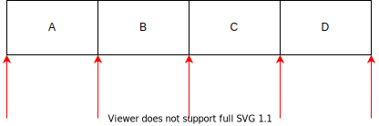
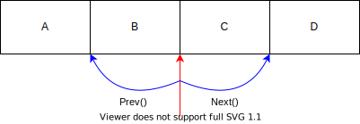
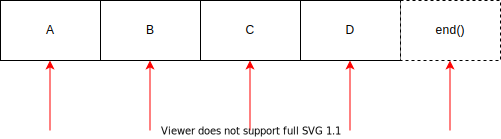

# 容器

## 引言

Qt 提供了一系列基于模板的通用容器类，可以用于存储指定类型的元素。例如，如果你需要一个可动态调整大小的 [QString](../../S/QString/QString.md) 数组，那么你可以使用 [QVector](qvector.html)<[QString](../../S/QString/QString.md)>。

这些类的设计目标是比 STL 容器更轻量，更安全，更易用。如果你不熟悉 STL，或想更有“ Qt 范”，使用这些类代替 STL 会是更好的选择。

这些类都是[隐式共享](../../I/Implicit_Sharing/Implicit_Sharing.md)和[可重入](../../T/Threads_Reentrancy/Threads_Reentrancy.md)的，并且针对几个方面做了优化，一是速度，二是较低的内存占用，三是尽可能少的内联代码，减少生成程序的体积。另外，在所有线程都以只读的方式访问容器时，这些类是[线程安全](../../T/Threads_Reentrancy/Threads_Reentrancy.md)的。

要遍历容器中的元素，你可以使用两种风格迭代器：[Java 风格迭代器](Container_Classes.md#Java-风格迭代器)和 [STL 风格迭代器](Container_Classes.md#STL-风格迭代器)。Java 风格迭代器有更好的易用性和更高级的函数，而 STL 风格迭代器则在效率上会略有优势，并且可以用于 Qt 和 STL 提供的[泛型算法](../../A/QtAlgorithms/QtAlgorithms.md)中。

Qt 还提供了 [foreach](Container_Classes.md#foreach-关键字) 关键字，可以方便地遍历容器。

**注**：从 Qt 5.14 开始，绝大部分容器类已经支持范围构造函数，但需要注意的是 [QMultiMap](../../M/QMultiMap/QMultiMap.md) 是一个例外。我们推荐使用该特性代替各种 from/to 方法。例如：

> 译者注：这里的 from/to 方法指的是 Qt 容器类提供的以 from/to 开头的转换方法，如`QVector::toList`

```cpp
QVector<int> vector{1, 2, 3, 4, 4, 5};
QSet<int> set(vector.begin(), vector.end());
/*
    将会生成一个 QSet，包含元素 1, 2, 4, 5。
*/
```

## 容器类

Qt 提供了以下几种顺序容器：[QList](../../L/QList/QList.md)，[QLinkedList](../../L/QLinkedList/QLinkedList.md)，[QVector](../../V/QVector/QVector.md)，[QStack](../../S/QStack/QStack.md) 和 [QQueue](../../Q/QQueue/QQueue.md)。对于大多数的应用，[QList](../../L/QList/QList.md) 是最适用的。虽然其基于数组实现，但支持在头部和尾部快速插入。如果确实需要一个基于链表的列表，你可以使用 [QLinkedList](../../L/QLinkedList/QLinkedList.md)；如果要求元素以连续内存的形式保存，那么可以使用 [QVector](../../V/QVector/QVector.md)。[QStack ](../../S/QStack/QStack.md)和 [QQueue](../../Q/QQueue/QQueue.md)提供了 LIFO 和 FIFO 语义的支持。

Qt也提供了一系列关联容器：[QMap](../../M/QMap/QMap.md)，[QMultiMap](../../M/QMultiMap/QMultiMap.md)，[QHash](../../H/QHash/QHash.md)，[QMultiHash](../../M/QMultiHash/QMultiHash.md) 和 [QSet](../../S/QSet/QSet.md)。"Multi" 容器可以方便地支持键值一对多的情形。“Hash” 容器提供了快速查找的能力，这是通过使用哈希函数代替对有序集合进行二分查找实现的。

较为特殊的是 [QCache](../../C/QCache/QCache.md) 和 [QContiguousCache](../../C/QContiguousCache/QContiguousCache.md)，这两个类提供了在有限的缓存中快速查找元素的能力。

| 类  | 综述  |
|:---:|:---:|
| [QList](../../L/QList/QList.md)<T>  | 这是目前使用最普遍的容器类，其保存了一个元素类型为`T`的列表，支持通过索引访问。[QList ](../../L/QList/QList.md)内部通过数组实现，以确保基于索引的访问足够快。<br/> 元素可以通过 [QList::append()](../../L/QList/QList.md#void-qlistappendconstqlistt-value) 和 [QList::prepend()](../../L/QList/QList.md#void-qlistprependconst-t-value) 插入到首尾，也可以通过 [QList::insert()](../../L/QList/QList.md#void-qlistinsertint-i-const-t-value) 插入到列表中间，和其他容器类不同的是，[QList ](../../L/QList/QList.md)为生成尽可能少的代码做了高度优化。[QStringList ](../../S/QStringList/QStringList.md)继承于 [QList](../../L/QList/QList.md)<[QString](../../S/QString/QString.md)>。 |
| [QLinkedList](../../L/QLinkedList/QLinkedList.md)<T>)  | 这个类和 [QList](../../L/QList/QList.md) 很像，不同的是这个类使用迭代器进行而不是整形索引对元素进行访问。和 [QList](../../L/QList/QList.md) 相比，其在中间插入大型列表时其性能更优，而且其具有更好的迭代器语义。（在 [QLinkedList](../../L/QLinkedList/QLinkedList.md) 中，指向一个元素的迭代器只要该元素存在，则会一直保持有效，而在 [QList](../../L/QList/QList.md) 的迭代器则可能会在任意的元素插入或删除后失效。） |
| [QVector](../../V/QVector/QVector.md)<T>  | 这个类以数组的形式保存给定类型的元素，在内存中元素彼此相邻。在一个 vector 的头部或中部插入可能会相当慢，因为这可能会导致大量元素需要在内存中移动一个位置。 |
| [QVarLengthArray](../../V/QVarLengthArray/QVarLengthArray.md)<T, Prealloc> | 这个类提供了一个底层的变长数组，在速度极其重要的情况下可以用来代替 [QVector](../../V/QVector/QVector.md) |
| [QStack](../../S/QStack/QStack.md)<T>  | 这个类继承于 [QVector](../../V/QVector/QVector.md)，用于为”后进，先出”（LIFO ）提供便捷的语义支持。其为 [QVector](../../V/QVector/QVector.md) 添加了以下方法：[QVector::push()](../../V/QVector/QVector.md#void-qstackpushconst-t-t)，[pop()](../../V/QVector/QVector.md#t-qstackpop) 和 [top()](../../V/QVector/QVector.md#t-qstacktop) |
| [QQueue](../../Q/QQueue/QQueue.md)<T>  |  这个类继承于 [QVector](../../V/QVector/QVector.md)，用于为”先进，先出”（FIFO ）提供便捷的语义支持。其为 [QVector](../../V/QVector/QVector.md) 添加了以下方法：[QList::enqueue()](../../L/QList/QList.md#void-qqueueenqueueconst-t-t)，[dequeue()](../../L/QList/QList.md#t-qqueuedequeue) 和 [head()](../../L/QList/QList.md#t-qqueuehead)  |
| [QSet](../../S/QSet/QSet.md)<T>  | 这个类提供了一个单值数学集合，支持快速查找  |
| [QMap](../../M/QMap/QMap.md)<Key, T>  | 这个类提供了一个将类型为`Key`的键映射到类型为`T`的值的字典（关联数组）。通常情况下键值是一一对应的。[QMap](../../M/QMap/QMap.md) 根据`Key`进行排序，如果排序无关紧要，使用 [QHash ](../../H/QHash/QHash.md)代替速度会更快 |
| [QMultiMap](../../M/QMultiMap/QMultiMap.md)<Key, T>  | 这个类继承于 [QMap](../../M/QMap/QMap.md)，其为诸如键值一对多的多值映射提供了一个友好的接口 |
| [QHash](../../H/QHash/QHash.md)<Key, T>  | 这个类几乎与 [QMap](../../M/QMap/QMap.md) 有完全一致的 API ，但查找效率会有明显的提高。[QHash ](../../H/QHash/QHash.md)的数据是无序的。 |
| [QMultiHash](../../M/QMultiHash/QMultiHash.md)<T>  | 这个类继承于 [QMap](../../M/QMap/QMap.md)，其为多值映射提供了一个友好的接口 |

容器可以嵌套。例如在键为 [QString](../../S/QString/QString.md)，值为 [QList](../../L/QList/QList.md)<int> 时，完全可以使用 [QMap](../../M/QMap/QMap.md)<[QString](../../S/QString/QString.md), [QList](../../L/QList/QList.md)<int>>。

容器类的定义位于和容器同名的独立头文件中（例如，`<QLinkedList>`）。为了方便，在 `<QtContainerFwd> ` 中对所有容器类进行了前置声明。

保存在各个容器中的值类型可以是任意*可复制数据类型*。为了满足这一要求，该类型必须提供一个复制构造函数和一个赋值运算符。某些操作可能还要求类型支持默认构造函数。对于大多数你想要在容器中保存的类型都满足这些要求，包括基本类型，如 `int`， `double`，指针类型，以及 Qt 数据类型，如 [QString](../../S/QString/QString.md)，[QDate ](../../D/QDate/QDate.md) 和 [QTime](../../T/QTime/QTime.md)，但并不包括 [QObject](../../O/QObject/QObject.md) 及其子类（[QWidget](../../W/QWidget/QWidget.md)，[QDialog](../../D/QDialog/QDialog.md)，[QTimer ](../../T/QTimer/QTimer.md) 等）。如果你尝试实例化一个 [QList](../../L/QList/QList.md)<[QWidget](../../W/QWidget/QWidget.md)>，编译器将会抱怨道 [QWidget](../../W/QWidget/QWidget.md) 的复制构造函数和赋值运算符被禁用了。如果需要在容器中保存这些类型的元素，可以保存其指针，如 [QList](../../L/QList/QList.md)<[QWidget](../../W/QWidget/QWidget.md) *>。

下面是一个满足可赋值数据类型要求的自定义数据类型的例子：

``` cpp
class Employee
{
public:
    Employee() {}
    Employee(const Employee &other);

    Employee &operator=(const Employee &other);

private:
    QString myName;
    QDate myDateOfBirth;
};
```

如果我们没有提供一个复制构造函数或一个赋值运算符，C++ 将会提供一个表现为逐个复制成员的默认实现。在上面的例子中，默认行为就足够了。同样的，如果没有提供默认构造函数，C++ 会提供一个默认构造函数，对成员进行默认构造。尽管没有提供任何的构造函数或赋值运算符，下面的数据类型可以被保存于容器中。

``` cpp
struct Movie
{
    int id;
    QString title;
    QDate releaseDate;
};
```

一些容器对它们所能保存的数据类型有额外的要求。举个例子，[QMap](../../M/QMap/QMap.md)<Key, T> 的键类型 Key 必须提供 **`operator<()`** 方法。这些特殊要求在类的详细描述中有说明。在某些情况下，特定函数会有特定的要求，这在函数的描述中有说明。如果条件不满足，编译器将总是会报错。

Qt容器提供了 `operator<<()` 和 `operator>>()`，因此这些类可以很方便地通过 [QDataStream](../../D/QDataStream/QDataStream.md) 进行读写。这意味着存储在容器中的元素类型也必须支持 `operator<<()` 和 `operator>>()`。支持这一点是很简单的；以下是我们使上面的 `Movie` 结构体支持这一点所做的改动：

``` cpp
QDataStream &operator<<(QDataStream &out, const Movie &movie)
{
    out << (quint32)movie.id << movie.title
        << movie.releaseDate;
    return out;
}

QDataStream &operator>>(QDataStream &in, Movie &movie)
{
    quint32 id;
    QDate date;

    in >> id >> movie.title >> date;
    movie.id = (int)id;
    movie.releaseDate = date;
    return in;
}
```

某些容器类的文档中会提到*默认值*；举个例子，[QVector](../../V/QVector/QVector.md) 会自动使用默认值初始化其元素；[QMap::value()](../../M/QMap/QMap.md#const-t-qmapvalueconst-key-key-const-t-defaultvalue--t-const) 在指定键不存在时会返回一个默认值。对于大部分的值类型，这就是简单地代表通过默认构造函数创建的值（例如对于 [QString](../../S/QString/QString.md) 即空字符串）。但是对于基本类型，如 `int` 和 `double` 和指针类型，C++ 语言并没有规定任何的初始化方式，因此在这些情况下，Qt 容器将会自动将其初始化为0。

# 迭代器类

迭代器提供了一个统一的方式去访问容器中的元素。Qt 容器类提供了两种风格迭代器：Java 风格迭代器和 STL 风格迭代器。两种迭代器均会在容器中的数据被修改或因调用非 `const` 成员函数导致数据从[隐式共享](../../I/Implicit_Sharing/Implicit_Sharing.md)中分离后失效。

## Java 风格迭代器

Java 风格迭代器在 Qt4 中引入，作为标准使用在Qt应用中。和 STL 风格迭代器相比，其易用性更高，代价是性能略低。该风格迭代器 API 以 Java 迭代器类为原型设计。

对于每一个容器类，同时提供了两种数据类型的 Java 风格迭代器：一种支持只读访问，另一种支持读写访问。

|容器|只读迭代器|读写迭代器|
|---|---|---|
|[QList](../../L/QList/QList.md)<T>, [QQueue](../../Q/QQueue/QQueue.md)<T>|[QListIterator](../../L/QListIterator/QListIterator.md)<T>|[QMutableListIterator](../../M/QMutableListIterator/QMutableListIterator.md)<T>|
|[QLinkedList](../../L/QLinkedList/QLinkedList.md)<T>|[QLinkedListIterator](../../L/QLinkedListIterator/QLinkedListIterator.md)<T>|[QMutableLinkedListIterator](../../M/QMutableLinkedListIterator/QMutableLinkedListIterator.md)<T>|
|[QVector](../../V/QVector/QVector.md)<T>, [QStack](../../S/QStack/QStack.md)<T>|[QVectorIterator](../../V/QVectorIterator/QVectorIterator.md)<T>|[QMutableVectorIterator](../../M/QMutableVectorIterator/QMutableVectorIterator.md)<T>|
|[QSet](../../S/QSet/QSet.md)<T>|[QSetIterator](../../S/QSetIterator/QSetIterator.md)<T>|[QMutableSetIterator](../../M/QMutableSetIterator/QMutableSetIterator.md)<T>|
|[QMap](../../M/QMap/QMap.md)<Key, T>, [QMultiMap](../../M/QMultiMap/QMultiMap.md)<Key, T>|[QMapIterator](../../M/QMapIterator/QMapIterator.md)<Key, T>|[QMutableMapIterator](../../M/QMutableMapIterator/QMutableMapIterator.md)<Key, T>|
|[QHash](../../H/QHash/QHash.md)<Key, T>, [QMultiHash](../../M/QMultiHash/QMultiHash.md)<Key, T>|[QHashIterator](../../M/QHashIterator/QHashIterator.md)<Key, T>|[QMutableHashIterator](../../M/QMutableHashIterator/QMutableHashIterator.md)<Key, T>|

在接下来的讨论中，我们将重点关注 [QList](../../L/QList/QList.md) 和 [QMap](../../M/QMap/QMap.md)。[QLinkedList](../../L/QLinkedList/QLinkedList.md)，[QVector](../../V/QVector/QVector.md) 和 [QSet](../../S/QSet/QSet.md) 的迭代器类型和 [QList](../../L/QList/QList.md) 有完全一样的接口，类似的，[QHash](../../H/QHash/QHash.md) 和 [QMap](../../M/QMap/QMap.md) 的迭代器类型的接口也是相同的。

和 STL 风格迭代器（[下一节](Container_Classes.md#STL-风格迭代器)介绍）不同，Java 风格迭代器指向的是元素*间隙*而不是元素*本身*。因此，Java 风格迭代器可以指向容器最前（在第一个元素之前），也可以指向容器最后（在最后一个元素之后），还可以指向两个元素之间。下图用红色箭头展示了一个四个元素的列表容器合法的迭代器位置。



这是一个通过循环迭代有序遍历 [QList](../../L/QList/QList.md)<[QString](../../S/QString/QString.md)> 中的所有元素并打印到终端的常用写法：

``` cpp
QList<QString> list;
list << "A" << "B" << "C" << "D";

QListIterator<QString> i(list);
while (i.hasNext())
    qDebug() << i.next();
```

它的工作原理如下：需要被迭代的 [QList](../../L/QList/QList.md) 对象作为参数传递给 [QListIterator](../../L/QListIterator/QListIterator.md) 的构造函数。此时迭代器位于列表中第一个元素的前面（位于元素“A“之前）。接着我们调用 [hasNext()](../../L/QListIterator/QListIterator.md#bool-qlistiteratorhasnext-const) 检查迭代器之后是否有元素，如果有，我们调用 [next()](../../L/QListIterator/QListIterator.md#const-t-qlistiteratornext) 跳过这个元素。[next()](../../L/QListIterator/QListIterator.md#const-t-qlistiteratornext) 方法会返回其跳过的元素。对于 [QList](../../L/QList/QList.md)<[QString](../../S/QString/QString.md)> 类型，元素的类型为 [QString](../../S/QString/QString.md)。

下列代码展示了如何反向迭代一个 [QList](../../L/QList/QList.md)：

``` cpp
QListIterator<QString> i(list);
i.toBack();
while (i.hasPrevious())
    qDebug() << i.previous();
```

这段代码的逻辑和前向迭代是对称的除了在开始我们调用了 [toBack()](../../L/QListIterator/QListIterator.md#void-qlistiteratortoback) 将迭代器移动到列表中最后一个元素之后。

下图说明了在迭代器上调用 [next()](../../L/QListIterator/QListIterator.md#const-t-qlistiteratornext) 和 [previous()](../../L/QListIterator/QListIterator.md#const-t-qlistiteratorprevious) 产生的效果：



下表总结了[QListIterator](../../L/QListIterator/QListIterator.md)的 API：

|函数|行为|
|---|---|
|[toFront()](../../L/QListIterator/QListIterator.md#void-qlistiteratortoFront)|移动迭代器到列表最前（第一个元素之前）|
|[toBack()](../../L/QListIterator/QListIterator.md#void-qlistiteratortoback)|移动迭代器到列表最后（最后一个元素之后）|
|[hasNext()](../../L/QListIterator/QListIterator.md#bool-qlistiteratorhasnext-const)|如果迭代器不在列表最后则返回 `true`|
|[next()](../../L/QListIterator/QListIterator.md#const-t-qlistiteratornext)|返回下一个元素并将迭代器前移一位|
|[peekNext()](../../L/QListIterator/QListIterator.md#const-t-qlistiteratorpeeknext-const)|不移动迭代器，仅返回迭代器下一个元素|
|[hasPrevious()](../../L/QListIterator/QListIterator.md#bool-qlistiteratorhasprevious-const)|如果迭代器不在列表最前则返回 `true`|
|[previous()](../../L/QListIterator/QListIterator.md#const-t-qlistiteratorprevious)|返回前一个元素并将迭代器后移一位|
|[peekPrevious()](../../L/QListIterator/QListIterator.md#const-t-qlistiteratorpeekprevious-const)|不移动迭代器，仅返回迭代器前一个元素|

[QListIterator ](../../L/QListIterator/QListIterator.md)没有提供任何在迭代列表时插入或删除元素的方法。要实现这一点，你必须使用 [QMutableListIterator](../../M/QMutableListIterator/QMutableListIterator.md)。这是一个使用 [QMutableListIterator](../../M/QMutableListIterator/QMutableListIterator.md) 从 [QList](../../L/QList/QList.md)<int> 中移除所有奇数的例子：

``` cpp
QMutableListIterator<int> i(list);
while (i.hasNext()) {
    if (i.next() % 2 != 0)
        i.remove();
}
```

[next()](../../L/QMutableListIterator/QMutableListIterator.md#const-t-qmutablelistiteratornext) 方法会在每次循环时调用，用于跳过下一个元素。[remove()](../../L/QMutableListIterator/QMutableListIterator.md#void-qmutablelistiteratorremove) 方法用于移除上一个我们跳过的元素。对 [remove()](../../L/QMutableListIterator/QMutableListIterator.md#void-qmutablelistiteratorremove) 方法的调用不会导致迭代器的失效，因此继续使用迭代器是安全的。这种方式在反向迭代时也是没问题的。

``` cpp
QMutableListIterator<int> i(list);
i.toBack();
while (i.hasPrevious()) {
    if (i.previous() % 2 != 0)
        i.remove();
}
```

如果仅仅想修改已存在元素的值，我们可以使用 [setValue()](../../L/QMutableListIterator/QMutableListIterator.md#void-qmutablelistiteratorsetvalueconst-t-value-const)。下列代码中，我们将所有大于 128 的值替换成 128：

``` cpp
QMutableListIterator<int> i(list);
while (i.hasNext()) {
    if (i.next() > 128)
        i.setValue(128);
}
```

和 [remove()](../../L/QMutableListIterator/QMutableListIterator.md#void-qmutablelistiteratorremove) 一样， [setValue()](../../L/QMutableListIterator/QMutableListIterator.md#void-qmutablelistiteratorsetvalueconst-t-value-const) 对我们跳过的最后一个元素进行操作。如果我们向前迭代，这个元素就是迭代器之前的元素；如果我们向后迭代，这个元素就是迭代器之后的元素。

[next()](../../L/QMutableListIterator/QMutableListIterator.md#const-t-qlistiteratornext) 方法返回的是列表中元素的非常量引用，对于简单的操作，我们并不需要调用 [setValue()](../../L/QMutableListIterator/QMutableListIterator.md#void-qmutablelistiteratorsetvalueconst-t-value-const)。

``` cpp
QMutableListIterator<int> i(list);
while (i.hasNext())
    i.next() *= 2;
```

正如上面提到的，[QLinkedList](../../L/QLinkedList/QLinkedList.md)，[QVector](../../V/QVector/QVector.md) 和 [QSet](../../S/QSet/QSet.md) 的迭代器的 API 和 [QList](../../L/QList/QList.md) 的完全一致。接下来我们来看看在某些方面不太一样的 [QMapIterator](../../M/QMapIterator/QMapIterator.md)，因为其用于迭代（键，值）对。

和 [QListIterator](../../L/QListIterator/QListIterator.md) 一样，[QMapIterator](../../M/QMapIterator/QMapIterator.md) 提供了 [toFront()](../../M/QMapIterator/QMapIterator.md#void-qmapiteratortofront), [toBack()](../../M/QMapIterator/QMapIterator.md#void-qmapiteratortoback), [hasNext()](../../M/QMapIterator/QMapIterator.md#bool-qmapiteratorhasnext-const), [next()](../../M/QMapIterator/QMapIterator.md#qmapiteratoritem-qmapiteratornext), [peekNext()](../../M/QMapIterator/QMapIterator.md#qmapiteratoritem-qmapiteratorpeeknext-const), [hasPrevious()](../../M/QMapIterator/QMapIterator.md#bool-qmapiteratorhasprevious-const), [previous()](../../M/QMapIterator/QMapIterator.md#qmapiteratoritem-qmapiteratorprevious) 和 [peekPrevious()](../../M/QMapIterator/QMapIterator.md#qmapiteratoritem-qmapiteratorpeekprevious-const) 方法。我们可以对 [next()](../../M/QMapIterator/QMapIterator.md#qmapiteratoritem-qmapiteratornext), [peekNext()](../../M/QMapIterator/QMapIterator.md#qmapiteratoritem-qmapiteratorpeeknext-const), [previous()](../../M/QMapIterator/QMapIterator.md#qmapiteratoritem-qmapiteratorprevious) 或 [peekPrevious()](../../M/QMapIterator/QMapIterator.md#qmapiteratoritem-qmapiteratorpeekprevious-const) 返回的对象调用 [key()](../../M/QMapIterator/QMapIterator.md#const-key-qmapiteratorkey-const) 和 [value()](../../M/QMapIterator/QMapIterator.md#const-t-qmapiteratorvalue-const) 方法来获得键和值。

下列代码用于移除所有首都名以”`city`“结尾的（首都名，国家名）键值对。

```
QMap<QString, QString> map;
map.insert("Paris", "France");
map.insert("Guatemala City", "Guatemala");
map.insert("Mexico City", "Mexico");
map.insert("Moscow", "Russia");
...

QMutableMapIterator<QString, QString> i(map);
while (i.hasNext()) {
    if (i.next().key().endsWith("City"))
        i.remove();
}
```

[QMapIterator](../../M/QMapIterator/QMapIterator.md) 也提供了 [key()](../../M/QMapIterator/QMapIterator.md#const-key-qmapiteratorkey-const) 和 [value()](../../M/QMapIterator/QMapIterator.md#const-t-qmapiteratorvalue-const) 方法用于操作迭代器及迭代器上一个跳过的元素的键和值。举个例子，下列代码用于将 [QMap](../../M/QMap/QMap.md) 的内容拷贝到 [QHash](../../H/QHash/QHash.md) 中。

``` cpp
QMap<int, QWidget *> map;
QHash<int, QWidget *> hash;

QMapIterator<int, QWidget *> i(map);
while (i.hasNext()) {
    i.next();
    hash.insert(i.key(), i.value());
}
```

如果想要迭代遍历所有值相同的元素，我们可以使用 [findNext()](../../M/QMapIterator/QMapIterator.md#bool-qmapiteratorfindnextconst-t-value) 和 [findPrevious()](../../M/QMapIterator/QMapIterator.md#bool-qmapiteratorfindpreviousconst-t-value)。这里的例子用于移除带有指定值的元素。

``` cpp
QMutableMapIterator<int, QWidget *> i(map);
while (i.findNext(widget))
    i.remove();
```

## STL 风格迭代器

STL 风格迭代器在 Qt 2.0 中被引入，可用于 Qt 和 STL 的[泛型算法](../../A/QtAlgorithms/QtAlgorithms.md)，且为速度做了优化。

对于每一个容器类，同时提供了两种类型的 STL 风格迭代器：一种支持只读访问，另一种支持读写访问。

|容器|只读迭代器|读写迭代器|
|---|---|---|
|[QList](../../L/QList/QList.md)<T>, [QQueue](../../Q/QQueue/QQueue.md)<T>|[QList](../../L/QList/QList.md)<T>::const_iterator|[QList](../../L/QList/QList.md)<T>::iterator|
|[QLinkedList](../../L/QLinkedList/QLinkedList.md)<T>|[QLinkedList](../../L/QLinkedList/QLinkedList.md)<T>::const_iterator|[QLinkedList](../../L/QLinkedList/QLinkedList.md)<T>::iterator|
|[QVector](../../V/QVector/QVector.md)<T>, [QStack](../../S/QStack/QStack.md)<T>|[QVector](../../V/QVector/QVector.md)<T>::const_iterator|[QVector](../../V/QVector/QVector.md)<T>::iterator|
|[QSet](../../S/QSet/QSet.md)<T>|[QSet](../../S/QSet/QSet.md)<T>::const_iterator|[QSet](../../S/QSet/QSet.md)<T>::iterator|
|[QMap](../../M/QMap/QMap.md)<Key, T>, [QMultiMap](../../M/QMultiMap/QMultiMap.md)<Key, T>|[QMap](../../M/QMap/QMap.md)<Key, T>::const_iterator|[QMap](../../M/QMap/QMap.md)<Key, T>::iterator|
|[QHash](../../H/QHash/QHash.md)<Key, T>, [QMultiHash](../../M/QMultiHash/QMultiHash.md)<Key, T>|[QHash](../../H/QHash/QHash.md)<Key, T>::const_iterator|[QHash](../../H/QHash/QHash.md)<Key, T>::iterator|

STL  风格迭代器的 API 以 数组指针为原型设计。例如，`++` 运算符将迭代器向前移动至下一个元素，`*` 运算符返回迭代器指向的元素。实际上，对于 [QVector](../../V/QVector/QVector.md) 和 [QStack](../../S/QStack/QStack.md) 这类元素存储在连续内存的容器来说，[iterator](../../V/QVector/QVector.md#公共成员类型) 类型仅仅是 `T *` 的别名，[const_iterator](../../V/QVector/QVector.md#公共成员类型) 是 `const T *` 的一个别名。

在接下来的讨论中，我们将重点关注 [QList](../../L/QList/QList.md) 和 [QMap](../../M/QMap/QMap.md)。[QLinkedList](../../L/QLinkedList/QLinkedList.md)，[QVector](../../V/QVector/QVector.md) 和 [QSet](../../S/QSet/QSet.md) 的迭代器类型和[QList](../../L/QList/QList.md)有完全一样的接口，类似的，[QHash](../../H/QHash/QHash.md) 和 [QMap](../../M/QMap/QMap.md) 的迭代器类型的接口也是相同的。

这是一个通过循环迭代有序遍历 [QList](../../L/QList/QList.md)<[QString](../../S/QString/QString.md)> 中的所有元素并将它们转成小写的常见写法：

``` cpp
QList<QString> list;
list << "A" << "B" << "C" << "D";

QList<QString>::iterator i;
for (i = list.begin(); i != list.end(); ++i)
    *i = (*i).toLower();
```

和 [Java 风格迭代器](Container_Classes.md#Java-风格迭代器)不同，STL 风格迭代器直接指向元素本身。容器的 [begin()](../../L/QList/QList.md#qlistiterator-qlistbegin) 方法会返回一个指向容器第一个元素的迭代器，[end()](../../L/QList/QList.md#qlistiterator-qlistend) 方法返回的迭代器指向一个虚拟的元素，该元素位于容器最后一个元素的下一个位置。[end()](../../L/QList/QList.md#qlistiterator-qlistend) 标记了一个非法的位置，永远不要对其解引用。其通常被用作循环的结束条件。对于空列表，[begin()](../../L/QList/QList.md#qlistiterator-qlistbegin) 和 [end()](../../L/QList/QList.md#qlistiterator-qlistend) 是相等的，因此我们永远不会执行循环。

下图用红色箭头展示了一个四个元素的列表容器中合法的迭代器位置。



使用 STL 风格迭代器反向遍历可以通过反向迭代器实现

``` cpp
QList<QString> list;
list << "A" << "B" << "C" << "D";

QList<QString>::reverse_iterator i;
for (i = list.rbegin(); i != list.rend(); ++i)
    *i = i->toLower();
}
```

上面的代码片段中，我们通过一元运算符 `*` 来获取保存在指定迭代器位置的元素（此处类型为[QString](../../S/QString/QString.md)），并对其调用了 [QString::toLower()](../../S/QString/QString.md#qstring-qstringtolower-const) 方法。大部分 C++ 编译器也同时支持`i->toLower()`这种写法，但也有一些不支持。

对于只读访问，你可以使用 const_iterator , [constBegin()](../../L/QList/QList.md#qlistconst_iterator-qlistconstbegin-const) 和 [constEnd()](../../L/QList/QList.md#qlistconst_iterator-qlistconstend-const)。例如：

``` cpp
QList<QString>::const_iterator i;
for (i = list.constBegin(); i != list.constEnd(); ++i)
    qDebug() << *i;
```

下表整理了 STL 风格迭代器的 API：


|表达式|行为|
|---|---|
|`*i`|返回当前元素|
|`++i`|向前移动迭代器至下一元素|
|`i += n`|向前移动迭代器 n 次|
|`--i`|向后移动迭代器至前一个元素|
|`i -= n`|向后移动迭代器 n 次|
|`i - j`|返回迭代器 i 和 j 间隔的元素个数|

`++` 和 `--` 运算符既可以作为前缀( `++i`，`--i`) ，也可以作为后缀（`i++`，`i--`）运算符。前缀版本先修改迭代器，然后返回修改后的迭代器的引用。后缀版本在修改迭代器之前先将其复制一份，然后返回副本。在返回值被忽略的表达式中，我们建议使用前缀版本，因为这样会略快一点。

对于非常量迭代器类型，一元运算符 `*` 的返回值可以作为赋值运算符的左侧。

对于 [QMap](../../M/QMap/QMap.md) 和 [QHash](../../H/QHash/QHash.md)，`*` 运算符返回一个元素的值，如果你想获取键，可以调用迭代器的 key() 方法。相对应的，迭代器类型也提供了 value() 用于获取值。下面是一个将 [QMap](../../M/QMap/QMap.md) 中所有元素打印到终端的例子：

``` cpp
QMap<int, int> map;
...
QMap<int, int>::const_iterator i;
for (i = map.constBegin(); i != map.constEnd(); ++i)
    qDebug() << i.key() << ':' << i.value();
```

正是因为[隐式共享](../../I/Implicit_Sharing/Implicit_Sharing.md)，调用一个返回容器的函数的开销不会很大。Qt API 中包含几十个返回值为 [QList](../../L/QList/QList.md) 或 [QStringList](../../S/QStringList/QStringList.md) 的函数（例如 [QSplitter::sizes()](../../S/QSplitter/QSplitter.md#qlistint-qsplittersizes-const) ）。如果需要通过 STL 迭代器遍历这些返回值，你应当总是将返回的容器复制一份然后迭代其副本。例如：

``` cpp
// 正确
const QList<int> sizes = splitter->sizes();
QList<int>::const_iterator i;
for (i = sizes.begin(); i != sizes.end(); ++i)
    ...

// 错误
QList<int>::const_iterator i;
for (i = splitter->sizes().begin();
        i != splitter->sizes().end(); ++i)
    ...
```

如果函数返回的是一个容器的常量或非常量引用，那么是不存在这个问题的。

### 隐式共享迭代器问题

[隐式共享](../../I/Implicit_Sharing/Implicit_Sharing.md)给 STL 风格迭代器带来了另一个后果是：当一个容器的迭代器在使用时你应当避免复制该容器。迭代器指向了一个内部结构，当你复制容器时你需要特别小心的处理迭代器。比如：

``` cpp
QVector<int> a, b;
a.resize(100000); // 创建一个填充0的大数组.

QVector<int>::iterator i = a.begin();
// 迭代器i的错误用法:
b = a;
/*
    现在我们应当小心地使用迭代器`i`，因为 i 指向的是共享的数据。
    如果我们执行 *i = 4 那么我们可能改变共享的实例（两个数组共享）
    这个行为和 STL 容器是不同的。在 Qt 中不要这样做。
*/

a[0] = 5;
/*
    容器 a 现在已经和共享数据脱离，
    即使 i 之前是容器 a 的迭代器，但现在它是作为 b 的迭代器而存在。
    此时 (*i) == 0
*/

b.clear(); // 此时 i 彻底失效

int j = *i; // 未定义行为!
/*
    b 中的数据（即i 指向的）已经被释放，
    在 STL 容器中这是有明确定义的（(*i) == 5），
    但对于 QVector 来说这样做很有可能导致崩溃。
*/
```

> 译注：STL 容器`std::vector`在调用clear()方法后内存不会被释放，因此迭代器并不会立即失效

上面的例子仅仅说明了[QVector](../../V/QVector/QVector.md)的问题，但实际上所有支持隐式共享的容器都存在该问题。

# foreach 关键字


如果仅仅是需要有序迭代容器中的每个元素，你可以使用 Qt 提供的关键字 `foreach`。这个关键字对 C++ 语言的一个特定于 Qt 的补充，其通过预处理器实现。

使用的语法是：`foreach`(*变量*，*容器*) *语句*。下面是一个使用 `foreach` 迭代 [QLinkedList](../../L/QLinkedList/QLinkedList.md)<[QString](../../S/QString/QString.md)> 的例子：

``` cpp
QLinkedList<QString> list;
...
QString str;
foreach (str, list)
    qDebug() << str;
```

和使用迭代器实现相同功能的代码相比，使用`foreach`的代码明显简洁很多。

``` cpp
QLinkedList<QString> list;
...
QLinkedListIterator<QString> i(list);
while (i.hasNext())
    qDebug() << i.next();
```

除了数据类型包含逗号（例如 `QPair<int, int>`）以外，用于迭代的变量可以在 `foreach` 语句中被定义：

``` cpp
QLinkedList<QString> list;
...
foreach (const QString &str, list)
    qDebug() << str;
```

和其他 C++ 循环结构类似，你可以使用大括号将循环体包围，也可以使用 `break` 跳出循环。

``` cpp
QLinkedList<QString> list;
...
foreach (const QString &str, list) {
    if (str.isEmpty())
        break;
    qDebug() << str;
}
```

对于 [QMap](../../M/QMap/QMap.md) 和 [QHash](../../H/QHash/QHash.md)，`foreach` 会自动访问（键，值）对中的值，因此你不需要再调用容器的 values() 方法（这样可能会产生不必要的复制，见后续说明）。如果你想要同时迭代键和值，可以使用迭代器（会更快），或者也可以先获取所有的键，再通过它们获取对应的值：

``` cpp
QMap<QString, int> map;
...
foreach (const QString &str, map.keys())
    qDebug() << str << ':' << map.value(str);
```

对于一个多值映射：

``` cpp
QMultiMap<QString, int> map;
...
foreach (const QString &str, map.uniqueKeys()) {
    foreach (int i, map.values(str))
        qDebug() << str << ':' << i;
}
```

当进入一个 `foreach` 循环，Qt 会自动产生一个容器的副本。如果在迭代过程中修改了容器，并不会影响到这次循环。（如果没有修改容器，副本依然会占用空间，但由于[隐式共享](../../I/Implicit_Sharing/Implicit_Sharing.md)的缘故，复制一个容器是非常快的）。

因为 `foreach` 会产生容器的副本，使用是个变量的非常量引用也是无法修改原容器的，它仅仅会影响副本，这可能不是你想要的。

一个对 Qt 的 `foreach` 循环的替代方案是 C++ 11 或更新标准中引入的基于范围的 `for` 循环。然而，基于范围的 `for` 循环可能强行导致 Qt 容器[脱离](Container_Classes.md#隐式共享)，但 `foreach` 不会。由于使用 `foreach` 总是会复制一份容器，对 STL 容器来说这通常会导致一定的开销。如果不知道用哪个，建议对 Qt 容器选择 `foreach`，而对 STL 容器选择基于范围的 `for` 循环。

除了 `foreach`，Qt 还提供了一个 `forever` 伪关键字用于执行无限循环。

``` cpp
forever {
    ...
}
```

如果你担心命名空间污染，你可以在 `.pro` 文件中添加以下代码以禁用这些宏：

```
CONFIG += no_keywords
```

# 其他类似容器类

Qt 包含了在某些方面和容器相似的其他模板类。这些类没有提供迭代器，也无法在`foreach`关键字中使用。

- [QCache](../../C/QCache/QCache.md)<Key, T> 提供了一个缓存，用于保存与键类型Key相关联的类型T的对象。
- [QContiguousCache](../../C/QContiguousCache/QContiguousCache.md)<T> 提供了一个高效的方式用于缓存那些通常以连续的方式访问的数据。
- [QPair](../../P/QPair/QPair.md)<T1, T2> 保存了一对元素。

其他基于 Qt 的模板容器实现的非模板类型有 [QBitArray](../../B/QBitArray/QBitArray.md),  [QByteArray](../../M/QByteArray/QByteArray.md), [QString](../../S/QString/QString.md) 和 [QStringList](../../S/QStringList/QStringList.md)。


# 算法复杂度

算法复杂度关注的是当容器中元素数量增加时，每个函数有多快（或者说多慢）。例如，无论 [QLinkedList](../../L/QLinkedList/QLinkedList.md) 中的元素数量有多少，在其中间插入一个元素是一个极快的操作，然而在一个具有非常多的元素的 [QVector](../../V/QVector/QVector.md) 中间插入一个元素可能会非常慢，因为半数的元素需要在内存中移动一个位置。

为了描述算法复杂度，我们使用以下基于“大O”符号的术语：

- **常量时间**：O(1)。函数有常量时间复杂度表示无论容器中有多少元素，执行该函数的时间都是相等的。一个例子是 [QLinkedList::insert()](../../L/QLinkedList/QLinkedList.md#qlinkedlistiterator-qlinkedlistinsertqlinkedlistiterator-before-const-t-value))；
- **对数时间**：O(log n)。函数有对数时间复杂度表示该函数的运行时间和容器中元素个数的对数成正比。一个例子是二分查找算法。
- **线性时间**：O(n)。函数有线性时间复杂度表示该函数的运行时间和容器中元素的个数成正比。一个例子是  [QVector::insert()](../../V/QVector/QVector.md#void-qvectorinsertint-i-t-value)。
- **线性对数时间**：O(n log n)。线性对数时间复杂度的函数要比线性复杂度的函数慢，且随着数量的增加差距会越来越大，但依然比平方时间的函数快。
- 平方时间：O(n²)。函数有平方时间复杂度表示该函数的运行时间和容器中元素的个数的平方成正比。


下表总结了 Qt 线性容器类的算法复杂度。

||线性查找|插入|头部追加|尾部追加|
|---|---|---|---|---|
|[QLinkedList](../../L/QLinkedList/QLinkedList.md)<T>|O(n)|O(1)|O(1)|O(1)|
|[QList](../../L/QList/QList.md)<T>|O(1)|O(n)|Amort. O(1)|Amort. O(1)|
|[QVector](../../V/QVector/QVector.md)<T>|O(1)|Amort. O(n)|O(n)|Amort. O(1)|

表中的 “Amort. ” 表示“均摊行为”。例如，“Amort. O(1)” 表示如果仅调用一次该方法，你可能耗费 O(n) 的时间，但如果多次调用（假设调用 n 次），平均下来复杂度将会是 O(1)。

下表总结了 Qt 关联容器的算法复杂度。

||查找键||插入||
|---|---|---|---|---|
||平均|最坏情况|平均|最坏情况|
|[QMap](../../M/QMap/QMap.md)<Key, T>|O(log n)|O(log n)|O(log n)|O(log n)|
|[QMultiMap](../../M/QMultiMap/QMultiMap.md)<Key, T>|O(log n)|O(log n)|O(log n)|O(log n)|
|[QHash](../../H/QHash/QHash.md)<Key, T>|Amort. O(1)|O(n)|Amort. O(1)|O(n)|
|[QSet](../../S/QSet/QSet.md)<Key>|Amort. O(1)|O(n)|Amort. O(1)|O(n)|

对于 [QVector](../../V/QVector/QVector.md)，[QHash](../../H/QHash/QHash.md) 和 [QSet](../../S/QSet/QSet.md)，在尾部追加元素的时间复杂度均摊下来是 O(log n)。但如果在插入元素之前以计划插入的元素个数 n 为参数调用 [QVector::reserve()](../../V/QVector/QVector.md#void-qvectorreserveint-size), [QHash::reserve()](../../H/QHash/QHash.md#void-qhashreserveint-size) 或 [QSet::reserve()](../../S/QSet/QSet.md#void-qsetreserveint-size)，复杂度将会降低至 O(1) 。下一节将会针对该问题做更深入的讨论。

# 增长策略

[QVector](../../V/QVector/QVector.md)<T>，[QString](../../S/QString/QString.md) 和 [QByteArray](../../B/QByteArray/QByteArray.md) 使用连续内存保存元素；[QList](../../L/QList/QList.md)<T> 维护了一个保存所有元素的指针（除非 T 本身是一个指针类型或一个指针大小的基本类型，这种情况下数组中保存的的是元素本身的值）的数组，用于提供基于索引的快速访问；[QHash](../../H/QHash/QHash.md)<Key, T> 内部有一个和大小元素个数成正比的哈希表。为了避免每次在尾部添加元素时重新分配内存，这些类通常会分配比实际需要要多的内存。

考虑下列代码，它用另一个 [QString](../../S/QString/QString.md) 构建出一个新的 [QString](../../S/QString/QString.md)：

``` cpp
QString onlyLetters(const QString &in)
{
    QString out;
    for (int j = 0; j < in.size(); ++j) {
        if (in[j].isLetter())
            out += in[j];
    }
    return out;
}
```

我们通过每次追加一个字符的方式动态的构建了一个字符串。假设我们追加 15000 个字符到这个 [QString](../../S/QString/QString.md) 字符串，接下来会在已分配内存耗尽时触发 [QString](../../S/QString/QString.md) 进行 18 次内存重新分配，分别在已分配量为：4，8，12，16，20，52，116，244，500，1012，2036，4048，6132，8180，10228，12276，14324，16372时。最后，这个 [QString](../../S/QString/QString.md) 占用了 16372 个 Unicode 字符的空间，其中 15000 个被实际使用了。

上面的数字可能有些奇怪，这里是分配的指导原则。

- [QString ](../../S/QString/QString.md)每次分配 4 个字符指导达到 20 个字符。
- 从 20 到 4084 个字符，每次将当前的大小翻倍。更准确的说，是翻倍后再减去 12。（一些内存分配器在分配刚好两倍的内存时性能较差，因为它们需要使用每块内存块中的一些字节用于登记。
- 从 4084 开始，每次分配将会在原来的基础上增加 2048 个字符大小（4096 字节）。这么做的意义是现代操作系统在重新分配内存时并不会复制全部的数据，而仅仅是简单地将物理内存页重新排序,只有第一页和最后一页的数据需要复制。

[QByteArray](../../B/QByteArray/QByteArray.md) 和 [QList](../../L/QList/QList.md)<T> 使用和 [QString](../../S/QString/QString.md) 差不多的增长算法。

当数据类型支持通过 `memcpy()` 在内存中进行移动时（包括基本 C++ 类型，指针类型和 Qt 的[隐式共享](../../I/Implicit_Sharing/Implicit_Sharing.md)类），[QVector](../../V/QVector/QVector.md)<T> 也使用相同的算法。但在数据类型只支持通过复制构造函数和析构函数进行移动时则使用不同的算法。在这种情况下，重新分配的开销会大的多，因此 [QVector](../../V/QVector/QVector.md)<T> 将总是会在空间耗尽时直接申请两倍的内存，以减少重新分配的次数。

[QHash](../../H/QHash/QHash.md)<Key, T> 则是完全不同。[QHash](../../H/QHash/QHash.md) 内部的哈希表每次增长两倍，每次增长时，保存的元素将会重新分配到一个通过 [qHash](../../H/QHash/QHash.md)(*key*) % [QHash::capacity()](../../H/QHash/QHash.md#int-qhashcapacity-const)（簇序号）计算出来的新的簇中。此说明同样适用于 [QSet](../../S/QSet/QSet.md)<T> 和 [QCache](../../C/QCache/QCache.md)<Key, T>。

对于大部分的应用，Qt 提供的增长策略完全可以满足需要。如果你需要进行自定义调整，[QVector](../../V/QVector/QVector.md)<T>, [QHash](../../H/QHash/QHash.md)<Key, T>, [QSet](../../S/QSet/QSet.md)<T>, [QString](../../S/QString/QString.md) 和 [QByteArray](../../B/QByteArray/QByteArray.md) 提供了一个提供了三个方法用于检查和指定保存元素使用的内存量。


- [capacity()](../../S/QString/QString.md#int-qstringcapacity-const) 用于返回已分配内存的元素个数（对于[QHash](../../H/QHash/QHash.md) 和 [QSet](../../S/QSet/QSet.md)，返回的是哈希表的簇的个数）。
- [reserve](../../S/QString/QString.md#void-qstringreserveint-size)(*size*) 用于显式的预分配 *size* 个元素大小的内存。
- [squeeze()](../../S/QString/QString.md#void-qstringsqueeze) 用于释放所有没有用来保存元素的内存。

如果预先知道容器要保存元素的大概数量，可以提前调用 [reserve()](../../S/QString/QString.md#void-qstringreserveint-size) 方法分配内存，最后在填充完容器后，再调用 [squeeze()](../../S/QString/QString.md#void-qstringsqueeze) 来释放多余的预分配内存。
