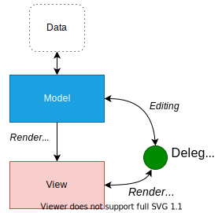

# 模型/视图 编程

## 模型/视图编程简介 
`Qt` 中包含了一系列的项目视图类，他们使用了模型/视图架构来管理数据和显示之间的关系。此架构的功能分离特征给开发人员在自定义项目的呈现形式时带来了很大的灵活性，并提供标准的模型接口，以允许将各种数据源与现有项目视图一起使用。在本文档中，我们对模型/视图进行了简要介绍，概述了所涉及的概念，并描述了项目视图系统的结构特征。介绍了体系结构中的每个组件，并给出了示例，这些示例告诉我们如何使用所提供的类。

## 模型/视图体系架构

模型-视图-控制器（MVC）是源自 `Smalltalk` 的设计模式，在构建用户界面时经常使用。在[《设计模式》]()一书中，`Gamma` 等人写到：
> MVC 由三种对象组成。模型是应用程序对象，视图是其在屏幕上的呈现，控制器定义了用户界面对用户输入的反应方式。 在MVC之前，用户界面设计往往会将这些对象整合在一起。 MVC 使它们解耦以增加灵活性和重用性。

如果将视图和控制器对象组合在一起，就是模型/视图架构。基于将数据的存储方式与向用户呈现的方式分开的原理，模型/视图架构提供了一个更简单的框架。这种分离使得可以在几个不同的视图中显示相同的数据，并实现新的视图类型，而无需更改基础数据结构。为了灵活处理用户输入，我们引入了委托的概念。在此框架中使用委托的好处在于，它允许自定义呈现和编辑数据项的方式。

<div class="table"><table class="generic">
<tbody><tr class="odd" valign="top"><td></td><td><b>模型/视图架构</b><p>模型与数据源通信，为架构中的其他组件提供接口。通信的性质取决于数据源的类型以及模型的实现方式。</p>
<p>视图从模型中获取模型索引； 这些索引是对数据项的引用。 通过向模型提供模型索引，视图可以从数据源检索出数据项。</p>
<p>在标准视图中，委托负责渲染显示数据项。 当编辑项目后，委托将直接通过模型索引与模型进行通信。</p>
</td></tr>
</tbody></table></div>

通常，模型/视图类可以分为上述三个组：模型，视图和委托。这些组件中的每个组件都由抽象类定义，这些抽象类提供了公共接口，并在某些情况下提供了一些功能的默认实现。抽象类应被子类化，以提供其他组件期望的全部功能；当然也可以编写专用组件。

模型、视图和委托之间通过信号槽通信。

- 数据源的数据发生改变时模型将发射信号通知视图。
- 用户交互发生改变时，视图将发射相应的信号。
- 在编辑期间，委托将发射信号来告知模型和视图有关编辑器的状态。

## 模型
所有项目模型均基于 [QAbstractItemModel]() 类。此类定义一个接口，视图和委托使用该接口访问数据。数据本身不必存储在模型中。它可以保存在由单独的类，文件，数据库或某些其他应用程序组件提供的数据结构或存储库中。

有关模型的基本概念在 [“模型类”] (#模型类)部分中介绍。

[QAbstractItemModel]() 提供了一个数据接口，该接口足够灵活，可以处理以表，列表和树的形式表示数据的视图。但是，当为列表和类似表的数据结构实现新模型时，[QAbstractListModel]() 和 [QAbstractTableModel]() 类是更好的选择，因为它们提供了常用功能的默认实现。这些类中的每一个都可以被子类化以提供支持特殊类型的列表和表的模型。

在 [创建新模型](#创建新模型) 部分中讨论了模型子类化的过程。

Qt提供了一些现成的模型，可用于处理数据项：
- [QStringListModel]() 用于存储一列简单的 [QString]() 类型的项目。
- [QStandardItemModel]() 用于管理更复杂的树形结构项目，每个项目可以包含任意数据。
- [QFileSystemModel]() 提供有关本地归档系统中文件和目录的信息。
- [QSqlQueryModel]()，[QSqlTableModel]() 和 [QSqlRelationalTableModel]() 用于在使用模型/视图架构时访问数据库。

如果这些标准模型不满足您的要求，则可以将 [QAbstractItemModel]()，[QAbstractListModel]() 或 [QAbstractTableModel]() 子类化以创建您自己的自定义模型。

## 视图
Qt 提供了针对各种视图的完整实现：[QListView]() 用于显示项目列表，[QTableView]() 用于显示表结构模型的数据，[QTreeView]() 在一个分层次的结构列表中显示数据项。这些类均基于 [QAbstractItemView]() 抽象基类。尽管这些类都是已经实现好的，但也可以将它们子类化以提供满足我们需求的自定义视图。

所有可用的视图可在 [视图类](#视图类) 部分中进行查阅。

## 委托

[QAbstractItemDelegate]() 是模型/视图框架中委托的抽象基类。默认委托实现由 [QStyledItemDelegate]() 提供， Qt 中的标准视图都将其作为默认委托。但是，[QStyledItemDelegate]() 和 [QItemDelegate]() 是绘制和为视图中的项目提供编辑器的独立替代方法。它们之间的区别在于 [QStyledItemDelegate]() 使用当前样式来绘制其项目。因此，在实现自定义委托或使用 Qt 样式表时，建议将 [QStyledItemDelegate]() 用作基类。

委托在 [“委托类”](#委托类) 部分中进行了描述。

## 排序

在模型/视图架构中，有两种方法可以进行排序；选择哪种方法取决于底层使用的模型。

如果您的模型是可排序的，即重新实现 [QAbstractItemModel::sort()]() 函数，则 [QTableView]() 和 [QTreeView]() 都提供了API，可让您以编程方式对模型数据进行排序。 另外，通过将 [QHeaderView::sortIndicatorChanged()]() 信号连接到 [ QTableView::sortByColumn() ]() 槽函数或 [QTreeView::sortByColumn()]() 槽函数，可以启用交互式排序（即允许用户通过单击视图的标题对数据进行排序））。

如果您的模型没有所需的接口，或者如果您想使用列表视图来呈现数据，则另一种方法是在视图呈现数据之前，使用委托模型来转换模型的结构。 有关 [代理模型](#代理模型) 的部分将对此进行详细介绍。

## 便捷类

从标准视图类派生出了许多便捷类，用于 Qt 中基于项目的项目视图类和表类，它们不打算被子类化。

比如 [QListWidget]()，[QTreeWidget]() 和 [QTableWidget]()。

这些类的灵活性不如视图类，并且不能与任意模型一起使用。我们建议您使用模型/视图方法来处理项目视图中的数据，除非您强烈需要一组基于项目的类。

如果希望在使用基于项目的接口的同时利用模型/视图方法提供的功能，请考虑将视图类（例如 [QListView]()，[QTableView]() 和 [QTreeView]() ）与 [QStandardItemModel]() 一起使用。


# 使用模型和视图

以下各节说明如何在 Qt 中使用模型/视图模型。每个部分都包含一个示例，紧接着是展示如何创建新组件。

## Qt 中包含的两个模型
Qt 提供的两个标准模型是 [QStandardItemModel]() 和 [QFileSystemModel]()。[QStandardItemModel]() 是一个多功能模型，可用于表示列表，表和树视图所需的各种不同的数据结构。该模型还保存数据项。[QFileSystemModel]() 是用于维护有关目录内容的信息的模型，它本身不保存任何数据项，而仅表示本地文件系统上的文件和目录。

[QFileSystemModel]() 提供了一个现成的模型用来测试使用，并且可以通过简单的配置就可以使用现有的数据。使用该模型，我们可以展示如何创建一个可用于现成视图的模型，并探索如何使用模型索引来操控数据。

# 通过现有模型使用视图

[QListView]() 和 [QTreeView]() 类是最适合与 [QFileSystemModel]()一起使用的视图。下面提供的示例是分别在树形视图和列表视图中显示相同的目录内容。这些视图共享用户的选择，以便在两个视图中突出显示所选的项目。


我们使用了现成的模型 [QFileSystemModel]()，并创建了一些视图来显示目录的内容。展示了使用模型的最简单方法。 该模型的构建和使用是在单个 `main()` 函数中执行的：

```cpp
int main(int argc, char *argv[])
{
    QApplication app(argc, argv);
    QSplitter *splitter = new QSplitter;

    QFileSystemModel *model = new QFileSystemModel;
    model->setRootPath(QDir::currentPath());
```

该模型被设置为使用来自特定文件系统的数据。调用 [setRootPath()]() 将告诉模型文件系统上的哪个驱动器会暴露给视图。

我们使用同一个模型创建两个不同的视图，来查看模型中的项目呈现出来的效果：

```cpp
QTreeView *tree = new QTreeView(splitter);
tree->setModel(model);
tree->setRootIndex(model->index(QDir::currentPath()));

QListView *list = new QListView(splitter);
list->setModel(model);
list->setRootIndex(model->index(QDir::currentPath()));
```

视图的构造方法与其他部件一样。设置视图来显示模型中的项目仅需使用目录模型作为参数来调用视图的 [setModel()]() 函数即可。我们通过在每个视图上调用 [setRootIndex()]() 函数来过滤模型提供的数据，并从文件系统模型中为当前目录传递合适的模型索引。

这种情况下对于 [QFileSystemModel]() 来说只能通过传递一个目录参数来使用 `index()` 函数获取索引，模型索引在 [模型类](#模型类) 部分中讨论。

该函数的其余部分是在分裂器部件中显示视图，并运行应用程序的事件循环：

```cpp
    splitter->setWindowTitle("Two views onto the same file system model");
    splitter->show();
    return app.exec();
}
```

在上面的示例中，我们忽略了如何处理项目选择。 在 [处理项目视图中的选择项](#处理项目视图中的选择项) 部分中将更详细地介绍。

# 模型类

在学习如何处理选择项之前，理解模型/视图框架中使用的概念是很有用的。

## 基本概念

在模型/视图体系结构中，模型提供了视图和委托用来访问数据的标准接口。在 `Qt` 中，标准接口由 [QAbstractItemModel]() 类定义。无论数据项如何存储在任何基础数据结构中，[QAbstractItemModel]() 的所有子类都将数据表示为一个有层次的包含项表的结构。视图使用此约定来访问模型中的数据项，但是它们向用户呈现此信息的方式不受限制。

 

模型通过信号槽机制通知所有附加视图有关数据更改的信息。

本节描述一些基本概念，这些概念对于其他组件通过模型类访问数据项的方式至关重要。 稍后的部分将讨论更高级的概念。

## 模型索引

为了确保数据的表示方式与访问方式分开，引入了模型索引的概念。通过模型获得的每条信息都由模型索引表示。视图和委托使用这些索引来请求要显示的数据项。

所以，只有模型需要知道如何获取数据和定义数据类型。模型索引包含一个指向创建它们的模型的指针，以免在使用多个模型时造成混淆。

```cpp
QAbstractItemModel *model = index.model();
```

模型索引提供了一个对信息的临时的引用，可用于通过模型检索或修改数据。由于模型可能会不时重组其内部结构，因此模型索引可能会变得无效，*不应进行存储*。如果需要长期使用一条信息，则必须创建一个*持久的模型索引*。这为模型保持最新状态提供了参考。临时模型索引由 [QModelIndex]() 类提供，而持久模型索引由 [QPersistentModelIndex]() 类提供。

要获得与数据项相对应的模型索引，必须为模型指定三个属性：行号，列号和父项的模型索引。以下各节将详细描述和解释这些属性。

## 行和列

在基本的形式中，可以将模型作为一个简单的表进行访问，项目按行和列的编号位于其中。*这并不意味着底层数据存储在数组结构中*；行号和列号的使用仅仅是组件之间相互通信的约定。我们可以通过在模型中指定给定项目的行号和列号来检索有关任何给定项目的信息，我们接收到的是代表该项目的索引：

```cpp
QModelIndex index = model->index(row, column, ...);
```

为简单的单层数据结构（例如列表和表）提供接口的模型不需要提供任何其他信息，但是，如上述代码所示，在获取模型索引时，我们需要提供更多信息。

<div class="table">
<table class="generic">
<tbody>
<tr class="odd" valign="top"><td></td>
<td>
<b>行和列</b>
<p>
该图显示了基本表模型的表示形式，其中每个项目都由一对行号和列号定位。通过将相关的行号和列号传递给模型，我们获得了一个引用数据项的模型索引。

```cpp
QModelIndex indexA = model->index(0, 0, QModelIndex());
QModelIndex indexB = model->index(1, 1, QModelIndex());
QModelIndex indexC = model->index(2, 1, QModelIndex());
```
始终通过用 `QModelIndex()` 指定为其父项来引用模型中的顶级项目。下一节将对此进行讨论。

</p>
</p>
</td>
</tr>
</tbody>
</table>
</div>

## 项的父项

当在表视图或列表视图中使用数据时，模型提供的类似于表的接口就非常合适。行号和列号系统准确地映射到视图显示项目的方式上。但是，诸如树状视图的结构对于模型项目的操作要求模型提供更灵活的接口。每个项目也可以是另一个项目表的父项，就像树状视图中的顶级项目可以包含另一个项目列表一样。

当请求模型项的索引时，我们必须提供有关该项父项的一些信息。在模型之外，引用项目的唯一方法是通过模型索引，因此还必须提供父模型索引：

```cpp
QModelIndex index = model->index(row, column, parent);
```

<div class="table">
<table class="generic">
<tbody>
<tr class="odd" valign="top"><td></td>
<td>
<b>父项、行和列</b>
<p>
该图展示了树模型的表示形式，其中每一项均由父项、行号和列号检索出来。

“A”和“C”项在模型中为同级顶级：

```cpp
QModelIndex indexA = model->index(0, 0, QModelIndex());
QModelIndex indexC = model->index(2, 1, QModelIndex());
```

“A”项有多个子代。使用以下代码获得“B”项的模型索引：

```cpp
QModelIndex indexB = model->index(1, 0, indexA);
```

</p>
</p>
</td>
</tr>
</tbody>
</table>
</div>

## 项角色

模型中的项可以为其他组件扮演各种不同的*角色*，从而可以为不同的数据提供不同的方案。 例如，[Qt::DisplayRole]() 用于访问可以在视图中显示为文本的字符串。通常，项包含许多不同角色的数据，标准角色由 [Qt::ItemDataRole]() 定义。

我们可以通过向模型传递与该项相对应的模型索引，并指定一个角色来获取所需的数据类型，从而获得我们想要的数据：

```cpp
QVariant value = model->data(index, role);
```

<div class="table">
<table class="generic">
<tbody>
<tr class="odd" valign="top"><td></td>
<td>
<b>项角色</b>
<p>
项角色向模型指示要引用的数据类型。视图可以以不同的方式显示角色，因此为每个角色提供适当的信息很重要。

[创建新模型](#创建新模型) 部分将更详细地介绍角色的某些特定用法。

</p>
</p>
</td>
</tr>
</tbody>
</table>
</div>

项标准角色 [Qt::ItemDataRole]() 涵盖了大部分常用的项角色。通过为每个角色提供适当的项目数据，模型可以向视图和委托提示如何将项呈现给用户。不同类型的视图可以根据自身需要解释或忽略此信息。也可以为特定目的定义其他角色。

## 摘要
- 模型索引以独立于任何底层数据结构的方式提供给视图和委托有关模型所提供项的位置的信息。
- 项通过其行号和列号以及其父项的模型索引检索出来。
- 模型索引是由模型根据其他组件（例如视图和委托）的请求构造出来的。
- 如果使用 [index()]() 请求索引时为父项指定了有效的模型索引，则返回的索引将引用模型中该父项之下的项。获得的索引指向该项目的子项。
- 如果使用 [index()]() 请求索引时为父项指定了无效的模型索引，则返回的索引引用模型中的顶级项。
- [项角色](#项角色) 用来区分与项关联的不同类型的数据。

## 使用模型索引

为了演示如何使用模型索引从模型中检索数据，我们设置了一个没有视图的 [QFileSystemModel]()，并在部件中显示文件和目录的名称。尽管这没有展示使用模型的正常方法，但是它说明了在处理模型索引时模型使用的规则。

[QFileSystemModel]() 加载是异步的，以最大程度地减少系统资源的使用。在处理此模型时，我们必须考虑到这一点。

我们通过以下方式构造文件系统模型：

```cpp
QFileSystemModel *model = new QFileSystemModel;
connect(model, &QFileSystemModel::directoryLoaded, [model](const QString &directory) {
    QModelIndex parentIndex = model->index(directory);
    int numRows = model->rowCount(parentIndex);
});
model->setRootPath(QDir::currentPath);
```

在这种情况下，我们首先设置默认的 [QFileSystemModel]() 。我们将其连接到 `lambda`，在其中我们将使用该模型提供的 `index()` 的特定实现来获取父索引。 在 `lambda` 中，我们使用 [rowCount()]() 函数计算模型中的行数。最后，我们设 [QFileSystemModel]() 的根路径，以便它开始加载数据并触发 `lambda` 。

为简单起见，我们只处理模型第一栏中的项目。我们依次检查每一行，获取每一行中第一项的模型索引，然后读取模型中为该项存储的数据。

```cpp
for (int row = 0; row < numRows; ++row) {
    QModelIndex index = model->index(row, 0, parentIndex);
```

为了获得模型索引，我们指定行号，列号（第一列为零），并为所需的所有项的父项指定适当的模型索引。使用模型的 [data()]() 函数检索存储在每个项目中的文本。我们指定模型索引和 [DisplayRole]() 获取字符串形式的项数据。

```cpp
QString text = model->data(index, Qt::DisplayRole).toString();
    // Display the text in a widget.

}
```
以上示例演示了从模型中检索数据的基本用法：
- 模型的大小范围可以使用 [rowCount()]() 和 [columnCount]() 获取到。这些函数通常需要指定一个父项模型索引。
- 模型索引用于访问模型中的数据项。指定一个项需要行、列和父项的模型索引。
- 通过 `QModelIndex()` 指定一个空的父项的索引来访问模型中的顶层项。
- 项包含不同角色的数据。要获得特定角色的数据，必须同时向模型提供模型索引和角色。

## 拓展阅读

可以通过提供了标准接口的 [QAbstractItemModel]() 类来创建新模型。在 [创建新模型](#创建导航和模型索引) 部分，我们将通过创建一个方便可用的保存字符串列表的模型来展示这一点。

# 视图类

## 概念

在模型/视图架构中，视图从模型中获取数据项并将其呈现给用户。呈现数据的方式不必类似于模型提供数据的方式，而可以与用于存储数据项的底层数据结构*完全不同*。

通过使用 [QAbstractItemModel]() 提供的标准模型接口，[QAbstractItemView]() 提供的标准视图接口以及使用表示数据项的模型索引来实现内容和表示的分离。视图通常管理从模型获得的数据的整体布局。它们可以自己呈现单个数据项，或使用委托来处理渲染和编辑功能。

除了显示数据外，视图还处理项目之间的导航以及项目选择。这些视图还实现了基本的用户界面功能，例如上下文菜单和拖放功能。视图可以提供项目的默认编辑功能，也可以与 [委托](#委托类) 一起使用以提供自定义编辑器。

可以在没有模型的情况下构造视图，但是必须提供模型才能显示有用的信息。视图通过使用 [选择项](#处理项目视图中的选择项) 来跟踪用户选择的项目，这些选择项可以被每个视图单独维护，或者在多个视图之间共享。

一些视图，例如 [QTableView]() 和 [QTreeView]()，需要显示表头和项目。这些由视图类 [QHeaderView]() 实现。表头通常与包含它们的视图访问的是同一个模型。他们使用 [QAbstractItemModel::headerData()]() 函数从模型中检索数据，并且通常以标签形式显示表头信息。可以继承 [QHeaderView]() 类实现新的标头，以为视图提供更专业的标签。

## 使用现有视图

Qt提供了三种现成的视图类，它们以大多数用户熟悉的方式显示来自模型的数据。 [QListView]() 可以将模型中的项目显示为简单列表或经典图标视图的形式。[QTreeView]() 将模型中的项目显示为具有层次结构的列表，从而以紧凑的方式表示深层嵌套的结构。[QTableView]() 以表格的形式显示来自模型的项目，非常类似于电子表格应用程序的布局。


上面显示的标准视图的默认行为对于大多数应用程序来说应该足够了。它们提供了基本的编辑功能，并且可以进行定制以满足更专业的用户界面的需求。

### 使用模型

我们以创建的字符串列表模型为例，设置一些数据，并构造一个视图以显示模型的内容。所有这些都可以在一个函数中执行：

```cpp
int main(int argc, char *argv[])
{
    QApplication app(argc, argv);

    // Unindented for quoting purposes:
    QStringList numbers;
    numbers << "One" << "Two" << "Three" << "Four" << "Five";

    QAbstractItemModel *model = new StringListModel(numbers);
```

请注意，`StringListModel` 被声明为 [QAbstractItemModel]()。这使我们能够使用模型的抽象接口，并确保即使我们将字符串列表模型替换为其他模型，代码仍然可以正常工作。

[QListView]() 提供的列表视图足以在字符串列表模型中显示项目。我们构造视图，并使用以下代码行建立模型：

```cpp
    QListView *view = new QListView;
    view->setModel(model);
```

该视图以正常方式显示：

```cpp
    view->show();
    return app.exec();
}
```

视图渲染显示模型中的内容，并通过模型的接口访问数据。当用户尝试编辑项目时，视图使用默认委托提供一个默认的编辑器部件。


上图显示了 [QListView]() 如何显示字符串列表模型中的数据。由于模型是可编辑的，因此视图允许使用默认委托来编辑列表中的每个项目。

### 多个视图共用一个模型

为同一模型提供多个视图仅是为每个视图设置相同模型的问题。在下面的代码中，我们创建了两个表视图，每个表视图都使用了创建的简单的表模型：

```cpp
    QTableView *firstTableView = new QTableView;
    QTableView *secondTableView = new QTableView;

    firstTableView->setModel(model);
    secondTableView->setModel(model);
```

在模型/视图架构中使用信号槽可以将对模型的更改传递给到所有设置该模型的视图，从而确保我们始终可以访问相同的数据，而不管所使用的视图如何。


上面的两张图片显示了两种不同的视图使用同一个模型的情况，每一个视图都包含一些被选中的项。尽管在视图中始终显示来自模型的数据，但每个视图都维护一个自己内部的选择模型。在某些情况下这可能很有用，但是对于许多应用程序来说，需要一个共享的选择模型。

## 处理项目选择

[QItemSelectionModel]() 类提供了用于处理视图中项目选择的机制。默认情况下，所有标准视图都构建自己的选择模型，并以常规方式与其交互。可以通过 [selectionModel()]() 函数获得视图使用的选择模型，并可以使用 [setSelectionModel]() 指定替换选择模型。当我们想在同一模型数据上提供多个一致的视图时，控制视图使用的选择模型的功能非常有用。

通常，除非要对模型或视图进行子类化，否则无需直接操作选择的内容。但是，如果需要，可以访问选择模型的接口，这在 [处理项目视图中的选择项](#处理项目视图中的选择项) 部分中进行了探讨。

### 在视图之间共享选择

尽管默认情况下视图类提供它们自己的选择模型很方便，但是当我们在同一个模型上使用多个视图时，通常希望在所有视图中都同时显示模型的数据和用户的选择。由于视图类允许替换其内部选择模型，因此我们可以使用以下代码在视图之间实现统一选择：

```cpp
    secondTableView->setSelectionModel(firstTableView->selectionModel());
```

为第二个视图提供了第一个视图的选择模型。现在，两个视图都在相同的选择模型上运行，从而使数据和所选项目保持同步。


在上面显示的示例中，使用了两个相同类型的视图来显示相同模型的数据。但是，如果使用两种不同类型的视图，则在每个视图中所选项目的表现方式可能会非常不同。例如，表视图中的连续选择在树状图视图中就表现为一系列分散的高亮项的片段。

## 委托类

### 概念

与“模型-视图-控制器”模式不同，模型/视图设计不包括用于管理与用户交互的完全独立的组件。通常，视图负责将模型数据呈现给用户，并负责处理用户输入。为了使获取此输入的方式具有一定的灵活性，交互由委托执行。这些组件提供输入功能，还负责在某些视图中渲染单个项目。在 [QAbstractItemDelegate]() 类中定义了用于控制委托的标准接口。

委托应该能够通过实现 [paint()]() 和 [sizeHint()]() 函数来呈现它们自己的内容。但是，基于简单窗口部件的委托可以继承　[QStyledItemDelegate]() 而不是 [QAbstractItemDelegate]() 类，并使用这些函数的默认实现。

委托编辑器可以通过使用部件来管理编辑过程或直接处理事件来实现。本节稍后将介绍第一种方法，在 [SpinBox委托]() 示例中也有相应的实现。

[Pixelator]() 示例显示了如何创建自定义委托来专门渲染一个表视图。

### 使用现有的委托

`Qt` 提供的标准视图使用 [QStyledItemDelegate]() 实例提供编辑功能。委托接口的默认实现以通用的样式为每个标准视图 [QListView]()，[QTableView]() 和 [QTreeView]() 呈现项目。

所有标准角色均由标准视图使用的默认委托处理。[QStyledItemDelegate]() 文档中描述了这些解释的方式。

视图使用的委托由 [itemDelegate()]() 函数返回。[setItemDelegate()]() 函数允许为标准视图设置自定义委托，并且在为自定义视图设置委托时必须使用此函数。

### 一个简单的委托

此处实现的委托使用 [QSpinBox]() 提供编辑功能，并且主要用于显示整数的模型。因此我们建立了一个基于整数的自定义的表模型，但是由于自定义委托控制数据输入，因此我们可以轻松地使用 [QStandardItemModel]()。 我们构造一个表视图来显示模型的内容，使用自定义委托进行编辑。


我们从 [QStyledItemDelegate]() 继承实现自定义委托，因为我们不想编写自定义显示函数。但是，我们仍然必须提供函数来管理编辑器部件：

```cpp
class SpinBoxDelegate : public QStyledItemDelegate
{
    Q_OBJECT

public:
    SpinBoxDelegate(QObject *parent = nullptr);

    QWidget *createEditor(QWidget *parent, const QStyleOptionViewItem &option,
                          const QModelIndex &index) const override;

    void setEditorData(QWidget *editor, const QModelIndex &index) const override;
    void setModelData(QWidget *editor, QAbstractItemModel *model,
                      const QModelIndex &index) const override;

    void updateEditorGeometry(QWidget *editor, const QStyleOptionViewItem &option,
                              const QModelIndex &index) const override;
};
```

注意，在构造委托时，不会设置任何编辑器部件。我们仅在需要时构造一个编辑器部件。

### 提供一个编辑器

在此示例中，当表视图需要提供编辑器时，要求委托提供适合于项目修改的编辑器部件。[createEditor()]() 函数可以让委托能够设置合适的部件作为编辑器：

```cpp
QWidget *SpinBoxDelegate::createEditor(QWidget *parent,
                                       const QStyleOptionViewItem &/* option */,
                                       const QModelIndex &/* index */) const
{
    QSpinBox *editor = new QSpinBox(parent);
    editor->setFrame(false);
    editor->setMinimum(0);
    editor->setMaximum(100);

    return editor;
}
```

注意，我们不需要保留指向编辑器部件的指针，因为当视图不再需要该编辑器时，负责将其销毁。

我们在编辑器上安装了委托的默认事件过滤器，以确保它提供用户期望的标准编辑快捷方式。可以将其他快捷方式添加到编辑器中，以允许更复杂的行为。这些内容将在 [编辑提示](#编辑提示) 部分中进行讨论。

视图可通过调用稍后我们定义的函数来确保正确设置编辑器的数据和几何形状。我们可以根据视图提供的模型索引创建不同的编辑器。例如，如果我们有一列整数和一列字符串，则可以返回 `QSpinBox` 或 `QLineEdit`，具体取决于正在编辑的列。

委托必须提供将模型数据复制到编辑器中的功能。在此示例中，我们读取了 [显示角色]() 中存储的数据，并在 `spin box` 中相应地设置了值。

```cpp
void SpinBoxDelegate::setEditorData(QWidget *editor,
                                    const QModelIndex &index) const
{
    int value = index.model()->data(index, Qt::EditRole).toInt();

    QSpinBox *spinBox = static_cast<QSpinBox*>(editor);
    spinBox->setValue(value);
}
```

在此示例中，我们知道编辑器部件是一个 `spin box`，但是我们可以为模型中的不同类型的数据提供不同的编辑器，在这种情况下，我们需要在访问其成员函数之前将部件转换为适当的类型。

### 提交数据到模型

当用户完成在 `spin box` 中的值编辑后，视图通过调用 [setModelData()]() 函数要求委托将已编辑的值存储在模型中。

```cpp
void SpinBoxDelegate::setModelData(QWidget *editor, QAbstractItemModel *model,
                                   const QModelIndex &index) const
{
    QSpinBox *spinBox = static_cast<QSpinBox*>(editor);
    spinBox->interpretText();
    int value = spinBox->value();

    model->setData(index, value, Qt::EditRole);
}
```

由于视图管理委托的编辑器部件，因此我们只需要使用提供的编辑器的内容来更新模型。在这种情况下，我们确保 ` spin box ` 是最新的，并使用指定的索引更新模型数据。

标准 [QStyledItemDelegate]() 类在完成编辑后通过发出 [closeEditor()]() 信号通知视图。该视图确保编辑器部件已关闭并销毁。在此示例中，我们仅提供简单的编辑工具，因此我们永远不需要发出此信号。

数据的所有操作都是通过 [QAbstractItemModel]() 提供的接口执行的。这使委托在很大程度上不受其处理的数据类型的影响，但是必须做出一些假设才能使用某些类型的编辑器部件。在此示例中，我们假定模型始终包含整数值，但是我们仍然可以将此委托与其他类型的模型一起使用，因为 [QVariant]() 为意外的数据提供了合理的默认值。

### 更新编辑器的几何图形

委托负责管理编辑器的几何图形。创建编辑器时以及更改项目的大小或在视图中的位置时，必须设置几何形状。幸运的是，视图在 [视图选项]() 对象内提供了所有必要的几何信息。

```cpp
void SpinBoxDelegate::updateEditorGeometry(QWidget *editor,
                                           const QStyleOptionViewItem &option,
                                           const QModelIndex &/* index */) const
{
    editor->setGeometry(option.rect);
}
```

在这种情况下，我们仅使用了视图选项提供的项的矩形几何信息。具有多个元素的项目的委托将不会直接使用项目矩形几何信息。它将编辑器放置在相对于其它项的位置。

### 编辑提示
编辑后，委托应向其他组件提供有关编辑过程结果的提示，并提供有助于后续任何编辑操作的提示。这是通过发出一个带有适当提示的 [closeEditor()]() 信号来实现的。 默认情况下，这是由我们在构造 `spin box` 时安装的 [QStyledItemDelegate]() 事件过滤器来处理的。

`spin box` 的行为可以进行调整，以使其更加用户友好。在 [QStyledItemDelegate]() 提供的默认事件过滤器中，如果用户单击 `Return` 确认在 `spin box` 中的选择，则委托将值提交给模型并关闭 `spin box` 。我们可以通过在 `spin box` 上安装我们自己的事件过滤器来更改此行为，并提供我们需要的编辑提示。例如，我们可以发出带有 [EditNextItem]() 提示的 [closeEditor()]() 信号来自动开始编辑视图中的下一个项目。

另一种不需要使用事件过滤器的方法是提供我们自己的编辑器部件，为方便起见，可能将 [QSpinBox]() 子类化。这种替代方法可以使我们更好地控制编辑器部件的行为，而无需编写其他代码。如果需要自定义标准 `Qt` 编辑器窗口部件的行为，简单常用的方法就是在委托中安装事件过滤器。

委托不必发出这些提示，但是为了应用程序的更加可用，我们需要发出提示以支持常见编辑操作。

# 处理项目视图中的选择项

## 概念

项目视图类中使用的选择模型对基于模型/视图架构的选择提供了的一般描述。尽管用于提供选择的标准视图足以处理提供的项目视图，但是选择模型允许创建专门的选择模型，以适合项目模型和视图的要求。

视图中被选择的项目的信息存储在一个 [QItemSelectionModel]() 类的实例中。它负责维护单个模型中项目的模型索引，并且独立于任何视图。由于模型上可以有很多视图，因此可以在视图之间共享选择，从而允许应用程序以一致的方式显示多个视图。

选择由*选择范围*指定。只需记录每一个选择范围开始和结束的模型索引即可，这些有效地维护了有关大量项目选择的信息。非连续的选择可以使用多个选择范围来描述。

 选择可以看作是在选择模型中保存的一个模型索引集合，最近的项目选择被称为*当前选择*。即使在应用了某些类型的选择命令后，也可以修改此选择的效果。这些将在本节后面讨论。

### 当前视图和被选择的项目
 
 视图中总有一个当前项目和一个被选择的项目，两者时两个独立的状态。在同一时间，一个项目既可以是当前项目也同时可以是被选择的项目。视图图则确保总是有一个项目作为当前项目来实现键盘导航。

 下表显示了当前项目和被选择的项目的区别。

 |当前项目|被选择的项目|
 |-------|-------|
 |只能有一个当前项目|可以有多个被选择的项目|
 |使用键盘导航键或者鼠标按键可以改变当前项目|项目是否处于被选择状态，取决于用户交互时当前几个预定义好的模式，比如单项选择、多重选择等|
 |如果按下 `F2` 键或者双击都可以编辑当前项目（前提是允许编辑）|当前项目可以指定一个范围来一起选择或者取消选择（或者两种混用）|
 |当前项目会显示焦点矩形|被选择的项目会使用选择矩形来表示|

 当操作选择时，可以将 [QItemSelectionModel]() 看作是一个项目模型中所有项目的选择状态的一个记录。一旦设置了一个选择模型，所有的集合项目都可以被选择、取消选择或者切换选择状态，而不需要知道哪一个项目已经被选择了。所有被选择的项目的索引都可以被随时进行检索，其他的组件也可以通过信号槽机制来获取选择模型的改变信息。

 ## 使用选择模型

 标准的视图类中提供了默认的选择模型，可以在大多数的应用中直接使用。属于一个视图的选择模型可以使用这个视图的 [ setSelectionModel()]() 获得，而且还可以在多个视图之间使用 [ setSelectionModel()]() 函数来共享该选择模型，所以一般是不需要重新构建一个选择模型的。

 通过指定一个模型和一对指向 [QItemSelection]() 的模型索引来创建选择。使用索引来引用给定模型中的项目，并将它们解释为所选项目块中的左上和右下项目。要将选择应用于模型中的项目，需要将选择提交给选择模型。这可以通过多种方式来实现，每种方式都对选择模型中已经存在的选择产生不同的影响。

 ### 选择项目

 为了演示选择的一些主要功能，我们构造了一个总共有32个项目的自定义表格模型实例，并将其设置给表格视图：

 ```cpp
    TableModel *model = new TableModel(8, 4, &app);

    QTableView *table = new QTableView(0);
    table->setModel(model);

    QItemSelectionModel *selectionModel = table->selectionModel();
 ```

 检索表视图的默认选择模型以供以后使用。我们不修改模型中的任何项目，而是选择一些显示在表左上方的一些项目。为此，我们需要检索与要选择的区域中的左上和右下项目相对应的模型索引：

 ```cpp
    QModelIndex topLeft;
    QModelIndex bottomRight;

    topLeft = model->index(0, 0, QModelIndex());
    bottomRight = model->index(5, 2, QModelIndex());
 ```

 要在模型中选择这些项目，并在表视图中查看相应的更改，我们需要构造一个选择对象，然后将其应用于选择模型：
 
 ```cpp
    QItemSelection selection(topLeft, bottomRight);
    selectionModel->select(selection, QItemSelectionModel::Select);
 ```

 使用 [选择标志]() 的组合定义的命令将选择应用于选择模型。在这种情况下，所使用的标志使得记录在选择对象中的项目被包括在选择模型中，而与它们先前的状态无关。视图显示结果选择。

 

 在示例模型上执行的命令都涉及到累积模型中各项的选择。也可以清除选择，或用新选择替换当前选择。

 要将当前选择替换为新选择，请将其他选择标志与 [当前]() 标志组合。使用此标志的命令指示选择模型将其当前模型索引集合替换为对 [select()]() 的调用中指定的模型索引集合。要在开始添加新选择之前清除所有选择，将其他选择标记与 [清除]() 标记结合使用。它的作用是重置选择模型的模型索引集合。

 ### 选择模型中的所有项目

 要选择模型中的所有项目，必须为模型的每个级别创建一个选择，以覆盖该级别中的所有项目。为此，我们使用给定的父索引检索与左上和右下项目相对应的索引：

 ```cpp
     QModelIndex topLeft = model->index(0, 0, parent);
     QModelIndex bottomRight = model->index(model->rowCount(parent)-1,
        model->columnCount(parent)-1, parent);
 ```

 使用这些索引和模型构建选择。然后在选择模型中选择相应的项目：

```cpp
    QItemSelection selection(topLeft, bottomRight);
    selectionModel->select(selection, QItemSelectionModel::Select);
``` 

需要对模型中的所有级别执行此操作。对于顶级项目，通常将以定义父索引的方式：

```cpp
    QModelIndex parent = QModelIndex();
```

对于分层模型，[hasChildren()]() 函数用于确定任何给定项目是否是另一级别项目的父项。

## 创建新模型

使用了模型/视图架构的组件之间功能分离特征允许创建的模型使用已有的视图。这种方法可以用标准图形界面组件呈现各种各样的数据源，比如 [QListView]() 、[QTableView]() 和 [QTreeView]() 。

[QAbstractItemModel]() 类提供了足够灵活的接口，以支持按层次结构排列信息的数据源，从而允许以某种方式插入，删除，修改或分类数据。它还支持拖放操作。

[QAbstractListModel]() 和 [QAbstractTableModel]() 类为更简单的非分层数据结构提供接口支持，并且更易于用作简单列表和表模型。

在本节中，我们将创建一个简单的只读模型，以探索模型/视图架构的基本原理。在本节的稍后部分，我们将修改此简单模型，以便用户可以修改项目。

有关更复杂的模型的示例，请参见 [简单树模型]() 示例。

有关 [QAbstractItemModel]() 子类的要求在 [模型子类参考]() 文档中有更详细的描述。

### 设计模型

当为已有的数据结构创建新的模型时，考虑需要创建哪种模型很重要的。如果数据结构可以用列表或者表呈现出来，可以子类化 [QAbstractListModel]() 或者 [QAbstractTableModel]()，因为这些类已经为很多功能提供了默认的实现。

如果底层数据结构只能被具体有层次的树形结构表现出来，那么子类化 [QAbstractItemModel]() 就很有必要。在 [简单树模型]() 一例中采用了这种方法。

本节我们实现一个基于字符串列表的 [QAbstractListModel]() 作为基类的简单模型。

无论底层数据结构采用什么形式，通常最好在专用模型中扩展补充标准 [QAbstractItemModel]() `API`，可以更自然地访问底层数据结构。这样可以更轻松地用数据填充模型，也仍然允许其他常规模型/视图组件使用标准 `API` 与之交互。下述模型为此提供了一个自定义构造函数。


### 只读的示例模型

这里我们基于标准 [QStringListModel ]() 类实现了一个简单的，非层次结构的只读的数据模型。使用 [QStringList]() 作为其内部数据源，并且仅实现构建功能模型所需的内容。为了简化实现，我们将 [QAbstractListModel]() 子类化，因为它为列表模型定义了明智的默认行为，并且它公开了比 [QAbstractItemModel]() 类更简单的接口。

在实现模型时，重要的是要记住 [QAbstractItemModel]() 本身并不存储任何数据，它只是提供了一个视图用来访问数据的接口。对于最小的只读模型，仅需要实现一些功能，因为大多数接口都有默认实现。 类声明如下：

```cpp
class StringListModel : public QAbstractListModel
{
    Q_OBJECT

public:
    StringListModel(const QStringList &strings, QObject *parent = nullptr)
        : QAbstractListModel(parent), stringList(strings) {}

    int rowCount(const QModelIndex &parent = QModelIndex()) const override;
    QVariant data(const QModelIndex &index, int role) const override;
    QVariant headerData(int section, Qt::Orientation orientation,
                        int role = Qt::DisplayRole) const override;

private:
    QStringList stringList;
};
```

除了模型的构造函数之外，我们只需要实现两个函数：[rowCount()]() 返回模型中的行数，[data()]() 返回与指定模型索引相对应的数据项。

比较好的模型还实现了 [headerData()]，用来显示树形视图和表视图的标题。

请注意，这是一个非分层模型，因此我们不必担心父子关系。如果我们的模型是分层的，那么我们还必须实现 [index()] 和 [parent]() 函数。

字符串列表被存储在 `stringList` 内部的私有成员变量中。

#### 模型尺寸

我们希望模型中的行数与字符串列表中的字符串数相同。考虑到这一点，我们实现 [rowCount]() 函数：

```cpp
int StringListModel::rowCount(const QModelIndex &parent) const
{
    return stringList.count();
}
```

由于模型是非分层的，因此我们可以安全地忽略与父项相对应的模型索引。默认情况下，从 [QAbstractListModel]() 派生的模型仅包含一列，因此我们无需重新实现 [columnCount()]() 函数。

#### 模型标题和数据

对于视图中的项目，我们想返回字符串列表中的字符串。[data()]() 函数负责返回与 `index` 参数对应的数据项：

```cpp
QVariant StringListModel::data(const QModelIndex &index, int role) const
{
    if (!index.isValid())
        return QVariant();

    if (index.row() >= stringList.size())
        return QVariant();

    if (role == Qt::DisplayRole)
        return stringList.at(index.row());
    else
        return QVariant();
}
```

仅当提供的模型索引有效，行号在字符串列表中的项目范围内并且请求的角色是我们支持的角色时，我们才返回有效的 [QVariant]()。

一些视图（例如 [QTreeView]() 和 [QTableView]() ）能够通过项目数据显示标题。如果我们的模型显示在带有标题的视图中，我们希望标题显示行号和列号。我们可以通过将 [headerData]() 函数子类化来提供有关标题的信息：

```cpp
QVariant StringListModel::headerData(int section, Qt::Orientation orientation,
                                     int role) const
{
    if (role != Qt::DisplayRole)
        return QVariant();

    if (orientation == Qt::Horizontal)
        return QStringLiteral("Column %1").arg(section);
    else
        return QStringLiteral("Row %1").arg(section);
}
```

同样，仅当角色是我们支持的角色时，我们才返回有效的 [QVariant]()。标题的方向也会影响返回的数据。

并非所有视图都显示带有项目数据的标题，可以通过配置隐藏它们。尽管如此，还是建议实现 [headerData]() 函数以提供有关模型据的相关信息。

一个项目可以具有多个角色，根据指定的角色给出不同的数据。我们模型中的项目只有一个角色 [DisplayRole]()，因此无论指定的角色如何，我们都将返回项目的数据。但是，我们可以在其他角色中重用为 [DisplayRole]() 提供的数据，例如 [ToolTipRole]()，视图可用来在工具提示中显示有关项目的信息。

### 可编辑的模型

只读模型显示了如何将简单的选择呈现给用户，但是对于许多应用程序而言，可编辑列表模型更加有用。我们可以通过更改为只读实现的 [data]() 函数以及实现两个额外的函数 [flags]() 和 [setData]() 来修改只读模型，以使项目可编辑。将以下函数声明添加到类定义中：

```cpp
    Qt::ItemFlags flags(const QModelIndex &index) const override;
    bool setData(const QModelIndex &index, const QVariant &value,
                 int role = Qt::EditRole) override;
```

#### 让模型可编辑

创建编辑器之前委托将检擦项目是否可编辑。模型必须让委托知道它的一些项目是可编辑的。具体做法是为模型中的每个项返回正确的标志；这种情况下，我们可以使能所有的项目并让这些项目可选择和可编辑：

```cpp
Qt::ItemFlags StringListModel::flags(const QModelIndex &index) const
{
    if (!index.isValid())
        return Qt::ItemIsEnabled;

    return QAbstractItemModel::flags(index) | Qt::ItemIsEditable;
}
```

请注意，我们不必知道委托是如何执行实际的编辑过程的。我们只需要为委托提供一种在模型中设置数据的方法。这是通过 [setData()]() 函数实现的:

```cpp
bool StringListModel::setData(const QModelIndex &index,
                              const QVariant &value, int role)
{
    if (index.isValid() && role == Qt::EditRole) {

        stringList.replace(index.row(), value.toString());
        emit dataChanged(index, index, {role});
        return true;
    }
    return false;
}
```

在此模型中，字符串列表中与模型索引对应的项目将替换为所提供的值。但是，在修改字符串列表之前，我们必须确保索引有效，项目类型正确并且支持该角色。按照惯例，我们使用 [EditRole]() 角色，因为这是标准项目委托使用的角色。但是，对于布尔值，可以使用 [Qt::CheckStateRole]() 并设置 [Qt::ItemIsUserCheckable]() 标志；然后将使用一个复选框来编辑值。模型中的底层数据对于所有角色都是相同的，这使得该模型与标准组件的集成更加容易。

设置数据后，模型必须让视图知道某些数据已更改。这是通过发出 [dataChanged()]() 信号完成的。由于仅一项数据已更改，因此信号中指定的项范围仅限于一个模型索引。

同样，测试[Qt::EditRole]() 需要更改 [data()]() 函数：

```cpp
QVariant StringListModel::data(const QModelIndex &index, int role) const
{
    if (!index.isValid())
        return QVariant();

    if (index.row() >= stringList.size())
        return QVariant();

    if (role == Qt::DisplayRole || role == Qt::EditRole)
        return stringList.at(index.row());
    else
        return QVariant();
}
```

#### 插入和删除行

模型中的行数和列数是可以改变的。在字符串列表模型中，仅更改行数才有意义，因此我们仅重新实现用于插入和删除行的函数。这些在类定义中声明：

```cpp
    bool insertRows(int position, int rows, const QModelIndex &index = QModelIndex()) override;
```

由于此模型中的行与列表中的字符串相对应，所以 `insertRows()` 函数将多个空字符串插入到字符串列表中的指定位置之前。插入的字符串数等于指定的行数。

父索引通常用于确定插入到模型中的的位置。我们只有一个顶级字符串列表，因此我们只需在该列表中插入空字符串即可。

```cpp
bool StringListModel::insertRows(int position, int rows, const QModelIndex &parent)
{
    beginInsertRows(QModelIndex(), position, position+rows-1);

    for (int row = 0; row < rows; ++row) {
        stringList.insert(position, "");
    }

    endInsertRows();
    return true;
}
```

该模型首先调用 [beginInsertRows()]() 函数以通知其他组件行数即将更改。该函数指定要插入的第一行和最后一行新行的行号，以及其父项的模型索引。更改字符串列表后，它将调用 [endInsertRows()]() 以完成操作并通知其他组件该模型的尺寸已更改，并返回 `true` 表示成功。

从模型中删除行的函数也很简单。要从模型中删除的行由位置和给定的行数指定。我们忽略父索引以简化实现，只是从字符串列表中删除相应的项。

```cpp
bool StringListModel::removeRows(int position, int rows, const QModelIndex &parent)
{
    beginRemoveRows(QModelIndex(), position, position+rows-1);

    for (int row = 0; row < rows; ++row) {
        stringList.removeAt(position);
    }

    endRemoveRows();
    return true;
}
```

在删除任何底层数据之前都要调用 [beginRemoveRows()]() 函数，并指定要删除的第一行和最后一行。这允许其他组件在数据不可用之前访问数据。删除行之后，模型将发出 [endRemoveRows()]() 信号以完成操作，并让其他组件知道模型的尺寸已更改。

### 下一步

我们可以使用 [QListView]() 类显示此模型或任何其他模型提供的数据，以垂直列表的形式显示模型的项目。对于字符串列表模型，此视图还提供了默认编辑器，以便可以操作项目。在 [视图类](#视图类) 部分我们研究了标准视图的各种各样的用法。

[模型子类参考](#模型子类参考) 文档更详细地讨论了 [QAbstractItemModel]() 子类的要求，并说明了如何在不同类型的模型中实现虚函数来实现各种不同的功能。

## 项目视图中的便捷类

基于项目的窗口部件具有反映其用途的名称：`QListWidget` 提供项目列表，`QTreeWidget` 显示多级树结构，`QTableWidget` 提供以项目为单位的表格。每个类都继承了 `QAbstractItemView` 类的行为，该类实现了项目选择和标头管理的常见行为。

### 列表部件

通常使用 `QListWidget` 和许多 `QListWidgetItems` 显示单级列表的项目。列表部件的构造方式与其他部件相同：

```cpp
    QListWidget *listWidget = new QListWidget(this);
```

构造列表项时，可以将它们直接添加到列表部件中：

```cpp
    new QListWidgetItem(tr("Sycamore"), listWidget);
    new QListWidgetItem(tr("Chestnut"), listWidget);
    new QListWidgetItem(tr("Mahogany"), listWidget);
```

也可以在没有父列表部件的情况下构造它们，并在以后将其添加到列表中：

```cpp
    QListWidgetItem *newItem = new QListWidgetItem;
    newItem->setText(itemText);
    listWidget->insertItem(row, newItem);
```

列表中的每个项目都可以显示一个文本标签和一个图标，文本的字体和颜色都可以自定义。工具提示、状态提示和 `What's This?` 提示也都可以设置。

```cpp
    newItem->setToolTip(toolTipText);
    newItem->setStatusTip(toolTipText);
    newItem->setWhatsThis(whatsThisText);
```

默认情况下，列表中的项目会根据添加的顺序显示，也可以使用 [Qt::SortOrder]() 对项目列表进行正向或反向字母顺序排序：

```cpp
    listWidget->sortItems(Qt::AscendingOrder);
    listWidget->sortItems(Qt::DescendingOrder);
```

### 树形部件

`QTreeWidget` 和 `QTreeWidgetItem` 类提供树或项目的层次结构列表。树部件中的每个项目都可以拥有自己的子项目，并且可以显示多列信息。树部件的创建与其他任何部件一样：

```cpp
    QTreeWidget *treeWidget = new QTreeWidget(this);
```

在将项目添加到树部件之前，必须设置列数。例如，我们可以定义两列，并创建一个标题以在每列的顶部提供标签：

```cpp
    treeWidget->setColumnCount(2);
    QStringList headers;
    headers << tr("Subject") << tr("Default");
    treeWidget->setHeaderLabels(headers);
```

为每个部分设置标签的最简单方法是提供一个字符串列表。对于更复杂的标题，可以构造一个树项目，根据需要对其进行装饰，并将其用作树部件的标题。

树部件中的顶级项目是使用树部件作为其父小部件构造的。可以按任意顺序插入它们，也可以通过在构造每个项目时指定上一个项目来确保以特定顺序列出它们：

```cpp
    QTreeWidgetItem *cities = new QTreeWidgetItem(treeWidget);
    cities->setText(0, tr("Cities"));
    QTreeWidgetItem *osloItem = new QTreeWidgetItem(cities);
    osloItem->setText(0, tr("Oslo"));
    osloItem->setText(1, tr("Yes"));

    QTreeWidgetItem *planets = new QTreeWidgetItem(treeWidget, cities);
```

树部件在处理顶级项目时，与树中较深处的其他项目略有不同。可以通过调用树部件的 [takeTopLevelItem]() 函数从树的顶层删除项目，但可以通过调用其父项的 [takeChild()]() 函数从较低级别的项目中删除项目。使用 [insertTopLevelItem()]() 函数将项目插入树的顶层。在树的较低级别位置，使用父项的 [insertChild]() 函数。

在树的最高层和最低层之间移动项目很容易。我们只需要检查项目是否为顶级项目，该信息由每个项目的 `parent()` 函数提供。例如，我们可以删除树部件中的当前项目，而不管其位置如何：

```cpp
    QTreeWidgetItem *parent = currentItem->parent();
    int index;

    if (parent) {
        index = parent->indexOfChild(treeWidget->currentItem());
        delete parent->takeChild(index);
    } else {
        index = treeWidget->indexOfTopLevelItem(treeWidget->currentItem());
        delete treeWidget->takeTopLevelItem(index);
    }
```

将项目插入到树部件中的其他位置也遵循相同的模式：

```cpp
    QTreeWidgetItem *parent = currentItem->parent();
    QTreeWidgetItem *newItem;
    if (parent)
        newItem = new QTreeWidgetItem(parent, treeWidget->currentItem());
    else
        newItem = new QTreeWidgetItem(treeWidget, treeWidget->currentItem());
```

### 表部件

使用 `QTableWidget` 和 `QTableWidgetItem` 构造类似于电子表格的项目的表。这些提供了带有标题和要可以滚动的表的窗口部件。

可以创建具有一定数量的行和列的表，也可以根据需要将它们添加到未调整大小的表中。

```cpp
    QTableWidget *tableWidget;
    tableWidget = new QTableWidget(12, 3, this);
```

在将表项添加到表中所需位置之前，先在表外部构造它们：

```cpp
    QTableWidgetItem *newItem = new QTableWidgetItem(tr("%1").arg(
        pow(row, column+1)));
    tableWidget->setItem(row, column, newItem);
```

通过在表外部构造项目并将其用作标题，可以将水平和垂直标题添加到表中：

```cpp
    QTableWidgetItem *valuesHeaderItem = new QTableWidgetItem(tr("Values"));
    tableWidget->setHorizontalHeaderItem(0, valuesHeaderItem);
```

注意，表中的行和列从零开始。

### 共同特征

这些便捷类都使用了相同的接口提供了一些基于项的特色功能。在以下各节中，我们将针对不同的部件提供一些示例。查看 [模型/视图类](#模型视图类) 列表，可以获取有关所使用的每个函数的用法的更多详细信息。

#### 隐藏项目

有时需要在项目视图部件中隐藏项目，而不是删除它们。上面所有的部件的项目都可以隐藏，以后再显示。可以通过调用 [isItemHidden()]() 函数确定某个项目是否隐藏，并且可以使用 [setItemHidden()]() 隐藏该项目。

由于此操作是基于项目的，因此对于所有三个便捷类都可以使用相同的功能。

#### 选择项

选择项目的方式由部件的选择模式（ [QAbstractItemView::SelectionMode]() ）控制。此属性控制用户是否可以选择一个或多个项目，并且在多个项目选择中控制选择是否必须是连续范围的项目。对于所有上述部件，选择模式都以相同的方式工作。

<div class="table">
<table class="generic">
<tbody>
<tr class="odd" valign="top"><td></td>
<td>
<b>单项选择：</b> 当用户需要从部件中选择单个项目时，默认的 <b>SingleSelection</b> 模式最合适。在此模式下，当前项目和所选项目相同。
</td>
</tr>
<tr class="odd" valign="top"><td></td>
<td>
<b>多项目选择：</b> 在这种模式下，用户可以在不更改现有选择的情况下切换部件中任何项目的选择状态，就像非独占复选框可以独立切换的方式一样。
</td>
</tr>
</tr>
<tr class="odd" valign="top"><td></td>
<td>
<b>扩展选择：</b> 通常部件需要许多相邻的项目被选择，例如在电子表格中的部件，需要 <b>ExtendedSelection</b> 模式。在这种模式下，可以用鼠标和键盘选择窗口部件中连续范围内的项目。如果使用修饰键，则还可以对控件中与其他被选择的项不相邻的项进行选择。
如果用户在不使用修饰键的情况下选择了项目，则会清除现有选择。
</td>
</tr>
</tbody>
</table>
</div>

使用 `selectedItems()` 函数读取窗口部件中的所选项目，从而提供可以迭代的相关项目的列表。例如，我们可以使用以下代码找到所选项目列表中所有数值的总和：

```cpp
    const QList<QTableWidgetItem *> selected = tableWidget->selectedItems();
    int number = 0;
    double total = 0;

    for (QTableWidgetItem *item : selected) {
        bool ok;
        double value = item->text().toDouble(&ok);

        if (ok && !item->text().isEmpty()) {
            total += value;
            number++;
        }
    }
```

请注意，对于单选模式，当前项目就是被选择的项目。在多选和扩展选择模式下，取决于用户形成选择的方式，当前项目可能不在选择之内。

#### 搜索

在项目视图部件中查找项目很实用。这三个项目视图便捷类都提供了一个通用的 `findItems()` 函数，以使其尽可能一致和简单。

根据从 [Qt::MatchFlags]() 中选择的值指定的标准使用它们所包含的文本来搜索项。我们可以使用 [findItems()]() 函数获得匹配项的列表：

```cpp
    const QList<QTreeWidgetItem *> found = treeWidget->findItems(
        itemText, Qt::MatchWildcard);

    for (QTreeWidgetItem *item : found) {
        item->setSelected(true);
        // Show the item->text(0) for each item.
    }
```

如果上面的代码搜索包含指定文本的项目，列表和表部件同样适用。

## 在项目视图中使用拖放

模型/视图框架完全支持 `Qt` 的拖放功能。列表，表和树中的项目可以在视图中拖动，并且数据可以作为 `MIME` 编码的数据导入和导出。

标准视图自动支持内部拖放，可以移动项目来更改显示顺序。默认情况下，这些视图没有配置拖放功能，因为它们被配置为最简单，最常见的用途。要允许拖动项目，需要启用视图的某些属性，并且项目本身还必须允许进行拖动。

仅允许从视图中导出项目且不允许将数据放入其中的模型的要求比完全启用的拖放模型的要求少。

另请参阅 [模型子类参考](#模型子类参考)，以获取有关在新模型中启用拖放支持的更多信息。

### 使用便捷视图类

默认情况下，与 [QListWidget]()，[QTableWidget]() 和 [QTreeWidget]() 一起使用的每种项目类型都配置为使用不同的标志集。 例如，每个 [QListWidgetItem]() 或[QTreeWidgetItem]() 最初都是启用的，可检查的，可选的，并且可用作拖放操作的源。每个 [QTableWidgetItem]() 也可以进行编辑，并用作拖放操作的目标。

尽管所有标准项都为拖放设置了一个或两个标志，但是通常需要在视图本身中设置各种属性来使它启用对拖放操作的内建支持：
- 启用项目拖拽，要将视图的 [dragEnabled ]() 属性设置为 `true`；
- 要允许用户将内部或者外部的项目放入视图中，需要设置视图的 [viewport()]() 的 [ acceptDrops]() 属性为 `true`；
- 要显示现在用户拖拽的项目将要放置的位置，需要设置 [ showDropIndicator]() 属性。这为用户提供了有关视图内项目放置的连续更新信息。

例如，我们可以使用以下代码在列表部件中拖放：

```cpp
QListWidget *listWidget = new QListWidget(this);
listWidget->setSelectionMode(QAbstractItemView::SingleSelection);
listWidget->setDragEnabled(true);
listWidget->viewport()->setAcceptDrops(true);
listWidget->setDropIndicatorShown(true);
```

该列表部件允许在视图内到处复制项目，甚至允许用户在包含相同数据类型的视图之间拖动项目。在两种情况下，都是复制而不是移动项目。

为了使用户能够在视图内移动项目，我们必须设置列表部件的 [dragDropMode]()：

```cpp
listWidget->setDragDropMode(QAbstractItemView::InternalMove);
```

### 在模型/视图类中使用拖放

设置拖放视图的方式与便捷视图类相同。例如，可以使用与 [QListWidget]() 相同的方式来设置 [QListView]()：

```cpp
QListView *listView = new QListView(this);
listView->setSelectionMode(QAbstractItemView::ExtendedSelection);
listView->setDragEnabled(true);
listView->setAcceptDrops(true);
listView->setDropIndicatorShown(true);
```

由于对视图显示的数据的访问由模型控制，因此所使用的模型还必须提供对拖放操作的支持。可以通过重新实现 [QAbstractItemModel::supportedDropActions()]() 函数来指定模型支持的动作。例如，使用以下代码启用复制和移动操作：

```cpp
Qt::DropActions DragDropListModel::supportedDropActions() const
{
    return Qt::CopyAction | Qt::MoveAction;
}
```

尽管可以给出 [Qt::DropActions]() 中值的任意组合，但是需要编写模型来支持它们 例如，要允许 [Qt::MoveAction]() 与列表模型一起正确使用，该模型必须直接或通过从其基类继承实现来提供 [QAbstractItemModel::removeRows()]() 的实现。

#### 启用项目拖放

通过重新实现 [QAbstractItemModel::flags()]() 函数以提供适当的标志，模型向视图指示可以拖动哪些项目，哪些将接受放置。

例如，一个提供基于 [QAbstractListModel]() 的简单列表的模型可以通过确保返回的标志包含 [Qt::ItemIsDragEnabled]() 和 [Qt::ItemIsDropEnabled]() 值来启用每个项目的拖放操作：

```cpp
Qt::ItemFlags DragDropListModel::flags(const QModelIndex &index) const
{
    Qt::ItemFlags defaultFlags = QStringListModel::flags(index);

    if (index.isValid())
        return Qt::ItemIsDragEnabled | Qt::ItemIsDropEnabled | defaultFlags;
    else
        return Qt::ItemIsDropEnabled | defaultFlags;
}
```

注意，可以将项目拖放到模型的顶层，但是仅对有效项目有效。

在上面的代码中，由于模型是从 [QStringListModel]() 派生的，我们通过调用重新实现的 [flags()]() 函数来获取默认的标志集。


#### 编码导出的数据

当通过拖放操作从模型中导出数据项时，会将它们编码为与一种或多种 `MIME` 类型相对应的格式。通过重新实现 [QAbstractItemModel::mimeTypes()]() 函数并返回标准 `MIME`类型的列表，声明了可用于项目的MIME类型。

例如，仅提供纯文本的模型将提供以下实现：

```cpp
QStringList DragDropListModel::mimeTypes() const
{
    QStringList types;
    types << "application/vnd.text.list";
    return types;
}
```

该模型还必须提供代码以被告知的格式编码数据。可以通过重新实现 [QAbstractItemModel::mimeData()]() 函数来提供 [QMimeData]() 对象来实现该功能，就像其他任何拖放操作一样。

以下代码显示了与给定索引列表相对应的每一项数据如何被编码为纯文本并存储在 [QMimeData]() 对象中。

```cpp
QMimeData *DragDropListModel::mimeData(const QModelIndexList &indexes) const
{
    QMimeData *mimeData = new QMimeData;
    QByteArray encodedData;

    QDataStream stream(&encodedData, QIODevice::WriteOnly);

    for (const QModelIndex &index : indexes) {
        if (index.isValid()) {
            QString text = data(index, Qt::DisplayRole).toString();
            stream << text;
        }
    }

    mimeData->setData("application/vnd.text.list", encodedData);
    return mimeData;
}
```

由于向函数提供了模型索引列表，该方法很通用，可以在分层模型和非分层模型中使用。

注意，必须将自定义数据类型声明为 [元对象]()，并且必须为其实现流运算符。有关详细信息，请参见 [QMetaObject]() 类描述。

#### 将放置的数据插入到模型中

任何给定模型处理放置数据的方式取决于其类型（列表，表或树）以及其内容可能呈现给用户的方式。通常，保存放置数据的方法就是最适合模型底层数据存储的方法。

不同类型的模型倾向于以不同方式处理放置的数据。列表和表模型仅提供了用于存储数据项的平面结构。因此，当将数据放置到视图中的现有项目上时，他们可能会插入新的行（和列），或者可能会使用提供的某些数据覆盖模型中项目的内容。树模型通常能够将包含新数据的子项添加到其底层数据存储中，因此就用户而言，其行为更具可预测性。

底层的数据由模型的 [QAbstractItemModel::dropMimeData()]() 重新实现来处理。例如，处理字符串的简单列表的模型可以提供一种实现，该实现将放置到现有项目上的数据与放置到模型顶层（即到无效项目）的数据分开处理。

通过重新实现 [QAbstractItemModel::canDropMimeData()]() ，模型可以禁止放置到某些项目，或者取决于放置的数据。

该模型首先必须确保执行操作，所提供的数据采用可以使用的格式，并且其在模型中的目的地是有效的：

```cpp
bool DragDropListModel::canDropMimeData(const QMimeData *data,
    Qt::DropAction action, int row, int column, const QModelIndex &parent)
{
    Q_UNUSED(action);
    Q_UNUSED(row);
    Q_UNUSED(parent);

    if (!data->hasFormat("application/vnd.text.list"))
        return false;

    if (column > 0)
        return false;

    return true;
}
bool DragDropListModel::dropMimeData(const QMimeData *data,
    Qt::DropAction action, int row, int column, const QModelIndex &parent)
{
    if (!canDropMimeData(data, action, row, column, parent))
        return false;

    if (action == Qt::IgnoreAction)
        return true;
```

如果提供的数据不是纯文本，或者为放置指定的列号无效，则简单的一列字符串列表模型可以指示失败。

根据要插入模型的数据是否被放到现有项目上，其处理方式有所不同。在这个简单的示例中，我们希望允许在现有项目之间，列表中的第一个项目之前以及最后一个项目之后进行放置。

发生放置时，对应于父项的模型索引将是有效的（指示该放置发生在某个项目上），或者将是无效的（指示该放置发生在视图中与模型顶层相对应的某处）。

```cpp
    int beginRow;

    if (row != -1)
        beginRow = row;
```

最初，我们检查提供的行号，以查看是否可以使用它向模型中插入项目，而不管父索引是否有效。

```cpp
    else if (parent.isValid())
        beginRow = parent.row();
```

如果父模型索引有效，则该放置到项目上。在这个简单的列表模型中，我们找出项目的行号，并使用该值将放置的项目插入模型的顶层。

```cpp
    else
        beginRow = rowCount(QModelIndex());
```

当视图中的其他位置发生拖放并且行号不可用时，我们会将项目追加到模型的顶层。

在分层模型中，当某项发生放置时，最好将新项作为该项的子项插入模型中。在此处显示的简单示例中，模型只有一个级别，因此此方法不合适。

#### 解码导入的数据

[dropMimeData()]() 的每个实现还必须解码数据并将其插入到模型的底层数据结构中。

对于简单的字符串列表模型，可以对编码的项目进行解码并将其流式传输到 [QStringList]() 中：

```cpp
    QByteArray encodedData = data->data("application/vnd.text.list");
    QDataStream stream(&encodedData, QIODevice::ReadOnly);
    QStringList newItems;
    int rows = 0;

    while (!stream.atEnd()) {
        QString text;
        stream >> text;
        newItems << text;
        ++rows;
    }
```

然后可以将字符串插入底层数据存储中。为了保持一致，可以通过模型自己的接口来完成此操作：

```cpp
    insertRows(beginRow, rows, QModelIndex());
    for (const QString &text : qAsConst(newItems)) {
        QModelIndex idx = index(beginRow, 0, QModelIndex());
        setData(idx, text);
        beginRow++;
    }

    return true;
}
```

注意，该模型通常需要重新实现 [QAbstractItemModel::insertRows()]() 和 [QAbstractItemModel::setData]() 函数。

## 代理模型

在模型/视图框架中，单个模型提供的数据项可以被任意数量的视图共享，并且每个视图可能以完全不同的方式表示相同的信息。自定义视图和委托对于完全相同的数据进行不同的显示提供了有效方法。但是，应用程序通常需要提供对相同数据的不同的处理版本的常规视图，例如对项列表的不同排序视图。

尽管将排序和筛选操作作为视图的内部功能执行似乎是适当的，但是这种方法不允许多个视图共享这种可能代价高昂的操作的结果。另一种方法，涉及到模型本身的排序，会导致类似的问题，即每个视图都必须显示根据最近的处理操作组织的数据项。

为了解决此问题，模型/视图框架使用代理模型来管理各个模型和视图之间提供的信息。从视图的角度来看，代理模型与普通的模型类似，视图从源模型访问数据。模型/视图框架使用的信号槽机制确保无论在其自身与源模型之间放置多少代理模型，每个视图都将在合适的时机进行更新。

### 使用代理模型

可以在现有模型和任意数量的视图之间插入代理模型。`Qt` 提供了一个标准的代理模型 [QSortFilterProxyModel]()，该模型通常被实例化并直接使用，但是也可以被子类化以提供自定义的过滤和排序功能。 [QSortFilterProxyModel]() 类可以按以下方式使用：

```cpp
    QSortFilterProxyModel *filterModel = new QSortFilterProxyModel(parent);
    filterModel->setSourceModel(stringListModel);

    QListView *filteredView = new QListView;
    filteredView->setModel(filterModel);
```

由于代理模型是从 [QAbstractItemModel]() 继承的，因此它们可以连接到任何类型的视图，并且可以在视图之间共享。它们还可以用于处理从其他代理模型获得的信息。

[QSortFilterProxyModel]() 在应用程序中可被实例化后直接使用。通过子类化此类并实现所需的比较操作，可以创建更多专业的代理模型。

### 自定义代理模型

通常，代理模型中使用的处理类型涉及到将每个数据项从源模型中的原始位置映射到代理模型中的不同位置。在某些模型中，某些项在代理模型中可能没有相应的位置；这些模型正在*过滤*代理模型。视图使用代理模型提供的模型索引访问数据项，这些索引不包含有关源模型或原始项在该模型中的位置的信息。

[QSortFilterProxyModel]() 允许在将源模型中的数据提供给视图之前对其进行筛选，还允许将源模型的内容作为预先排序的数据提供给视图。

#### 自定义过滤模型

[QSortFilterProxyModel]() 类提供了一个相当通用的过滤模型，并且可以在多种常见情况下使用。对于高级用户，可以将 [QSortFilterProxyModel]() 子类化，从而提供一种使自定义过滤器得以实现的机制。

[QSortFilterProxyModel]() 的子类可以重新实现两个虚函数，只要请求或使用来自代理模型的模型索引，就会调用这两个虚函数：

- [filterAcceptsColumn()]() 用于过滤部分源模型中的特定列。
- [filterAcceptsRow()]() 用于过滤部分源模型中的特定行。

[QSortFilterProxyModel]() 中上述函数的默认实现返回 `true`，以确保将所有项目都传递给视图。重新实现这些函数应返回 `false`，以过滤出单独的行和列。

#### 自定义排序模型

[QSortFilterProxyModel]() 实例使用 `std::stable_sort()` 函数在源模型中的项目和代理模型中的项目之间设置映射，从而将已排序的分层次的项目公开给视图，而无需修改源模型的结构。要提供这种自定义排序的功能，需要重新实现 [lessThan()]() 函数来执行自定义比较。

## 模型子类参考

模型子类需要实现 [QAbstractItemModel]() 基类中定义的许多虚函数。需要实现的这些函数的数量取决于模型的类型-它是否为视图提供简单的列表，表还是复杂的项目层次结构。从 [QAbstractListModel]() 和 [QAbstractTableModel]() 继承的模型可以利用这些类提供的函数的默认实现。以树状结构显示数据项的模型实现 [QAbstractItemModel]() 中的许多虚函数提。

在模型子类中需要实现的函数可以分为三类：

- **项目数据处理：** 所有模型都需要实现一些函数，以使视图和委托能够查询模型的尺寸，检查项目并检索数据。
- **导航和索引创建：** 层次模型需要实现视图可以调用的函数，以导航它们公开的树状结构，并获取项目的模型索引。
- **拖放支持和 `MIME` 类型处理：** 模型继承了控制内部和外部拖放操作执行方式的函数。这些函数允许使用其他组件和应用程序可以理解的 `MIME` 类型来描述数据项。

#### 项目数据处理

模型可以提供对数据的不同级别的访问：它们可以是简单的只读组件，某些模型可以支持调整大小的操作，而其他模型则可以编辑项目。

### 只读访问

要提供对模型数据的只读访问，必须在模型的子类中实现以下功能：

<div class="table">
<table class="generic" width="70%">
<tbody><tr class="odd" valign="top">
<td>
<a href="qabstractitemmodel.html#flags">flags()</a></td><td>用于其他组件来获取有关模型提供的每个项目的信息。在许多模型中，标志的组合应包括 <a href="">Qt::ItemIsEnabled</a> 和 <a hreaf="">Qt::ItemIsSelectable</a>。
</td></tr>
<tr class="even" valign="top"><td><a href="qabstractitemmodel.html#data">data()</a></td><td>用于向视图和委托提供项目数据。通常，模型只需要为 <a hreaf="">Qt::DisplayRole</a> 和任何特定应用程序的用户角色提供数据，但是为 <a hreaf="">Qt::DisplayRole</a>[Qt::ToolTipRole]，<a hreaf="">Qt::AccessibleTextRole</a> 和 <a hreaf="">Qt::AccessibleDescriptionRole</a> 提供数据也是一种好习惯。有关与每个角色关联的类型的信息，请参见 <a hreaf="">Qt::ItemDataRole</a> 枚举文档。
</td></tr>
<tr class="odd" valign="top"><td><a href="qabstractitemmodel.html#headerData">headerData()</a></td><td>提供有关标题的数据信息。该信息仅由可显示标题信息的视图检索。</td></tr>
<tr class="even" valign="top"><td><a href="qabstractitemmodel.html#rowCount">rowCount()</a></td><td>提供模型公开的数据行数。</td></tr>
</tbody>
</table>
</div>

这四个函数必须在所有类型的模型中实现，包括列表模型（ [QAbstractListModel]() 子类）和表模型（ [QAbstractTableModel]() 子类）。

此外，必须在 [QAbstractTableModel]() 和 [QAbstractItemModel]() 的直接子类中实现以下功能：

<div class="table">
<table class="generic" width="70%">
<tbody><tr class="odd" valign="top"><td>
<a href="qabstractitemmodel.html#columnCount">columnCount()
</a></td><td>提供模型公开的数据列数。列表模型不提供此功能，因为它已在<a href="qabstractlistmodel.html">QAbstractListModel</a>中实现。</td></tr>
</tbody>
</table>
</div>

#### 可编辑的项目

可编辑模型允许修改数据项，还可以提供允许插入和删除行和列的函数。要启用编辑，必须正确实现以下功能：

<div class="table"><table class="generic" width="70%">
<tbody><tr class="odd" valign="top"><td><a href="qabstractitemmodel.html#flags">flags()</a></td><td>必须为每个项目返回适当的标志组合。特别是，此函数返回的值除了应用于只读模型中的项的值外，还必须包括<a href="qt.html#ItemFlag-enum">Qt::ItemIsEditable</a>。</td></tr>

<tr class="even" valign="top"><td><a href="qabstractitemmodel.html#setData">setData()</a></td><td>用于修改与指定模型索引关联的数据项。 为了能够接受用户界面元素提供的用户输入，此功能必须处理与<a href="qt.html#ItemDataRole-enum">Qt::EditRole</a>相关的数据。 该实现还可以接受与<a href="qt.html#ItemDataRole-enum">Qt::ItemDataRole</a>指定的许多不同种类的角色相关联的数据。更改数据项后，模型必须发出<a href="qabstractitemmodel.html#dataChanged">dataChanged()</a>信号以将更改通知其他组件。</td></tr>

<tr class="odd" valign="top"><td><a href="qabstractitemmodel.html#setHeaderData">setHeaderData()</a></td><td>用于修改水平和垂直标题信息。更改数据项后，模型必须发出<a href="qabstractitemmodel.html#headerDataChanged">headerDataChanged()</a>）信号以将更改通知其他组件。</td></tr>
</tbody></table></div>

#### 可调整大小的模型

所有类型的模型都可以支持行的插入和删除。表模型和层次结构模型也可以支持列的插入和删除。在模型尺寸发生变化 *之前* 和 *之后* ，都必须通知其他组件有关模型尺寸的变化。可以实现以下函数以允许调整模型的大小，但是实现必须确保调用合适的函数以通知附加的视图和委托：

<table class="generic" width="70%">
<tbody><tr class="odd" valign="top"><td><a href="qabstractitemmodel.html#insertRows">insertRows()</a></td>
<td>用于向所有类型的模型添加新行和数据项。函数的实现必须在将新行插入任何底层数据结构 <i>之前</i> 调用<a href="qabstractitemmodel.html#beginInsertRows">beginInsertRows()</a>），<i>然后立即</i> 调用<a href="qabstractitemmodel.html#endInsertRows">endInsertRows()</a>。

</td></tr>
<tr class="even" valign="top"><td><a href="qabstractitemmodel.html#removeRows">removeRows()</a></td><td>用于从所有类型的模型中删除行及其包含的数据项。在从任何底层数据结构中删除行 <i>之前</i>，必须调用<a href="qabstractitemmodel.html#beginRemoveRows">beginRemoveRows()</a>，<i>然后立即</i> 调用<a href="qabstractitemmodel.html#beginRemoveRows">beginRemoveRows()</a>）。</td></tr>

<tr class="odd" valign="top"><td><a href="qabstractitemmodel.html#insertColumns">insertColumns()</a></td><td>用于向表模型和层次结构模型添加新的列和数据项。函数的实现必须在将新列插入任何底层数据结构 <i>之前</i> 调用<a href="qabstractitemmodel.html#beginInsertColumns">beginInsertColumns()</a>），<i>然后立即</i> 调用<a href="qabstractitemmodel.html#endInsertColumns">endInsertColumns()</a>。</td></tr>

<tr class="even" valign="top"><td><a href="qabstractitemmodel.html#removeColumns">removeColumns()</a></td><td>用于从表模型和层次模型中删除列及其包含的数据项。函数的实现必须在从任何基础数据结构中删除列 <i>之前</i> 调用<a href="qabstractitemmodel.html#beginRemoveColumns">beginRemoveColumns()</a>，<i>然后立即</i> 调用<a href="qabstractitemmodel.html#endRemoveColumns">endRemoveColumns()</a>。</td></tr>
</tbody></table>

通常，如果操作成功，这些函数应返回true。但是，在某些情况下，操作可能仅部分成功；例如，如果可以插入少于指定数量的行。在这种情况下，模型应返回 `false` 来提示失败，让连接到该模型的组件处理这种情况。

在调整大小的 `API` 函数中发出信号使附加的组件有机会在任何数据变得不可用之前采取措施。使用 `begin` 和 `end` 函数对插入和删除操作进行的封装也使模型能够正确管理持久模型索引。

通常，`begin` 和 `end` 函数能够通知其他组件有关模型底层结构的更改。对于模型结构的更复杂的更改，可能涉及内部重组，数据排序或任何其他结构更改，有必要按照以下顺序：

- 发射 [layoutAboutToBeChanged()]() 信号
- 更新表示模型结构的内部数据
- 使用 [changePersistentIndexList]() 更新持久索引
- 发射 [ layoutChanged()] 信号

该顺序可用于任何结构更新，以代替更高级，更方便的受保护方法。例如，如果一个200万行的模型需要删除所有奇数行，那就是100万个不连续的范围，每行1个元素。可以使用 `beginRemoveRows` 和 `endRemoveRows 一百万次，但这显然效率不高。相反，这可以作为一个单独的布局更改来表示，它一次更新所有必需的持久性索引。

#### 懒惰的模型数据

懒散填充模型数据可以有效地延迟对模型信息的请求，直到视图实际需要它为止。

一些模型需要从远程源获取数据，或者必须执行耗时的操作才能获取有关数据组织方式的信息。由于视图通常要求尽可能多的信息以准确显示模型数据，因此限制返回给它们的信息量以减少不必要的后续数据请求可能很有用。

在分层模型中查找给定项目的子代数是一项昂贵的操作，确保仅在必要时才调用模型的 [rowCount]() 实现是有用的。在这种情况下，可以重新实现 [hasChildren]() 函数，以提供一种廉价的方法来查看视图是否存在子项，对于 [QTreeView]()，则为其父项绘制适当的装饰。

无论 [hasChildren()]() 的重新实现返回 `true` 还是 `false`，该视图都不必调用 [rowCount()]() 来找出存在多少个子代。例如，如果 [QTreeView]() 未扩展父项则就不需要知道有多少个子级。

如果知道许多项目将有子代，那么重新实现 [hasChildren()]() 以无条件返回 `true` 有时是一种有用的方法。这样可以确保以后可以检查每个项目的子代，同时尽可能快地对模型数据进行初始填充。唯一的缺点是，在用户试图查看不存在的子项之前，没有子项的项目可能会在某些视图中显示不正确。

### 创建导航和模型索引

分层结构的模型需要提供一些函数，视图可以调用这些函数来导航它们公开的树状结构，并获取项目的模型索引。

#### 父项和子代

由于公开给视图的结构是由底层数据结构决定的，因此由每个模型子类通过提供以下函数的实现来创建自己的模型索引：

<div class="table"><table class="generic" width="70%">
<tbody><tr class="odd" valign="top"><td><a href="qabstractitemmodel.html#index">index()</a></td><td>给定父项的模型索引，此函数允许视图和委托访问该项的子项。如果找不到有效的子项-对应于指定的行，列和父模型索引，则该函数必须返回 <b>QModelIndex()</b> ，这是无效的模型索引。</td></tr>

<tr class="even" valign="top"><td><a href="qabstractitemmodel.html#parent">parent()</a></td><td>提供与任何给定子项的父项相对应的模型索引。如果指定的模型索引对应于模型中的顶级项，或者模型中没有有效的父项，则该函数必须返回使用空 <b>QModelIndex()</b> 构造函数创建的无效模型索引。</td></tr>
</tbody></table></div>

以上两个函数都使用 [createIndex()]() 工厂函数来生成索引以供其他组件使用。通常，模型会为此函数提供一些唯一的标识符，以确保以后可以将模型索引与其对应的项目重新关联。

### 拖放支持和 MIME 类型处理

模型/视图类支持拖放操作，提供足以用于许多应用程序的默认行为。但是，也可以自定义拖放操作期间项目的编码方式，无论是复制项目还是移动项目以及如何将其插入现有模型。

另外，便捷视图类实现了专门的行为，该行为应与现有开发人员所期望的行为紧密相随。[便捷视图]() 部分提供了此行为的概述。

#### MIME 数据

默认情况下，内置模型和视图使用内部 `MIME` 类型（ `application / x-qabstractitemmodeldatalist` ）来传递有关模型索引的信息。这将指定项目列表的数据，其中包含每个项目的行号和列号，以及有关每个项目支持的角色的信息。

`MIME` 类型编码的数据可以通过调用带有 [QModelIndexList]() 参数的 [QAbstractItemModel::mimeData]() 函数获取。

在自定义模型中实现拖放支持时，可以通过重新实现以下函数以专用格式导出数据项：

<div class="table"><table class="generic" width="70%">
<tbody><tr class="odd" valign="top"><td><a href="qabstractitemmodel.html#index">mimeData()</a></td><td>可以重新实现此函数，以返回默认 `application / x-qabstractitemmodeldatalist` 内部 `MIME` 类型以外的格式的数据。子类可以从基类获取默认的 <a href="qabstractitemmodel.html#parent">QMimeData</a> 对象，并以其他格式向其添加数据。</td></tr>
</tbody></table></div>

对于许多模型，以 `MIME` 类型表示的通用格式（例如 `text / plain和image / png` ）提供项目的内容很有用。请注意，可以使用 [QMimeData::setImageData()]()，[QMimeData::setColorData]() 和 [QMimeData::setHtml]() 函数轻松地将图像，颜色和 `HTML` 文档添加到 [QMimeData]() 对象。

#### 接受放置的数据

在视图上执行拖放操作时，将查询底层模型，以确定其支持的操作类型以及可以接受的 `MIME` 类型。此信息由 [QAbstractItemModel::supportedDropActions]() 和 [QAbstractItemModel::mimeTypes()]() 函数提供。不覆盖 [QAbstractItemModel]() 提供的实现的模型支持复制操作和项的默认内部 `MIME` 类型。

当序列化的项目数据放到视图上时，使用其 [QAbstractItemModel::dropMimeData()]() 实现将数据插入当前模型。该函数的默认实现将永远不会覆盖模型中的任何数据。而是尝试将数据项作为项的兄弟或项的子项插入。

要利用 [QAbstractItemModel]() 的默认实现来实现内置的 `MIME` 类型，新模型必须提供以下函数的重新实现：

<div class="table"><table class="generic" width="70%">
<tbody><tr class="odd" valign="top"><td><a href="qabstractitemmodel.html#insertRows">insertRows()</a></td><td rowspan=" 2">这些函数使模型可以使用 <a href="qabstractitemmodel.html#dropMimeData">QAbstractItemModel::dropMimeData</a>() 提供的现有实现自动插入新数据。</td></tr>
<tr class="even" valign="top"><td><a href="qabstractitemmodel.html#insertColumns">insertColumns()</a></td></tr>
<tr class="odd" valign="top"><td><a href="qabstractitemmodel.html#setData">setData()</a></td><td>允许用项目填充新的行和列。</td></tr>
<tr class="even" valign="top"><td><a href="qabstractitemmodel.html#setItemData">setItemData()</a></td><td>此函数为填充新项目提供了更有效的支持。</td></tr>
</tbody></table></div>

要接受其他形式的数据，必须重新实现以下函数：

<table class="generic" width="70%">
<tbody><tr class="odd" valign="top"><td><a href="qabstractitemmodel.html#supportedDropActions">supportedDropActions()</a></td><td>用于返回 <a href="qt.html#DropAction-enum">放置动作</a> 的组合，指示模型接受的拖放操作的类型。</td></tr>
<tr class="even" valign="top"><td><a href="qabstractitemmodel.html#mimeTypes">mimeTypes()</a></td><td>用于返回可由模型解码和处理的 MIME 类型的列表。通常，支持输入模型的 MIME 类型与对数据进行编码以供外部组件使用时可以使用的 MIME 类型相同。</td></tr>
<tr class="odd" valign="top"><td><a href="qabstractitemmodel.html#dropMimeData">dropMimeData()</a></td><td>对通过拖放操作传输的数据执行实际的解码，确定将在模型中设置的位置，并在必要时插入新的行和列。在子类中如何实现此函数取决于每个模型公开的数据的要求。</td></tr>
</tbody></table>

如果 [dropMimeData()]() 函数的实现通过插入或删除行或列来更改模型的尺寸，或者如果修改了数据项，则必须注意确保发出所有相关信号。简单地调用子类中其他函数的重新实现（例如 [setData]()，[insertRows]() 和 [insertColumns]() ）可能很有用，以确保模型表现一致。

为了确保拖动操作正常工作，重要的是重新实现以下从模型中删除数据的函数：

- [removeRows()]()
- [removeRow()]()
- [removeColumns()]()
- [removeColumn()]()

有关在项目视图中进行拖放的更多信息，请参阅 [在项目视图中使用拖放]()。

#### 便捷视图

便捷视图（ [QListWidget]()，[QTableWidget]() 和 [QTreeWidget]()）将覆盖默认的拖放功能，以提供较不灵活但更自然的行为，适用于许多应用程序。例如，由于更常见的是将数据放入 [QTableWidget]() 中的单元格中，用传输的数据替换现有内容，因此底层模型将设置目标项目的数据，而不是在模型中插入新的行和列。有关在方便视图中拖放的更多信息，请参阅 [在项目视图中使用拖放]()。

### 针对大量数据的性能优化

[canFetchMore()]() 函数检查父级是否有更多可用数据，并相应地返回 `true` 或 `false`。 [fetchMore()]() 函数根据指定的父级获取数据。这两个函数可以组合在一起，例如，在涉及增量数据的数据库查询中组合以填充 [QAbstractItemModel]()。我们重新实现 [canFetchMore()]() 来指示是否有更多数据要提取，并根据需要使用 [fetchMore()]() 来填充模型。

另一个示例是动态填充的树模型，当树模型中的分支扩展时，我们重新实现 [fetchMore()]()。

如果重新实现 [fetchMore]() 将行添加到模型中，则需要调用 [beginInsertRows()]() 和 [endInsertRows()]()。另外，必须重新实现 [canFetchMore()]()和 [fetchMore()]()，因为它们的默认实现返回 `false` 并且不执行任何操作。

## 模型/视图类

这些类使用模型/视图设计模式，其中（模型中的）底层数据与用户（视图中）呈现和操作数据的方式保持分离。

|类  | 说明|
|-----|-----|
| [QAbstractItemDelegate]() | 用于显示和编辑模型中的数据项 |
| [QAbstractItemModel]() | 项目模型类的抽象接口 |
| [QAbstractItemView]() | 项目视图类的基本功能 |
| [QAbstractListModel]() | 可以被子类化创建一维列表模型的抽象模型 |
| [QAbstractProxyModel]() | 代理项目模型的基类，可以执行排序，过滤或其他数据处理任务 |
| [QAbstractTableModel]() | 可以被子类化创建表模型的抽象模型 |
| [QColumnView]() | 列视图的模型/视图实现 |
| [QConcatenateTablesProxyModel]() | 代理多个源模型，并连接它们的行 |
| [QDataWidgetMapper]() | 数据模型的一部分到部件之间的映射 |
| [QFileSystemModel]() | 本地文件系统的数据模型 |
| [QHeaderView]() | 项目视图的标题行或标题列 |
| [QIdentityProxyModel]() | 代理未经修改的源模型 |
| [QItemDelegate]() | 显示和编辑来自模型的数据项的工具 |
| [QItemEditorCreator]() | 无需子类 `QItemEditorCreatorBase` 即可创建项目编辑器创建者库 |
| [QItemEditorCreatorBase]() | 实现新项目编辑器创建者时必须子类化的抽象基类 |
| [QItemEditorFactory]() | 用于在视图和委托中编辑项目数据的部件 |
| [QItemSelection]() | 管理有关模型中选定项目的信息 |
| [QItemSelectionModel]() | 跟踪视图的选定项目 |
| [QItemSelectionRange]() | 管理有关模型中选定项目范围的信息 |
| [QListView]() | 模型上的列表或图标视图 |
| [QListWidget]() | 基于项目的列表部件 |
| [QListWidgetItem]() | 与 `QListWidget` 项目视图类一起使用的项目 |
| [QModelIndex]() | 用于在数据模型中定位数据 |
| [QPersistentModelIndex]() | 用于在数据模型中定位数据 |
| [QSortFilterProxyModel]() | 支持对在另一个模型和视图之间传递的数据进行排序和过滤 |
| [QStandardItem]() | 与 `QStandardItemModel` 类一起使用的项目 |
| [QStandardItemEditorCreator]() | 无需子类化 `QItemEditorCreatorBase` 即可注册部件的可能新 |
| [QStandardItemModel]() | 用于存储自定义数据的通用模型 |
| [QStringListModel]() | 向视图提供字符串的模型 |
| [QStyledItemDelegate]() | 显示和编辑来自模型的数据项的工具 |
| [QTableView]() | 表格视图的默认模型/视图实现 |
| [QTableWidget]() | 具有默认模型的基于项目的表视图 |
| [QTableWidgetItem]() | 与 `QTableWidget` 类一起使用的项目 |
| [QTableWidgetSelectionRange]() | 在不使用模型索引和选择模型的情况下与模型中的选择进行交互的方法 |
| [QTreeView]() | 树视图的默认模型/视图实现 |
| [QTreeWidget]() | 使用预定义树模型的树视图 |
| [QTreeWidgetItem]() | 与 `QTreeWidget` 便捷类一起使用的项目 |
| [QTreeWidgetItemIterator]() | 遍历 `QTreeWidget` 实例中的项目的方法 |

## 相关示例

- [目录视图]()
- [`Spin Box` 委托]()
- [像素器]()
- [简单的树模型]()
- [图表]()

另请参阅 [项目视图拼图示例]()。
