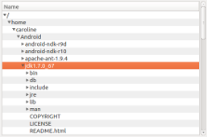
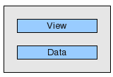
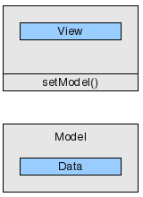
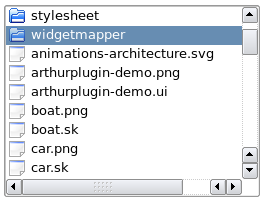
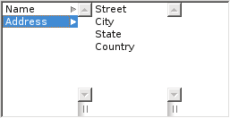
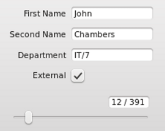
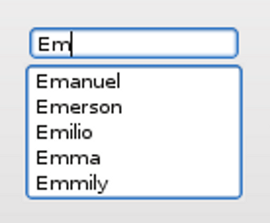
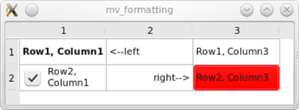
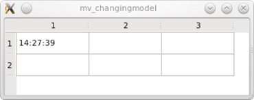
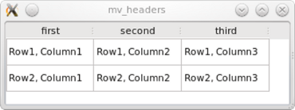

# 模型视图教程

每个 `UI` 开发人员都应该了解模型视图编程，本教程的目的是让您轻松理解有关模型视图的相关知识。

表格，列表和树部件是 `GUI` 中经常使用的组件。这些部件可以通过两种不同的方式访问其数据。传统方式是，这些部件包含用于存储数据的内部容器。这种方法非常直观，但是，在许多应用程序中，它会导致数据同步问题。第二种方法是模型/视图编程，其中部件不维护内部数据容器。他们通过标准化接口访问外部数据，因此避免了数据重复。乍一看，这似乎很复杂，但是如果您仔细看一看，不仅容易掌握，而且模型/视图编程的许多好处也变得更加明显。



在此过程中，我们将了解 `Qt` 提供的一些基本技术，例如：
- 标准部件和模型视图部件的区别
- 窗体和模型之间的适配器
- 开发一个简单的模型视图的应用程序
- 预定义模型
- 中间主题，比如：
  - 树形视图
  - 选项
  - 委托
  - 模型调试测试

您还将了解到新的应用程序是否可以通过模型/视图编程更容易地编写，或者经典的标准部件是否也可以工作。

本教程中的代码您可以编辑修改或者集成到您的项目中去。 源码在 `Qt` 的 `examples/widgets/tutorials/modelview` 目录。

详见 [参考文档]()

## 1. 介绍

模型/视图是一种将数据从视图中分离出来，来处理数据集的一种技术。标准部件并不是为将数据从视图中分离出来而设计的，这就是为什么 `Qt` 会有两种不同类型的部件。这两种部件看起来都一样，但是它们与数据之间的交互方式是不同的。

<div class="table"><table class="generic">
<tbody><tr class="odd" valign="top"><td>标准部件使用的数据最为部件的一部分。</td><td><p class="centerAlign"></p></td></tr>
<tr class="even" valign="top"><td>视图类操作的是外部的数据（模型）。</td><td><p class="centerAlign"></p></td></tr>
</tbody></table></div>

### 1.1 标准部件

让我们仔细看一下标准表部件。表格部件是用户可以更改的数据元素的 `2D` 数组。通过读取和写入表部件提供的数据元素，可以将表部件集成到程序流中。该方法非常直观，在许多应用程序中很有用，但是使用标准表窗口部件显示和编辑数据库表可能会出现问题。数据的两个副本必须协调一致：一个在部件外部；另一个在部件外部。开发人员负责同步两个版本。除此之外，表示和数据的紧密耦合使编写单元测试更加困难。

### 1.2 使用模型/视图解决

模型/视图提供了一个使用更通用体系结构的解决方案。模型/视图消除了标准控件可能出现的数据一致性问题。模型/视图还可以更容易地使用同一数据的多个视图，因为一个模型可以传递给多个视图。最重要的区别是模型/视图部件不在表单元格后面存储数据。实际上，它们直接根据您的数据进行操作。因为视图类不知道数据的结构，所以需要提供一个包装器，使数据符合 [QAbstractItemModel]() 接口。视图使用此接口读取和写入数据。实现 [QAbstractItemModel]() 类的任何实例都称为模型。一旦视图接收到指向模型的指针，它将读取和显示其内容，并成为其编辑器。

### 1.3 模型/视图部件概览

下面是模型/视图部件及其对应的标准部件。

<div class="table"><table class="generic">
<thead><tr class="qt-style"><th>部件</th><th>标准部件<br>
 (基于项的便捷类)</th><th>模型/视图 视图类<br>
 (使用外部数据)</th></tr></thead>
<tbody><tr class="odd" valign="top"><td></td><td><a href="qlistwidget.html">QListWidget</a></td><td><a href="qlistview.html">QListView</a></td></tr>
<tr class="even" valign="top"><td></td><td><a href="qtablewidget.html">QTableWidget</a></td><td><a href="qtableview.html">QTableView</a></td></tr>
<tr class="odd" valign="top"><td></td><td><a href="qtreewidget.html">QTreeWidget</a></td><td><a href="qtreeview.html">QTreeView</a></td></tr>
<tr class="even" valign="top"><td></td><td></td><td><a href="qcolumnview.html">QColumnView</a> s显示列表层次结构的树视图</td></tr>
<tr class="odd" valign="top"><td></td><td colspan="2" rowspan=" 1"><a href="qcombobox.html">QComboBox</a> 既可以用作视图类，也可以用作传统部件 </td></tr>
</tbody></table></div>

### 1.4 在表单和模型之间使用适配器

在表单和模型之间使用适配器非常方便。我们可以直接从表内部编辑存储在表中的数据，但是在文本字段中编辑数据更为方便。在对部件的一个数据而不是数据集操作时，模型/视图并没有提供对应的方法将数据和视图分离开。比如 [QLineEdit]()，[QCheckBox]()...因此我们需要一个适配器来将表单连接到数据源。

[QDataWidgetMapper]() 是一个很好的解决方案，因为它可以将表单部件映射到表行，并且为数据库表构建表单非常容易。



适配器的另一个例子是 [QCompleter]()。`Qt` 使用 [QCompleter]() 在 `Qt` 部件（如 [QComboBox]() 和 如下图所示的 [QLineEdit]()）中提供自动补全功能。QCompleter使用模型作为其数据源。



## 2. 一个简单的模型/视图应用程序

如果要开发模型/视图应用程序，应该从哪里开始？我们建议从一个简单的示例开始，并逐步扩展它。这样更容易理解模型/视图架构。事实证明，在调用 `IDE` 之前尝试详细了解模型/视图体系结构对于许多开发人员来说并不方便。从具有演示数据的简单模型/视图应用程序开始要容易得多。试试看！只需将以下示例中的数据替换为您自己的数据即可。

以下是7个非常简单和独立的应用程序，它们展示了模型/视图编程的不同方面。可以在 `examples/widgets/tutorials/modelview` 目录中找到源代码。

### 2.1 只读的表

我们从使用 [QTableView]() 来显示数据的应用程序开始。稍后我们将添加编辑功能。

(文件: `examples/widgets/tutorials/modelview/1_readonly/main.cpp`)

```cpp
// main.cpp
#include <QApplication>
#include <QTableView>
#include "mymodel.h"

int main(int argc, char *argv[])
{
    QApplication a(argc, argv);
    QTableView tableView;
    MyModel myModel;
    tableView.setModel(&myModel);
    tableView.show();
    return a.exec();
}
```

`main()` 函数：

这是有趣的部分：我们创建 `MyModel` 的实例并使用 `tableView.setModel(＆myModel);`。 将其指针传递给 `tableView`。 `tableView` 将调用它收到的指针的方法来找出两件事：

- 需要显示多少行和列。
- 每个单元格中应该显示什么内容。
  
模型需要一些代码来响应以上这些。

我们有一个表数据集，因此让我们从 [QAbstractTableModel]() 开始，因为它比更通用的 [QAbstractItemModel]() 更易于使用。

(文件：`examples/widgets/tutorials/modelview/1_readonly/mymodel.h`)

```cpp
// mymodel.h
#include <QAbstractTableModel>

class MyModel : public QAbstractTableModel
{
    Q_OBJECT
public:
    MyModel(QObject *parent = nullptr);
    int rowCount(const QModelIndex &parent = QModelIndex()) const override;
    int columnCount(const QModelIndex &parent = QModelIndex()) const override;
    QVariant data(const QModelIndex &index, int role = Qt::DisplayRole) const override;
};
```

[QAbstractTableModel]() 需要实现三个抽象方法。

(文件：`examples/widgets/tutorials/modelview/1_readonly/mymodel.cpp`)

```cpp
// mymodel.cpp
#include "mymodel.h"

MyModel::MyModel(QObject *parent)
    : QAbstractTableModel(parent)
{
}

int MyModel::rowCount(const QModelIndex & /*parent*/) const
{
   return 2;
}

int MyModel::columnCount(const QModelIndex & /*parent*/) const
{
    return 3;
}

QVariant MyModel::data(const QModelIndex &index, int role) const
{
    if (role == Qt::DisplayRole)
       return QString("Row%1, Column%2")
                   .arg(index.row() + 1)
                   .arg(index.column() +1);

    return QVariant();
}
```

行数和列数由 [MyModel::rowCount()]() 和 [MyModel::columnCount()]() 提供。当视图必须知道单元格的文本是什么时，它将调用方法 [MyModel::data()]()。行和列信息由参数 `index` 指定，并且角色设置为 [Qt::DisplayRole]()。下一节将介绍其他角色。在我们的示例中，生成了应显示的数据。在实际的应用程序中，`MyModel` 会有一个名为 `MyData` 的成员，该成员充当所有读取和写入操作的目标。

这个小例子说明了模型的被动性质。该模型不知道何时使用它或需要哪些数据。每次视图请求时，它仅提供数据。

当需要更改模型数据时会发生什么？视图如何认识到数据已更改并且需要再次读取？该模型必须发射一个信号，该信号指示已更改了哪些单元格范围。这将在第2.3节中演示。

### 2.2 使用角色扩展只读表格示例

除了控制视图显示的文本之外，模型还控制文本的外观。当我们稍微改变模型时，我们得到以下结果：



实际上，除了 [data()]() 方法外，无需更改其他任何内容即可设置字体，背景色，对齐方式和复选框。下面是产生上面所示结果的 [data()]() 方法。不同之处在于，这次我们使用参数 `int` 角色根据其值返回不同的信息。

(文件： `examples/widgets/tutorials/modelview/2_formatting/mymodel.cpp`)

```cpp
// mymodel.cpp
QVariant MyModel::data(const QModelIndex &index, int role) const
{
    int row = index.row();
    int col = index.column();
    // generate a log message when this method gets called
    qDebug() << QString("row %1, col%2, role %3")
            .arg(row).arg(col).arg(role);

    switch (role) {
    case Qt::DisplayRole:
        if (row == 0 && col == 1) return QString("<--left");
        if (row == 1 && col == 1) return QString("right-->");

        return QString("Row%1, Column%2")
                .arg(row + 1)
                .arg(col +1);
    case Qt::FontRole:
        if (row == 0 && col == 0) { //change font only for cell(0,0)
            QFont boldFont;
            boldFont.setBold(true);
            return boldFont;
        }
        break;
    case Qt::BackgroundRole:
        if (row == 1 && col == 2)  //change background only for cell(1,2)
            return QBrush(Qt::red);
        break;
    case Qt::TextAlignmentRole:
        if (row == 1 && col == 1) //change text alignment only for cell(1,1)
            return Qt::AlignRight + Qt::AlignVCenter;
        break;
    case Qt::CheckStateRole:
        if (row == 1 && col == 0) //add a checkbox to cell(1,0)
            return Qt::Checked;
        break;
    }
    return QVariant();
}
```

每个格式化属性将通过对 [data()]() 方法的单独调用从模型中请求。角色参数用于让模型知道请求哪个属性：

| 枚举 [Qt::ItemDataRole]() | 意义 | 类型 |
|----|----|----|
| [Qt::DisplayRole]() | 文本 | [QString]() |
| [Qt::FontRole]() | 字体 |　[QFont]() |
| [BackgroundRole]() | 单元格背景的画笔 | [QBrush]() |
| [Qt::TextAlignmentRole]() | 文本对齐方式 | [enum Qt::AlignmentFlag]() |
| [Qt::CheckStateRole]() | 使用 [QVariant()]() 取消复选框，使用 [Qt::Checked]() 或 [Qt::UnChecked]() 设置复选框 | [enum Qt::ItemDataRole]() |

请参阅 `Qt` 明明控件文档了解有关　[Qt::ItemDataRole]() 枚举功能的更多信息。

现在我们需要确定使用分离的模型如何影响应用程序的性能，因此让我们跟踪视图调用 [data()]() 方法的频率。为了跟踪视图调用模型的频率，我们在 [data()]() 方法中放置了一条调试语句，该语句记录到错误输出流中。在我们的小示例中，[data()]() 将被调用 42 次。每次将光标悬停在该字段上时，都会再次调用 [data()]()，每个单元格7次。这就是为什么在调用　[data()]()　和缓存昂贵的查找操作时确保数据可用的重要原因。

### 2.3 表内的时钟



我们仍然使用一个只读表，但是这次内容每秒更改一次，因为我们正在显示当前时间。

（文件：`examples/widgets/tutorials/modelview/3_changingmodel/mymodel.cpp`）

```cpp
QVariant MyModel::data(const QModelIndex &index, int role) const
{
    int row = index.row();
    int col = index.column();

    if (role == Qt::DisplayRole && row == 0 && col == 0)
        return QTime::currentTime().toString();

    return QVariant();
}
```

缺少一些东西来使时钟滴答作响。我们需要每秒告诉视图时间已更改，并且需要再次读取。我们用一个计时器来做到这一点。在构造函数中，我们将其间隔设置为1秒，然后连接其超时信号。

(文件：`examples/widgets/tutorials/modelview/3_changingmodel/mymodel.cpp`)

```cpp
MyModel::MyModel(QObject *parent)
    : QAbstractTableModel(parent)
    , timer(new QTimer(this))
{
    timer->setInterval(1000);
    connect(timer, &QTimer::timeout , this, &MyModel::timerHit);
    timer->start();
}
```
（文件：`examples/widgets/tutorials/modelview/3_changingmodel/mymodel.cpp`）

槽函数：

```cpp
void MyModel::timerHit()
{
    //we identify the top left cell
    QModelIndex topLeft = createIndex(0,0);
    //emit a signal to make the view reread identified data
    emit dataChanged(topLeft, topLeft, {Qt::DisplayRole});
}
```

我们通过发射 [dataChanged()]() 信号要求视图再次读取左上角单元格中的数据。请注意，我们没有将 [dataChanged]() 信号显式连接到视图。这在我们调用 [setModel]() 时自动发生。

### 2.4 设置行和列的标题

标题可以通过调用视图的一个方法被隐藏： `tableView->verticalHeader()->hide();`



但是，标题内容是通过模型设置的，因此我们重新实现 [headerData()]() 方法：

（文件：`examples/widgets/tutorials/modelview/4_headers/mymodel.cpp`）

```cpp
QVariant MyModel::headerData(int section, Qt::Orientation orientation, int role) const
{
    if (role == Qt::DisplayRole && orientation == Qt::Horizontal) {
        switch (section) {
        case 0:
            return QString("first");
        case 1:
            return QString("second");
        case 2:
            return QString("third");
        }
    }
    return QVariant();
}
```

请注意，方法 [headerData()]() 也具有角色参数，该角色与 [MyModel::data()]() 中的含义相同。

### 最小编辑示例

在此示例中，我们将构建一个应用程序，该应用程序通过重复输入表单元格中的值来自动用内容填充窗口标题。为了能够轻松访问窗口标题，我们将　[QTableView]() 放在 [QMainWindow]() 中。

该模型决定编辑功能是否可用。我们仅需修改模型即可启用可用的编辑功能。这可以通过重新实现以下虚函数来完成：[setData()]() 和 [flags()]()。

（文件：`examples/widgets/tutorials/modelview/5_edit/mymodel.h`）

```cpp
// mymodel.h
#include <QAbstractTableModel>
#include <QString>

const int COLS= 3;
const int ROWS= 2;

class MyModel : public QAbstractTableModel
{
    Q_OBJECT
public:
    MyModel(QObject *parent = nullptr);
    int rowCount(const QModelIndex &parent = QModelIndex()) const override;
    int columnCount(const QModelIndex &parent = QModelIndex()) const override;
    QVariant data(const QModelIndex &index, int role = Qt::DisplayRole) const override;
    bool setData(const QModelIndex &index, const QVariant &value, int role = Qt::EditRole) override;
    Qt::ItemFlags flags(const QModelIndex &index) const override;
private:
    QString m_gridData[ROWS][COLS];  //holds text entered into QTableView
signals:
    void editCompleted(const QString &);
};
```

我们使用二维数组 [QString]() `m_gridData` 来存储我们的数据。这使 `m_gridData` 成为 `MyModel` 的核心。`MyModel` 的其余部分就像包装器一样，将 `m_gridData` 调整为 [QAbstractItemModel]() 接口。我们还引入了 [editCompleted()]() 信号，这使得将修改后的文本传输到窗口标题成为可能。

(文件：`examples/widgets/tutorials/modelview/5_edit/mymodel.cpp`)

```cpp
bool MyModel::setData(const QModelIndex &index, const QVariant &value, int role)
{
    if (role == Qt::EditRole) {
        if (!checkIndex(index))
            return false;
        //save value from editor to member m_gridData
        m_gridData[index.row()][index.column()] = value.toString();
        //for presentation purposes only: build and emit a joined string
        QString result;
        for (int row = 0; row < ROWS; row++) {
            for (int col= 0; col < COLS; col++)
                result += m_gridData[row][col] + ' ';
        }
        emit editCompleted(result);
        return true;
    }
    return false;
}
```

每次用户编辑单元格时都会调用　[setData()]() 。`index` 参数告诉我们哪个字段已被编辑，`value` 提供了编辑过程的结果。该角色将始终设置为 [Qt::EditRole]()，因为我们的单元格仅包含文本。如果存在一个复选框，并且将用户权限设置为允许选中该复选框，则还将以角色设置为 [Qt::CheckStateRole]() 进行调用。

(文件：`examples/widgets/tutorials/modelview/5_edit/mymodel.cpp`)

```cpp
Qt::ItemFlags MyModel::flags(const QModelIndex &index) const
{
    return Qt::ItemIsEditable | QAbstractTableModel::flags(index);
}
```

单元格的各种属性可以使用 [flags()]() 进行调整。

返回　[Qt::ItemIsSelectable | Qt::ItemIsEditable | Qt::ItemIsEnabled]() 足以显示一个可被单元格选中的编辑器。

如果编辑一个单元格所修改的数据多于该特定单元格中的数据，则该模型必须发射　[dataChanged()]() 信号，以便读取已更改的数据。